# Admiral Swiggins

## Backstory
Raised in the Swiggins Navy Family on the Kraken planet Titan, Charles Swiggins was the youngest of 30 siblings. Graduating from Wet Point with top honors, he quickly rose through the ranks to become Captain of his very first ship in the Royal Fleet. This ship was called the ‘Sweet Homboldt’.Tasked with finding and defeating Pirates, Swiggins set out with a loyal crew on many succesful sortees. One day, the Homboldt chanced upon the massive Pirateship 'Colossus' helmed by the dreaded Captain Inkbeard!After a furious battle, which reduced both ships to floating heaps of debris, the two captains were the only ones alive for a final showdown. Being nearly overpowered, Swiggins' grasping tentacle found a chain just below the surface of the churning water. Powered by his desperation he hurled the object at his foe. This object was Sweet Homboldts anchor! With one massive blow, Swiggins ended the biggest Pirate threat on Titan once and for all.Now an Admiral, he has exchanged the seas for the voids of space where his fame and leadership skills have found him a contract among the Awesomenauts!

## Base Stats
- **Health:**: 1500 (2640)
- **Movement Speed:**: 7.2
- **Attack Type:**: Melee/Ranged
- **Role:**: Fighter
- **Mobility:**: Tactical

## Abilities & Upgrades
### Anchor Hook
**Description:** Swiggins hurls Homboldt forward, and grapples towards whatever he hits. If you thought getting hit by an anchor is bad, wait for the iron-clad squid that's coming after it!

- **Damage**: 310 (486.7)
- **Droid damage**: 100 (157)
- **Stun Duration**: 0.25s
- **Cooldown**: 7s
- **Range**: 11

#### Upgrades
- 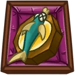 **Flying Fish Compass**: Reduces the cooldown of anchor hook *(Flavor: In the winter they point south, in the summer they point north, easy!)*
- 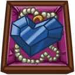 **Blue Heart Medal**: Increases the base damage of anchor hook *(Flavor: Draw me like one of your French girls. :3)*
- 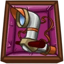 **Mobile Periscope**: Increases the range of anchor hook *(Flavor: Penguins on iceplanet Rill use these to find flying fish.)*
- 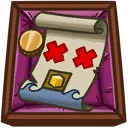 **Treasure Lottery Map**: Enables a shield when hitting an enemy Awesomenaut with anchor hook. *(Flavor: Do you have what it takes to find the treasure? This months treasure jackpot is 1.4 million Solar!)*
- 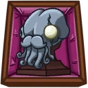 **Kraken Statue**: Increases the stun duration on anchor hook *(Flavor: Resembles Kewlu the ancient one, ruler of the flying seas on Okeanos.)*
- 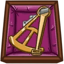 **Ancient Octant**: Makes anchor hook do damage in an area whn hitting an enemy Awesomenaut. *(Flavor: The must have hipster item in sea warfare.)*

### Anchor Swing/Ink Spray
**Description:** Admiral Swiggins carries his trustworthy anchor Homboldt anywhere. Quite handy for smacking people on the head with! Especially when they fail to pay a highborn squid admiral his properly earned respect!

- **Anchor Swing Damage**: 120 (188.4)
- **Anchor Swing Attack Speed**: 95.2
- **Anchor Swing Range**: 3.2
- **Ink Spray Damage**: 80 (125.6)
- **Ink Spray Attack Speed**: 130.4
- **Ink Spray Range**: 7.2

#### Upgrades
- 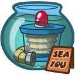 **Aquarium Pump**: Increases the attackspeed of anchor swing and ink spray *(Flavor: For deepsea fish tanks.)*
- 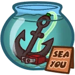 **Energized Hook**: Increases the base damage of anchor swing and ink spray *(Flavor: Makes your fish swing!)*
- 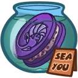 **Krill Biscuits**: Increases movement speed when not holding Homboldt. *(Flavor: Twist, lick and puke!)*
- 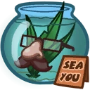 **Not Seeweed**: Adds a blinding effect to ink spray *(Flavor: It isn't.)*
- 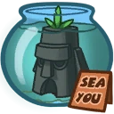 **Royal Toy Castle**: You gain a damage-reducing shield when not holding Homboldt *(Flavor: Resembles the sunken castle Windsor.)*
-  **Pool Boy**: Doubles the damage of the next anchor swing and ink spray when switching between weapons *(Flavor: Comes with denim cut-off shorts.)*

### Drop Anchor
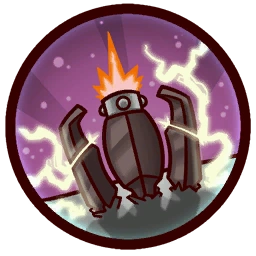

**Description:** Swiggins throws Homboldt in an arch. If it hits an enemy Awesomenaut, it will be chained to homboldt for a couple of seconds. The anchor can be destroyed. Now that's anchor management!

- **Damage**: 80 (125.6)
- **Chain break damage**: 50 (78.5)
- **Cooldown**: 11s
- **Duration**: 3s
- **Homboldt Health**: 350 (616)

#### Upgrades
- 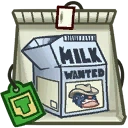 **Bovinian Skimmed Milk**: Enemies caught by the chain will receive extra damage. *(Flavor: Can also be used as car paint.)*
- 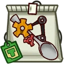 **Pneumatic Spoon**: When the chain breaks the caught enemy will receive extra damage *(Flavor: Creates a little hurricane in your cup!)*
- 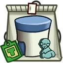 **Alien Sweetener**: Increases the base health of Homboldt *(Flavor: That just kicks it up a little bit!)*
- 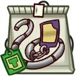 **Palladium Teabag Chain**: Increases the duration of the chain *(Flavor: No more rusty tea!)*
- 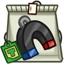 **Magnetic Anchor**: Adds a damage over time effect to drop anchor *(Flavor: Clean the sea of mines and spiky objects!)*
-  **Double Glazed Royal Porcelain**: Slows chained enemy after the chain breaks. *(Flavor: "Property of the Bouquet residence.")*

### Ink Propulsion
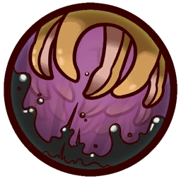

**Description:** Who said tentacles are only good for swimming in a weird manner? The admiral has no issues whatsoever with manouvering ground based obstacles. Swiggins can also perform a hovering technique by propelling himself upward with ink squirts. Quite splendid.

- **Jump Height**: 7.6
- **Descending Speed**: 1.4
- **Jumps**: 1 (Hover)
- **Max Hover Duration**: 3s

#### Upgrades
-  **Power Pills Turbo**: Increases maximum health. *(Flavor: Insert pill into rear end of digestive tract.)*
-  **Med-i'-can**: Automatically regenerate health. *(Flavor: Hello... anyone there? Please get me out of here!!!)*
-  **Space Air Max**: Increases movement speed. *(Flavor: Fashionable and Fast.)*
-  **Barrier Magazine**: Provides a damage absorbing shield. *(Flavor: Free personal shield with this month's edition of The Barrier! Read all about Zork's imperium.)*
-  **Piggy Bank**: Gives 100 Solar. *(Flavor: This product was brought to you by Zork industries, exploiting Zurians since 2780.)*
-  **Baby Kuri Mammoth**: Reduces the effect of all debuffs *(Flavor: "LOOK!!! A FLYING ELEPHANT!")*

