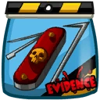
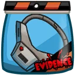
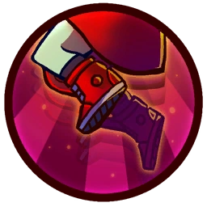

# Ayla

## Backstory
Ayla is a devious little girl. She comes from an old species called the Sadak, known for their great psychokinetic powers. Her parents were killed during the great Sevenelevian Coupon Wars and she was adopted by a sweet alien family. The couple grew fearful, however, when suspicious things started happening around the house: evil drawings on the wall, weird sounds at night and dead rapper frogs in the garden.

When they finally figured out Ayla's "gifts" and dark sense of humor, they turned her over to the Sunny-daisy School of Social Re-adjustment. A few short days and several fires later, she got transferred to a maximum security psychiatric ward where she went berserk and chose the nearest wall for her stage exit.
Using her cute puppy-dog eye routine she managed to hitchhike her way across the galaxy and ended up with the Awesomenauts who, after her tantrums left half the ship in ruins, couldn't wait to get her in a droppod and away from their precious belongings. Still, she's a cherished member of the group, requiring only a gold-star sticker for her efforts on the field of battle!

## Base Stats
- **Health:**: 1400 (2464)
- **Movement Speed:**: 8.3
- **Attack Type:**: Melee
- **Role:**: Fighter
- **Mobility:**: Balanced

## Abilities & Upgrades
### Evil Eye
**Description:** Unleash your third eye. The evil eye is more effective the less health you have.

- **Health stages**: <100% <70% <45% <20%
- **Damage**: 300 (471)
- **Extra Damage per Stage**: 84 (131.88)
- **Slowing Power**: 7.5%
- **Extra Slowing per Stage**: +7.5%
- **Slow Duration**: 2.5s
- **Range**: 9.2
- **Cooldown**: 7.5s

#### Upgrades
-  **Fresh Scrubs**: Reduces the cooldown of evil eye *(Flavor: Nuclear steamed to remove any alien bits and blood.)*
-  **Toothbrush Shank**: Increases damage of evil eye *(Flavor: Game rules: 1.) Form a circle with your cellmates 2.) Spin the toothbrush in the middle 3.) Whoever the toothbrush points at, stab that person! Have fun!)*
-  **Fake Family Pictures**: Reduces the amount of missing health needed per evil eye stage *(Flavor: For those depressing dark moments when you need a family smile.)*
-  **Biter Mask**: Increases the slow effect of evil eye *(Flavor: Good against braineaters.)*
-  **Jail Food**: Adds a damage over time effect to evil eye *(Flavor: Today's deal 50% off! (best before August 3521))*
-  **Dummy Prisoner**: Increases the range and projectile speed of evil eye *(Flavor: ATTENTION! When bought, the vending machine will warn the authorities that you might be planning an escape!)*

### Chain Whack
**Description:** Ayla swings the lock on her chain

- **Damage**: 80 (125.6)
- **Attack Speed**: 150
- **Lifesteal**: 20%
- **Range**: 2.6

#### Upgrades
-  **Thief Tools**: Increases attack speed of chain whack *(Flavor: Opens many locks as well as canned food.)*
-  **Hungry Zurian**: Increases the lifesteal effect to chain whack. *(Flavor: Zurians are a tough species, their hunger for metals makes them perfect for junkyard work.)*
-  **Explosive Neckband**: Increases base damage of chain whack *(Flavor: Let things escalate quickly!)*
-  **Prison Guard Keys**: Enemies hit by Chain Whack deal less damage. *(Flavor: Stealthly stolen from a Kremzon prison guard.)*
-  **Ion Blowtorch**: Increaes damage of chain whack when enemy Awesomenauts with less than 45% HP are near. *(Flavor: Crème brûlée anyone?)*
-  **Sonic Listening Device**: Mark critters to let them drop more health *(Flavor: Can you hear the Solar bubble?)*

### Rage

**Description:** Toggle rage mode on/off making Ayla float, and deal heavy damage

- **Damage**: 79 (124.03) (+15% per target)
- **Attack Speed**: 209.6
- **Self damage**: 40 (62.8)
- **Size**: 5.6
- **Shield**: 10% (+% per target)

#### Upgrades
-  **Angry Drawings**: Increases damage of rage *(Flavor: "Don't look.. or it takes you!")*
-  **Rip-Apart Bear**: Reduces the base damage inflicted upon yourself with rage. *(Flavor: So cute! You want to kill him!)*
-  **Neon Jumping Rope**: Increases the size of rage *(Flavor: Increase you skills, up to lightspeed.)*
-  **Blue Three-Wheeler**: Increases your movement speed while enraged. *(Flavor: Here's Danny!)*
-  **Rubberband Ball**: Ayla will leave a blood trail which speed up her allies. *(Flavor: Bounce right back into action!)*
-  **Fiery Jawbreakers**: When enabling rage after using evil eye you will pull enemies towards you. *(Flavor: New flavors: Nitroglycerine and gasoline!)*

### Hop Skip

**Description:** Ayla's favored mode of transportation is the ancient art of hop skipping. Constantly using this natural force of propulsion, her resulting muscles allow her stubby little legs to propel her into the great (depending on the current planet) blue yonder!

- **Jump Height**: 7.8
- **Jumps**: 1

#### Upgrades
-  **Power Pills Turbo**: Increases maximum health. *(Flavor: Insert pill into rear end of digestive tract.)*
-  **Med-i'-can**: Automatically regenerate health. *(Flavor: Hello... anyone there? Please get me out of here!!!)*
-  **Space Air Max**: Increases movement speed. *(Flavor: Fashionable and Fast.)*
-  **Solar Krab Burgers**: Solar coins will heal you *(Flavor: This popular underwater fast food, makes your stomach resistant to solar.)*
-  **Piggy Bank**: Gives 100 Solar. *(Flavor: This product was brought to you by Zork industries, exploiting Zurians since 2780.)*
-  **Baby Kuri Mammoth**: Reduces the effect of all debuffs *(Flavor: "LOOK!!! A FLYING ELEPHANT!")*

