# Chucho Krokk

## Backstory
Chucho comes from a rich, if slightly shady family called the Krokk. Let's face facts here: they may have achieved fame and fortune on Calias by hunting down the biggest criminals in the galaxy, but they're just as bad themselves. But hey, it takes a crook to catch a crook, so Chucho has taken up the family mantel of being a BAD-ASS BOUNTY HUNTER.

Which wouldn't be so awkward if he didn't have the world's biggest lisp. Oh well. No time for that, because the self-styled "Time Krokk" is on the hunt for a time-travelling criminal (a practice strictly forbidden under the intergalactic portal law, ever since someone went back in time to steal cocoa beans for a fondue, and accidentally ended up wiping chocolate from history).

Since the Krokks and the Zorks have been vicious rivals for centuries, he raised quite some eyebrows when out of nowhere he signed up for the Awesomenauts. In his inventory rests a suspicious, smelly time slipper that might lead him to an altogether deadly confrontation with his unsuspecting bounty...

The Krokk have been suspected to work together with many criminal organizations such as Shishu the underwater mafia, the religious clown killer known as the Grint, and even some suspect links with the lizard Sisterhood of Coba. None of these have ever been confirmed however. Chucho's homeplanet is Calias which is a rich and tech heavy planet. A lot of rich industrial corporations are based here mainly due to the mining of power crystals on Luxor, Calias' last moon

## Base Stats
- **Health:**: 1250 (2200)
- **Movement Speed:**: 7.3
- **Attack Type:**: Ranged
- **Role:**: Fighter
- **Mobility:**: Aerial and Tactical

## Abilities & Upgrades
### Sticky Bomb/Nitro Boost
**Description:** Throw a sticky bomb that attaches to enemies and walls and detonates after a few seconds. While on your bike, this skill becomes nitro boost, which grants a movement speed boost for a brief period of time.

- **Sticky Bomb Damage**: 400 (628)
- **Sticky Bomb Time**: 3s
- **Sticky Bomb Cooldown**: 9.5s
- **Nitro Boost Movement Speed**: +75%
- **Nitro Boost Duration**: 1s
- **Nitro Boost Cooldown**: 12s

#### Upgrades
- 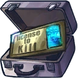 **Krokk License To Kill**: Increases the base damage of sticky bomb against enemy Awesomenauts. *(Flavor: You don't mess with the Krokk.)*
- 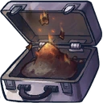 **Secret Krokk Mission Brief**: Causes an enemy to be slowed while a sticky bomb is stuck to them. *(Flavor: 50% OFF! It has already self destructed.)*
- 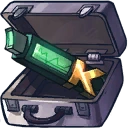 **Zork Industries Share Certificate**: Increases bomb size and explosion size of sticky bomb. *(Flavor: Whoever owns this, owns half of Zork Industries.)*
- 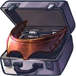 **Four-Eye Visor**: Adds a damage over time effect to every enemy within the bomb's range outline. *(Flavor: Easily adjustable for up to four eyes and the glasses automatically darken when getting too close to the sun.)*
- 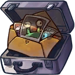 **Black Mail**: Makes the sticky bomb remain sticky when on the ground. *(Flavor: Contains sensitive secret information on Blabl Zork.)*
- 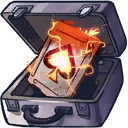 **Trick-Up-Your-Sleeve**: Makes sticky bomb drop one smaller bomb while stuck to an enemy. *(Flavor: An explosive surprise for when you are caught cheating in a game of poker.)*

### Double Pistol/Bike Blaster
**Description:** Shoot two successive shots which deal damage. When on the bike, this becomes bike blaster, a directional shot.

- **Double Pistol Damage**: 46 (72.22)
- **Double Pistol Attacks per second**: 4
- **Bike Blaster Damage**: 58 (91.06)
- **Bike Blaster Attacks per second**: 6

#### Upgrades
-  **The Koi-Robbers**: Makes your double pistol and bike blaster shots pierce through one enemy allowing you to hit an additional target. *(Flavor: WANTED for stealing the Kullinan Koi. The aquatic duo was last seen on Okeanos... they do look familiar.)*
- 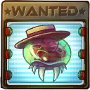 **Matt Parasite Roid**: Increases the base damage of your double pistol and bike blaster shots. *(Flavor: Some other female bounty hunter is also after this head.)*
- 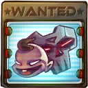 **Team Toddletron**: Increases the range of Double Pistol and Bike Blaster bullets. *(Flavor: WANTED for illegal streetfighting on Calias.)*
- 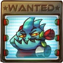 **One Armed Chameleon**: Makes the first next double pistol shot after dismounting your bike or after throwing sticky bomb a strong shot that has increased range and deals more damage. *(Flavor: WANTED DEAD OR ALIVE! By order of the Kremzon empire.)*
- 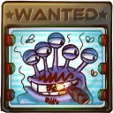 **Blabl Zork**: Increases the attack speed of double pistol after attaching a sticky bomb to someone. *(Flavor: Note from management: Jenny, what is my picture doing HERE!&%#! Someone has been messing with our merchandise! Don't let it happen again!)*
- 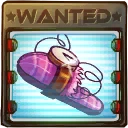 **The Time Slipper**: Reduces the cooldown of sticky bomb for every shot that hits. *(Flavor: WANTED for illegal time travel. Please call 555-KROKK if you recognize this slipper.)*

### Hyper Bike/Turret
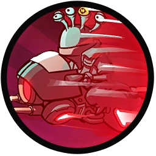

**Description:** Step on your bike to drive into combat with increased speed and a directional shot. Use the skill again to deploy your bike as a rapid shooting turret. Hold the skill button to either remote destroy your turret or mount it again when close. While on the bike your other skill becomes nitro boost.

- **Turret Damage**: 66 (103.62)
- **Turret Health**: 600 (1056)
- **Turret attacks per second**: 2.5
- **Cooldown (self-destruct)**: 5s
- **Cooldown (destroyed)**: 10s

#### Upgrades
- 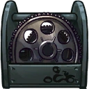 **12th Gear**: Increases base damage of the turret shot. *(Flavor: The gear you didn't know you needed before.)*
- 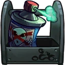 **Alien-Repellent Varnish**: Adds a damage absorbing shield to your turret when standing within its range. *(Flavor: 99% garanteed to keep the bike-stealing aliens away.)*
- 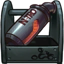 **Neon Nitro Muffler**: Adds an exhaust flame burst to bike when starting Nitro Boost. *(Flavor: They will hear you coming from light years away!)*
- 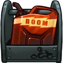 **BOOM Gas**: Causes a damaging explosion when manually detonating your bike. Also halves the cooldown of the manual detonation. *(Flavor: Cheap AND highly flammable. Available at your local space gas station.)*
- 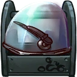 **Anti-Zork Windscreen Wipers**: Increases the movement speed bonus of nitro boost. *(Flavor: Perfect for wiping (holo)cats off your windscreen.)*
- 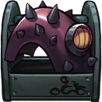 **Retracting-Spikes Fender**: Adds a damaging knockback effect to the front of your bike when using nitro boost. Hits each target only once. *(Flavor: Quickly gets rid of everything and everyone in your way.)*

### Dramatic Entrance High Jump/Hyper Bike Hover
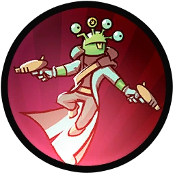

**Description:** Dramatic Entrance High Jump when on foot. Hovers around when on his bike.

- **Jump Height**: 7.6
- **Jumps**: 1

#### Upgrades
-  **Power Pills Turbo**: Increases maximum health. *(Flavor: Insert pill into rear end of digestive tract.)*
-  **Med-i'-can**: Automatically regenerate health. *(Flavor: Hello... anyone there? Please get me out of here!!!)*
-  **Space Air Max**: Increases movement speed. *(Flavor: Fashionable and Fast.)*
-  **Baby Kuri Mammoth**: Reduces the effect of all debuffs *(Flavor: "LOOK!!! A FLYING ELEPHANT!")*
-  **Piggy Bank**: Gives 100 Solar. *(Flavor: This product was brought to you by Zork industries, exploiting Zurians since 2780.)*
-  **Overdrive Gear**: Reduces the cooldown of all your skills. *(Flavor: Let's put it into Overdrive!)*

