# Clunk

## Backstory
Clunk is a robot suffering from anger management issues. He's saving up money to pay for therapy but keeps losing it due to damage compensations. Originally created as part of a robot army to combat an immensely powerful super villain terrorizing the outer star systems, Clunk found himself without a job when the villain accidentally died of a nasty bacterial infection before the robot army was completed.

This was actually a blessing in disguise for Clunk, since he was never designed to return in one piece from his mission. He was refitted to do standard house-keeping work, but soon found himself out of work once more as he kept blowing aggression inhibitors and subsequently went into immensely destrucive tantrums.

Eventually, Clunk signed up as a mercenary to do what he is best at: wrecking things. He found that finally giving in to his aggressive nature has given him great inner peace. Nowadays he takes great pleasure in jetting around the battlefield, blowing up in peoples' faces to the sound of heavy metal.

## Base Stats
- **Health:**: 1900 (3344)
- **Movement Speed:**: 7.02
- **Attack Type:**: Medium
- **Role:**: Tank
- **Mobility:**: Tactical

## Abilities & Upgrades
### Vacuum Bite
**Description:** Being a giant robot requires a lot of energy. Luckily, Clunk has a powerful set of metal jaws that allow him to take a bite out of almost everything. His iron stomach takes whatever comes in, and quickly converts it to raw health.

- **Damage**: 300 (471)
- **Cooldown**: 5s
- **Lifesteal**: 100%
- **Range**: 4.2

#### Upgrades
- 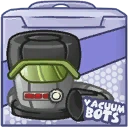 **Quick'n Cleaner**: Increases lifesteal and damage of vacuum bite. *(Flavor: Got your fine shirt covered in hitpoints? Try Quick 'n Cleaner!)*
- 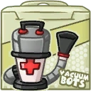 **Medical Pump**: Adds health to your maximum health for every successful bite. This health is removed upon death. *(Flavor: Clean up with surgical precision.)*
- 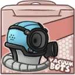 **Screamer Engine**: Vacuum bite will ensnare enemies. *(Flavor: WHAT ARE YOU SAYING!?! I CAN'T HEAR YOU!)*
- 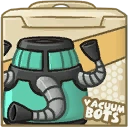 **Multi Hose**: Your bite will affect additional nearby enemies. *(Flavor: For robo-maid model 34-Y or models with same amount of arms.)*
- 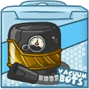 **The Suckanator Power 9000 Cleaner**: Increases lifesteal and damage of vacuum bite. *(Flavor: Free coupon inside for a Nurian ants facial.)*
- 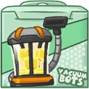 **Power Converter**: Get an adittional heal over time whenever you bite an enemy. *(Flavor: Makes cleaning up a walk in the park.)*

### Missiles
**Description:** Slow-loading but very powerful: Clunks' missiles are very useful to get rid of obstructions when he just wants to blow up in someone's face.

- **Damage**: 120 (188.4) | 140 (219.8) | 180 (282.6)
- **Attack Speed**: 60
- **Range**: 9.4
- **Speed**: 8
- **Homing**: 0

#### Upgrades
- 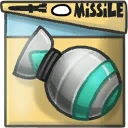 **Fragmenting Shells**: Makes missiles do damage in an area upon hitting an enemy target. *(Flavor: Anti bugs, rodents and trucks.)*
- 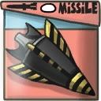 **Free Flight Fins**: Reduces cooldown on missile shot and increases missile speed. *(Flavor: Faster deploying, faster destroying.)*
- 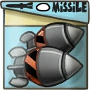 **Double Missile**: Increases the damage of all missiles. *(Flavor: Keep away from children and trigger happy Kremzons.)*
- 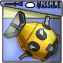 **The Juggernaut "Fat Pete"**: Adds a giant missile to your launch string. *(Flavor: Property of Earth's Liberation Front. Made in 2991)*
- 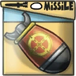 **Improved Homing Sensor**: Makes your missiles better at following enemies. *(Flavor: Pow! Right in the kisser.)*
- 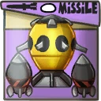 **Salvo Value Pack**: Doubles the next shot missile after exploding or performing a vacuum bite. *(Flavor: WARNING!: Do not aim at eye(s) or face(s).)*

### Explode

**Description:** Clunk was designed to be a suicide attacker, later fitted with armor powerful enough to survive his own explosion. Clunk now happily takes a bit of damage to blow away his enemies!

- **Damage**: 500 (785)
- **Self Damage**: 300 (471)
- **Cooldown**: 13.5s
- **Explosive Size**: 9
- **Charge Time**: 1.5s

#### Upgrades
-  **Thermonuclear Cleaner**: Increases base damage of explode against enemy Awesomenauts. *(Flavor: Clean any room in one big swipe!)*
-  **Titanium Hard Hat**: Reduce the damage you inflict upon yourself when using explode. *(Flavor: Approved Calias mining equipment. Safety first.)*
-  **Grease Lightning Snail**: Slows enemies near you while charging explode. *(Flavor: WARNING: Do not eat!)*
- 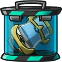 **Blueprints container**: Reduces incoming damage while exploding. *(Flavor: Where does this part go?)*
- 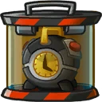 **Reactor Cooler**: Reduces cooldown time on explode. *(Flavor: Explosions, so hot right now.)*
-  **Universal Charger**: Reduces the charging time of explode. *(Flavor: When you look closely at the jar, you will see thousands of little stars and planets.)*

### Jet Boost
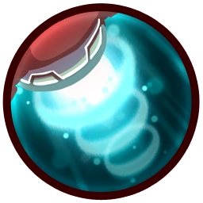

**Description:** Similar to white male humans, giant combat robots can't jump. To compensate, Clunk was outfitted with a powerful jet engine that lets him fly for short distances.

- **Jump Height**: 13.6
- **Jump Duration**: 1.1s
- **Jumps**: 1

#### Upgrades
-  **Power Pills Turbo**: Increases maximum health. *(Flavor: Insert pill into rear end of digestive tract.)*
-  **Med-i'-can**: Automatically regenerate health. *(Flavor: Hello... anyone there? Please get me out of here!!!)*
-  **Space Air Max**: Increases movement speed. *(Flavor: Fashionable and Fast.)*
-  **Barrier Magazine**: Provides a damage absorbing shield. *(Flavor: Free personal shield with this month's edition of The Barrier! Read all about Zork's imperium.)*
-  **Piggy Bank**: Gives 100 Solar. *(Flavor: This product was brought to you by Zork industries, exploiting Zurians since 2780.)*
-  **Baby Kuri Mammoth**: Reduces the effect of all debuffs *(Flavor: "LOOK!!! A FLYING ELEPHANT!")*

