# Coco Nebulon

## Backstory
Hailing from a psyonic race near the outer brim of the galaxy, comes Coco Nebulon, the cosmic waveblazer. Coco rides her combat waveboard into battle, using her psyonic powers to subdue her adversaries. Why Coco fights in the war is a bit unclear, as no-one can really understand her when she talks.

Excerpt from her spacelog: "It's just like, dude, I was cruisin' the galaxy, you know, in this totally tubular, space-van, searching for the best cosmic waves man. And, you know, like, when I was, like, you know, like acing these waves once, there was like this giant robot corporation that wanted to make like these waves like into a giant galactic like battlefield you know? And I was all like, oh man, that's so un-gnarly dude. But those robots were all like 10100111001 or whatever. So I was all like, yeah but ok, you know? And then these robots were all like, ohh we have to fight each other. And they were like shooting lasers at eachother man. And I was like, man, I gotta fight, you know, like totally with these robots against the other robots because it's like, you know, whatever."

## Base Stats
- **Health:**: 1300 (2288)
- **Movement Speed:**: 8.36
- **Attack Type:**: Melee
- **Role:**: Harasser
- **Mobility:**: Swift

## Abilities & Upgrades
### Ball Lightning
**Description:** Coco shoots an actual ball of lightning from her hands, which she can detonate at any time while it's traveling through the air. This little bundle of bolts is able to pass through any solid object.

- **Damage**: 400 (628)
- **Cooldown**: 7s
- **Range**: 8
- **Knockback**: 1.5
- **Speed**: 9.6

#### Upgrades
-  **Voltage Amplifier**: Increases the base damage of ball lightning against enemy Awesomenauts. *(Flavor: like being hit by Thor himself.)*
-  **Gyroscopic Dynamo**: Reduces cooldown time on ball lightning. *(Flavor: Turns you on!)*
- 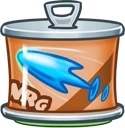 **Conducting Gel**: Increases the range of ball lightning. *(Flavor: Greased lightning!)*
-  **Thunder Striker**: Increases the knockback effect of ball lightning. *(Flavor: You've been... thunderstruck!)*
-  **Flashing Lights**: Adds a blinding effect to ball lightning. *(Flavor: Also works great with picture recording devices.)*
-  **Heavenly Fire**: Adds a blaze effect to ball lightning that deals half the normal Blaze damage. *(Flavor: A storm is coming.)*

### Shock
**Description:** Coco channels her psycho-electric powers through her unfortunate enemies, frying anything foolish enough to stand in front of her. Machine or mammal, they are all in for a nasty shock.

- **Damage**: 35 (54.95)
- **Attack Speed**: 428.6
- **Range**: 3.3

#### Upgrades
- 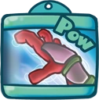 **Static Gloves**: Increases base damage of Shock attack. *(Flavor: Yes. Bigger IS better!)*
- 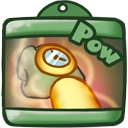 **Flexible Heat Sinks**: Increases the attack speed of Shock attack. *(Flavor: A combination of thermo infatuation and superconductive aerobics should keep the temperature stable.)*
- 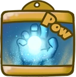 **Wetsuit**: Adds a slowing effect to Shock attack. *(Flavor: WARNING: does not protect against actual water.)*
- 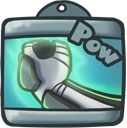 **Power Gloves**: Reduces shocked enemies' damage. *(Flavor: Dominating video play leagues since 2368)*
- 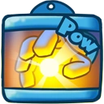 **Hoover Hands**: Adds a lifesteal effect to Shock attack. *(Flavor: Hard rubbing no longer necessary.)*
- 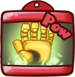 **Super Conductor**: Adds homing electricity particles to Shock attack. *(Flavor: They'll never know what zapped 'em!)*

### Blaze
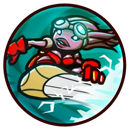

**Description:** Leaving a trail of lightning, Blaze will damage anyone who is foolish enough to step into it. Helpful to get rid of “the man” when he’s persuing you about those unpaid bills.

- **Damage Over Time**: 165 (259.05)
- **Damage Duration**: 2s
- **Cooldown**: 8s
- **Length**: 8
- **Time**: 1.6s
- **Slow Power**: 10%
- **Slow Duration**: 1s

#### Upgrades
- 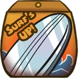 **Silver Coating**: Increases movement speed during blaze. *(Flavor: One coat only, withstands the four elements.)*
- 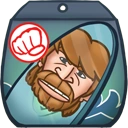 **Chuck's Board**: Increases base damage of blaze. *(Flavor: With this, you can surf through land!)*
- 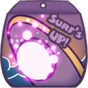 **Disruptor**: Increases slowing effect of blaze. *(Flavor: For smooth surfing on rough seas.)*
- 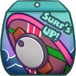 **Time Travel Turbine**: Increases time blaze stays on the floor. *(Flavor: The board is modified to reach a speed of 88.)*
- 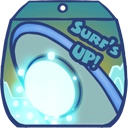 **Syphon Disruptor**: Increases shock damage while using blaze. *(Flavor: Far out dude!)*
-  **Wave Raiser**: Leaves a longer blaze trail. *(Flavor: Turns calm water into a tsunami, wicked!)*

### Ollie
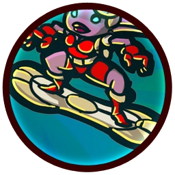

**Description:** Always willing to entertain the crowds and show off her skills, Coco will occasionally do a Front-Flip while soaring through the air.

- **Jump Height**: 10.8
- **Jumps**: 1
- **Frontflip Chance**: 50%

#### Upgrades
-  **Power Pills Turbo**: Increases maximum health. *(Flavor: Insert pill into rear end of digestive tract.)*
-  **Med-i'-can**: Automatically regenerate health. *(Flavor: Hello... anyone there? Please get me out of here!!!)*
-  **Space Air Max**: Increases movement speed. *(Flavor: Fashionable and Fast.)*
-  **Barrier Magazine**: Provides a damage absorbing shield. *(Flavor: Free personal shield with this month's edition of The Barrier! Read all about Zork's imperium.)*
-  **Piggy Bank**: Gives 100 Solar. *(Flavor: This product was brought to you by Zork industries, exploiting Zurians since 2780.)*
-  **Baby Kuri Mammoth**: Reduces the effect of all debuffs *(Flavor: "LOOK!!! A FLYING ELEPHANT!")*

