# Deadlift

## Backstory
Samuel "Deadlift" Gains was a young calf during "The Great Bovinion Wrangling" and escaped aboard a dairy transport bound for the Flexon, where all inhabitants are incredibly muscular! A Kremzon took him in and put him on a rough training regiment, to prepare for his revenge on Sheriff Lonestar.

Samuel grew stronger as the years passed, and one day, when Lonestar visited the planet, tried to ambush him at the spaceport. The cowboy saw through his plan and made Samuel lose his balance while he was preparing to throw a spaceship. Samuel woke up in a hospital with one of his arms and horns replaced by mechanical versions, and a note saying that they were a gift for "Pursuing a common goal." Lonestar and the inhabitants of Flexon thought he was dead, so his "revival" earned him the nickname: "Deadlift".

Back on his quest to avenge the Bovinions, Deadlift joined the Awesomenauts after telling Blabl Zork that he could pull out solar drills with his bare hands. He's secretly planning his final strike to put the cowboy out of business for good.

## Base Stats
- **Health:**: 1600 (2816)
- **Movement Speed:**: 7.46
- **Attack Type:**: Melee
- **Role:**: Support
- **Mobility:**: Balanced

## Abilities & Upgrades
### Power Lunge
**Description:** In true Bovinian fashion, lunge into enemies and cause an explosive burst that deals damage.

- **Damage**: 300 (471)
- **Cooldown**: 7s

#### Upgrades
- 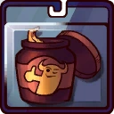 **Red Asteroid Horn Polish**: Reduces the cooldown of power lunge. *(Flavor: A brand of horn polish set up by the famous Bovinion hero: Red Asteroid.)*
- 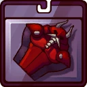 **Muscular-Posing Oil**: Increases the range of power lunge. *(Flavor: Made for intergalactic posing contests, but can also be used to oil robots and vikings.)*
- 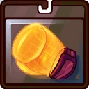 **Holotech Kickboxing Gloves**: Increases the damage of power lunge. *(Flavor: Makes your knuckles as powerful as a bull ram and protects them from blasts as strong as dynamite.)*
- 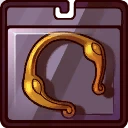 **Weighted Nose Ring**: Reduce the damage output of enemies hit by power lunge. *(Flavor: A sign of Bovinian masculinity. Not suitable for use on anything but the nose.)*
- 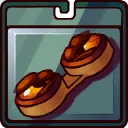 **Rodeo-Red Lenses**: When performing a Power Lunge out of Protective Pose, the shield will explode. This breaks the shield. *(Flavor: Everything is red! Must... destroy...)*
- 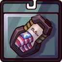 **McPain Odor-Blocking Bodywash**: Increases the knockback power of power lunge. *(Flavor: "Anything is possible when you smell like McPain. I'm on a unicorn.")*

### Iron Slam
**Description:** Swing Deadlift's muscular arms to slam your enemies and deal damage. Even a cowboy cannot wrangle these babies.

- **Normal arm damage**: 100 (157)
- **Uppercut damage**: 120 (188.4)
- **Attack speed**: 102

#### Upgrades
- 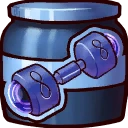 **Graviton Dumbbells**: Increases the attack speed of Iron Slam. *(Flavor: Imbued with the power to increase the gravitational force for more gains!)*
- 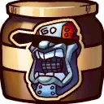 **Motivational Boombox Bot**: Increases movement speed when allies are nearby. *(Flavor: A high-tech boombox that yells motivational phrases while playing some sick tunes.)*
- 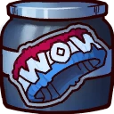 **Sweat-Wow-Band**: Heal over time after hitting an enemy with Deadlift's uppercut. *(Flavor: "You'll be saying WOW every workout. Holds 100 its weight in sweat.")*
- 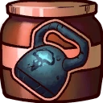 **Worn-Out Kettlebell**: Increases the damage of Iron Slam. *(Flavor: "For the last time, it's called a Kettlebell not a Cattle bell!")*
- 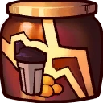 **Lightning-Start Protein Shake**: After landing a Power Lunge, the next Iron Slam will stun enemies. *(Flavor: Maintain your fantastic body with this orange and blue berry flavoured shake.)*
- 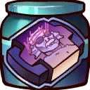 **Arnel Swertsenek Training Video**: Increases the damage of Iron Slam for every 'naut hit in quick succession up to a cap. Resets when no naut is hit for a while. *(Flavor: Teaches you the famous Arnel Dumbbell Press and much more in this extended cut!)*

### Protective Pose
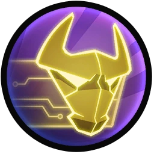

**Description:** Strike a pose to summon holo-tech's newest protective shield and soak up damage for you and your allies. Starts decaying over time. Use again to cancel.

- **Health**: 600 (942)
- **Health decay**: 100/s (157/s)
- **Decay start**: 2s
- **Cooldown**: 13s

#### Upgrades
- 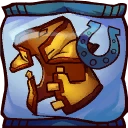 **Bovinian Coat**: Increases the health of protective pose shield. *(Flavor: Earthlings used to call this a "Cow Blanket". How fascinating.)*
- 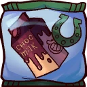 **Fresh Chocolate Milk**: Makes all allies in the Protective Pose shield stronger against Awesomenauts. *(Flavor: Genetically engineered Bovinions used to be illegal, until this was found on the black market.)*
- 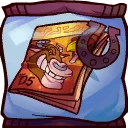 **Bovinion And Chicken Comic**: Slows enemies inside the Protective Pose shield. *(Flavor: A slapstick comic about an unlikely duo.)*
- 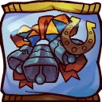 **Triple Cowbells Of Honor**: Reduces the cooldown of Protective Pose shield by 30% if the shield is cancelled manually. *(Flavor: The amount of Cowbells of Honor signifies stature on Bovinia. They are also used in Jazz Mooosic.)*
- 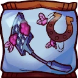 **Poefluma Fly Swatter**: Adds a self-healing burst that activates when Protective Pose shield breaks. *(Flavor: It smells like the natural stench of Bovinions, which the Poefluma Fly is attracted to.)*
- 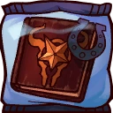 **Cowboy Boogeyman Storybook**: Makes allies passing through the Protective Pose shield receive a speed bonus. *(Flavor: "And the cowboy used his unrelenting lasso to catch the naughty Bovinion calves.")*

### Bovinian Lift Off
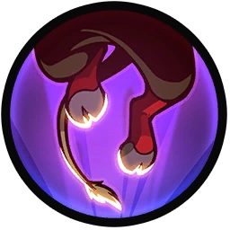

**Description:** Deadlift uses his powerful legs, trained extensively on the legpress, to launch himself in the air.

- **Jumps**: 1

#### Upgrades
-  **Power Pills Turbo**: Increases maximum health. *(Flavor: Insert pill into rear end of digestive tract.)*
-  **Med-i'-can**: Automatically regenerate health. *(Flavor: Hello... anyone there? Please get me out of here!!!)*
-  **Space Air Max**: Increases movement speed. *(Flavor: Fashionable and Fast.)*
-  **Barrier Magazine**: Provides a damage absorbing shield. *(Flavor: Free personal shield with this month's edition of The Barrier! Read all about Zork's imperium.)*
-  **Piggy Bank**: Gives 100 Solar. *(Flavor: This product was brought to you by Zork industries, exploiting Zurians since 2780.)*
-  **Baby Kuri Mammoth**: Reduces the effect of all debuffs *(Flavor: "LOOK!!! A FLYING ELEPHANT!")*

