# Derpl Zork

## Backstory
Riding his combat walker onto the battlefield, comes Derpl Zork. The nephew of Blabl Zork, president of Zork industries. Derpl Zork lacks his uncle's business-smarts. In fact he lacks any kind of smarts, managing to get his IQ rated under the level of plankton in the official galaxial IQ test.

Nevertheless Derpl is the heir apparent to Blabl's galaxy-spanning business empire. This is something that doesn't sit well with Blabl, not well at all. Dreading the day Derpl would inherit the company and run all the hardfought accomplishments into the ground, Blabl put Derpl in charge of fieldtesting the new Specialized Universal Secretary Interface (S.U.S.I. for short) in one of Zork Industries' combat walkers. Asking Derpl what form of devastation should be issued forth from his vehicle of destruction he simply drooled and said: "I wuv cats!"

Now Blabl is anxiously awaiting the day that Derpl would suffer a fatal blow on the fields of battle but as of yet Derpl's combat walker has proven to keep making up for its dimwitted driver.

## Base Stats
- **Health:**: 1800 (3168)
- **Movement Speed:**: 7.44
- **Attack Type:**: Medium Range
- **Role:**: Tank
- **Mobility:**: Tactical

## Abilities & Upgrades
### Grid Trap / Nuke
**Description:** Deploy traps that will ensnare enemies, locking them in place. When in Siege Mode, this ability will fire a homing Nuke which can obliterate pretty much anything. Also good for toasting marshmallows.

- **Trap Cooldown**: 6s
- **Time**: 9s
- **Snare Duration**: 1.2s
- **Slow**: 30%
- **Slow Duration**: 2.4s
- **Nuke Damage**: 500 (785)
- **Nuke Cooldown**: 14s
- **Explosion Size**: 8
- **Nuke Range**: 17.4
- **Nuke Speed**: 6

#### Upgrades
-  **Empowered Grid**: Increases snare duration of grid trap. *(Flavor: Perfect for catching rare and endangered aliens.)*
-  **Strengthened Trap**: Increases lifetime of grid trap. *(Flavor: Licensed to be used by R.E.T.A staff only.)*
- 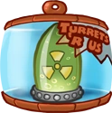 **Hydrocollision Lava Lamp**: Increases base damage of nuke against enemy Awesomenauts. *(Flavor: Keeps away mosquitoes, grime flies, and other insects.)*
- 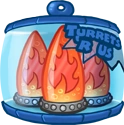 **Combustion Lava Lamp**: Increases nuke explosion size. *(Flavor: Lights up your campsite. Literally!)*
- 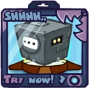 **Lead Casing**: Adds a silencing effect to grid trap. *(Flavor: Be vewy vewy quiet. I'm hunting wats.)*
- 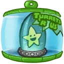 **Super-powered Nuke**: Increases nuke speed. *(Flavor: Essential part of the Kwark cheetah hunting pack.)*

### Cat Shot \ Gatling
**Description:** Mew enemies into oblivion by shooting explosive holocats. Derpl’s love of felines should be shared with everyone. When in Siege Mode, the cats take a break and the machine gun takes over.

- **Damage**: 90 (141.3)
- **Attack Speed**: 100
- **Range**: 9.8

### Siege Mode

**Description:** When the going gets tough, the tough get tougher! Transform the combat walker into a stationary siege turret of doom, brandishing a free rotating machine gun in the process. Siege mode also provides debuff immunity.

- **Cooldown**: 1/4.5s
- **Turret Damage**: 45 (70.65)
- **Turret Attack Speed**: 480
- **Turret Range**: 10.53
- **Debuff Immunity**: Yes

#### Upgrades
- 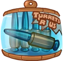 **Sweet Syrup Bullets**: Adds a slowing effect to turretshot. *(Flavor: This sticky candy is made of the eggs of spiderbirds.)*
- 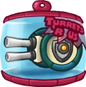 **Force Field**: You gain a damage-absorbing shield when transforming into siege mode. *(Flavor: Protect yourself from claws, horns, teeth and missiles.)*
- 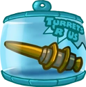 **Hollow Point Bullets**: Increases damage of turretshot. *(Flavor: WARNING: Will shred your prey, not suitable for trophy hunting.)*
- 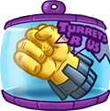 **Solid Fist Missiles**: Adds slow-loading missiles to your turretshot, which explode. *(Flavor: Modelled after the famous handmodel B. Grimm)*
- 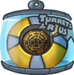 **Deployment Pads**: Deal a knockback pulse when transforming out of turret mode. *(Flavor: Get a chance to win a fishing trip to Okeanos.)*
- 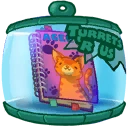 **Pussycat Album**: You gain a damage absorbing shield when transforming into siege mode. The shield protects you from damage above a maximum amount of damage. *(Flavor: The album is filled with autographs of all your favorite heroes, pictures of cats and a mysterious picture of a tough-looking bird.)*

### Booster Rocket
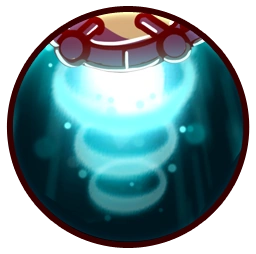

**Description:** Derpl's walking desk has a temporary jet boost, lifting him up high to soar with the pink elephants of joy!

- **Jump Height**: 8
- **Jump Duration**: 0.8s
- **Jumps**: 1

#### Upgrades
-  **Power Pills Turbo**: Increases maximum health. *(Flavor: Insert pill into rear end of digestive tract.)*
-  **Med-i'-can**: Automatically regenerate health. *(Flavor: Hello... anyone there? Please get me out of here!!!)*
-  **Space Air Max**: Increases movement speed. *(Flavor: Fashionable and Fast.)*
- 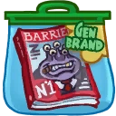 **Barrier Magazine**: Provides a damage absorbing shield. *(Flavor: Free personal shield with this month's edition of The Barrier! Read all about Zork's imperium.)*
-  **Piggy Bank**: Gives 100 Solar. *(Flavor: This product was brought to you by Zork industries, exploiting Zurians since 2780.)*
-  **Baby Kuri Mammoth**: Reduces the effect of all debuffs *(Flavor: "LOOK!!! A FLYING ELEPHANT!")*

