# Dizzy

## Backstory
Using her mastery in Aqua-fu, Dizzy fooled the Scarg prison guards with her water clones and escaped along with her team. After being separated, she went back to her home planet: Ribbit IV, with the plan to visit her family and revitalize her singing career.

Dizzy decided to form her own girl band, called the Dizzies, with two of her water clones. In no time she conquered the Universal Music Charts and toured all across the Galaxy, while angering some concert hall owners due to her 'explosive' performances.

After a popularity poll showed that one of the clones, Fizzy, was way more popular than Dizzy a fight erupted between the two, causing Fizzy to start her own successful solo career. In a fit of rage caused by the betrayal, Dizzy left the band and redirected her anger into vandalizing the modern streets of Ribbit IV with graffiti. Before being caught, she was calmed by an old friend who presented her with the perfect plan to both clear their names and redirect her rage. She now joins her old friends and follows her cousin's footsteps into joining the Awesomenauts!

## Base Stats
- **Health:**: 1150 (2024)
- **Movement Speed:**: 8.8
- **Attack Type:**: Medium Range
- **Role:**: Fighter
- **Mobility:**: Swift

## Abilities & Upgrades
### Multi Dash
**Description:** Save multiple dashes to unleash unto your enemies. Deals damage per dash.

- **Damage**: 160 (251.2)
- **Charges**: 3
- **Reload Time**: 4s
- **Cooldown Between Dashes**: 0.4s
- **Distance**: 7.5

#### Upgrades
- 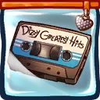 **"Dizzy Greatest Hits"**: Increases the damage of Multi Dash against enemy Awesomenauts. *(Flavor: Features hits like "Girl Ribbits", "Getting Dizzy With It", and "Killing Spree".)*
- 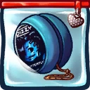 **The Butterfly Tour Yo-yo**: Adds a damage-reducing shield during Multi Dash. *(Flavor: The gimmick of The Butterfly Tour was meant to be butterfly themed outfits, but it was changed to yo-yo tricks after complaints by the Entin.)*
- 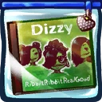 **"Ribbit Ribbit Real Good"**: Adds an additional dash to Multi Dash but reduces the damage of all dashes. *(Flavor: An album Dizzy dedicated to her family. Includes a cover of the song "Pond Pimpin".)*
-  **Backstage Pass**: Increases the range of the first dash when they are all recharged. *(Flavor: Disclaimer: If Dizzy accidentally blows up the backstage area, you will not receive a refund.)*
- 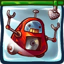 **Walkbot Pro**: Increases the reload speed when enemy Awesomenauts are near. *(Flavor: Plays the hippest tunes while it walks along with you.)*
- 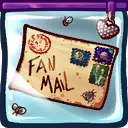 **Obsessive Fan-mail**: Reduce the remaining cooldown of Explosive Clone for each successful dash hit. *(Flavor: "Put it on the pile over there in the corner.")*

### Bubble Shot
**Description:** Fire a fast-moving bubble that deals damage.

- **Damage**: 70 (109.9)
- **Attack speed**: 120
- **Projectile Speed**: 22
- **Range**: 5.7
- **Explosion Size**: 1.8
- **Projectile Size**: 0.6

#### Upgrades
- 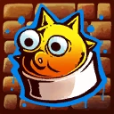 **Blowfish Nozzle**: Makes the bubble stay at the end. *(Flavor: For super sharp and explosive lines.)*
- 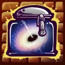 **Blackhole Compressed Canister**: Increases the damage of Bubble Shot. *(Flavor: Warning: Press very very gently!!!)*
- 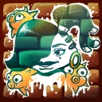 **Tipi Teal**: Increases the range and speed of Bubble Shot. *(Flavor: The most beautiful color in the galaxy!**No it's not invisible your eyes are just not evolved enough!)*
- 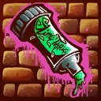 **Slimy Markers**: Increases the attackspeed of Bubble Shot. *(Flavor: 50% off. Someone has been chewing on them.)*
- 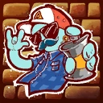 **Graffiti Artist**: Makes the next Bubble Shot after hitting a Multi Dash or Explosive Clone larger and deal more damage. *(Flavor: This little Zurian hipster knows all the best fonts and coffee shops in town.)*
- 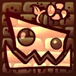 **Concrete Wall**: Increases the damage for each Multi Dash available. *(Flavor: "A blank canvas in pristine condition... wait... what happened here!?")*

### Explosive Clone
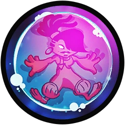

**Description:** Leave a water clone at your location that explodes after a delay.

- **Damage**: 360 (565.2)
- **Cooldown**: 7s
- **Radius**: 4.4
- **Explosive Arm Time**: 0.9s

#### Upgrades
- 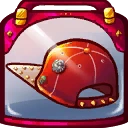 **Backwards High Cap**: Increases the size of Explosive Clone. *(Flavor: Can only be worn backwards no matter how hard you try.)*
- 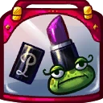 **"Purple Prince" Lipstick**: Slow down enemies who are hit by or leave the explosion area. *(Flavor: Might turn frog-like creatures into a prince.)*
- 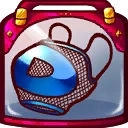 **Torn D-shirt**: Increases the damage of Explosive Clone against enemy Awesomenauts. *(Flavor: Dizzy wore this outfit on many tours across the universe.)*
- 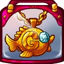 **Golden G Necklace**: After arming, explosive clones stick around for a while or until an enemy touches it. *(Flavor: Respect the G!)*
- 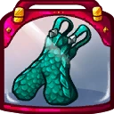 **Matching Glittery Dungarees**: Reduces the cooldown of the next explosive clone if an enemy 'naut is hit. *(Flavor: Glitters made of shattered Beryl Scales for some extra hot moves! Set of three.)*
- 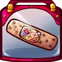 **Fake Band Aid**: Regain a dash after hitting someone with the explosion. *(Flavor: Not intended for medical purposes.)*

### Sassy Hop
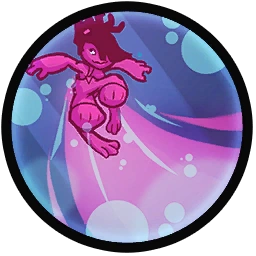

**Description:** Hop around with a sassy look.

- **Jumps**: 1
- **Jump Height**: 11

#### Upgrades
-  **Power Pills Turbo**: Increases maximum health. *(Flavor: Insert pill into rear end of digestive tract.)*
-  **Med-i'-can**: Automatically regenerate health. *(Flavor: Hello... anyone there? Please get me out of here!!!)*
- 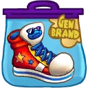 **One-time-only Exclusive Retro Edition Sneakers**: Increases speed and increases it further when no dashes are available. *(Flavor: Limited stock!)*
-  **Wraith Stone**: Heal additional health by killing critters. *(Flavor: Life sucks, death even more.)*
-  **Piggy Bank**: Gives 100 Solar. *(Flavor: This product was brought to you by Zork industries, exploiting Zurians since 2780.)*
-  **Baby Kuri Mammoth**: Reduces the effect of all debuffs *(Flavor: "LOOK!!! A FLYING ELEPHANT!")*

