# Froggy G

## Backstory
Straight out of the marsh pond ghettos of planet Ribbit IV comes the amphibious B.I.G., also known as Nate Frogg, but mostly known as Froggy G. Growing up in the baddest part of town, struggle and incarceration surrounded Froggy from an early age. Taking part in his first swim-by shootout as a tadpole, Froggy seemed destined for a life of crime and prison.

After a bloody gangwar with the neighbouring Toad-unit posse ended in a 5 year jail sentence, Froggy G vowed to end his gangsta ways. Instead, Froggy G started earning his keep as a beatboxing streetdancer and rapper, hoping to be picked up by a major record label. Unfortunately, his tracks titled "Pond Pimpin", "Froggin' dirty" and "Motherfrogger bounce!" didn't earn him much.

In order to make some money, and then make some mo', Froggy G became a hired gun. Combining his shoot-out experiences with lethal watery dance-moves and beatboxing techniques, Froggy G now spins and dashes across intergalactic battlefields, droppin foo's left and right with his fishgun, hoping to make some money to take his momma out of the hood.

## Base Stats
- **Health:**: 1200 (2112)
- **Movement Speed:**: 8.68
- **Attack Type:**: Short Range
- **Role:**: Assassin
- **Mobility:**: Swift

## Abilities & Upgrades
### Splash Dash
**Description:** Harnessing his aquatic payload, Froggy launches himself with incredible velocity towards his foes. Dashing straight through multiple targets he leaves them stunned!

- **Damage**: 280 (439.6)
- **Cooldown**: 7.5s
- **Distance**: 12.15
- **Stun Duration**: 0.7s
- **Self Stun Duration**: 0.2s

#### Upgrades
- 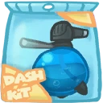 **Hydro Splash**: Increases base damage of splash dash. *(Flavor: ...for those moments when you feel out of the pond.)*
- 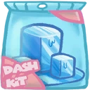 **Ice Cubes**: Adds a slowing effect to Splash Dash. *(Flavor: Head cool, game cool.)*
- 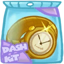 **Golden Watch**: Reduces cooldown on splash dash. *(Flavor: Manufactured in the Psy Universe. Clock will run backwards in any other universe.)*
- 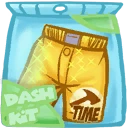 **Hammer Pants**: Adds a ground pound ability to splash dash which damages enemies. Aim at the ground to execute. *(Flavor: Disclaimer: Pants may or may not contain actual hammer.)*
- 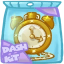 **Clock Necklace**: Gain a heal over time when hitting enemies with Splash Dash. *(Flavor: Manufactured in the Psy Universe. Clock will run backwards in any other universe.)*
- 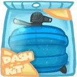 **Hydro Smash**: Increases the attack speed of your shots after landing splash dash. *(Flavor: WARNING: Water was used for plutonium cooling. Non-Zurians: DO NOT DRINK!)*

### Bolt .45 Fish-gun
**Description:** The Ribitian Spitfish (Spittious Maximus) is known for its ability to shoot jets of water near the speed of sound. Coaxed correctly, it makes for one lethal ally!

- **Damage**: 60 (94.2)
- **Attack Speed**: 133.3
- **Range**: 4.8

#### Upgrades
- 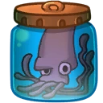 **Swirling Octopus Cartridges**: Increases range of shots. *(Flavor: Freshly caught from the flying seas on planet Okeanos.)*
- 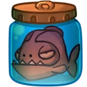 **Piranha Cartridges**: Increases base damage of shots. *(Flavor: May contain traces of human flesh.)*
-  **Mutant Worms**: Increases attack speed of shots. *(Flavor: Straight out of the pond (swamp planet Ribbit IV).)*
- 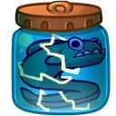 **Viridian Eel Cartridges**: Your shots will pierce through enemies, hitting additional enemies in their path. *(Flavor: Handle with care, use rubber gloves or Zurians.)*
- 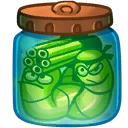 **Mutant Worms: Limited Ninja Edition**: The next shot deals extra base damage after hitting an enemy with Splash Dash or Tornado. Effect lasts for 5 seconds. *(Flavor: Ingredients: 7+7% Mutant Worm, 25% Minigun, 3% Bandana.)*
- 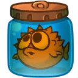 **Thorn Fish**: Adds two smaller bullets to your shot. *(Flavor: WARNING: Do not threaten the thornfish.)*

### Tornado
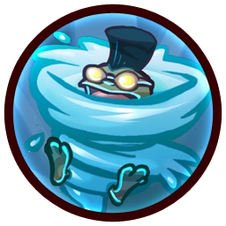

**Description:** Froggy G can transform himself into a whirling waterspout of pain! While spinning madly, he damages everyone foolish enough to come near him!

- **Damage**: 427 (670.39)
- **Attack Speed**: 300
- **Cooldown**: 11.6s
- **Duration**: 1.6s
- **Size**: 4
- **Movement**: 5.7

#### Upgrades
- 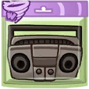 **Boom Box**: Increases base damage of tornado against enemies. *(Flavor: Antique piece of music apparatus.)*
- 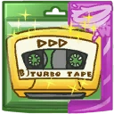 **Turbo Tape**: Increase movement speed during tornado. *(Flavor: Who thought ancient hiphop music would be popular amongst frogs?)*
- 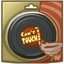 **Can't Touch This**: You gain a damage absorbing shield during tornado. *(Flavor: Newest hit from MC Green.)*
- 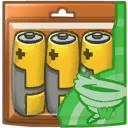 **Bio Fuel Cells**: Increases the duration of tornado and allows it to be cancelled earlier *(Flavor: WARNING: Close all your noses when opening package. Bovinian seal of quality.)*
- 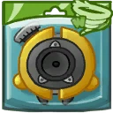 **Twister Tweeters**: Upon wearing off, the tornado effect will explode and deal damage to all nearby enemies. *(Flavor: Gives that extra boost for those small amphibious earholes.)*
- 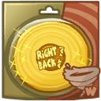 **Right Back At Ya!**: Reflects most enemy projectiles during tornado. *(Flavor: From the legendary Mud Deep.)*

### Frog Jump
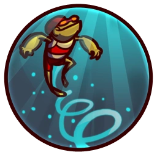

**Description:** Charging his waterpack, Froggy can leap higher than any frog has leaped before. The longer the charge, the higher the jump!

- **Jump Height**: 10
- **Jumps**: 1

#### Upgrades
-  **Power Pills Turbo**: Increases maximum health. *(Flavor: Insert pill into rear end of digestive tract.)*
- 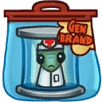 **Med-i'-can**: Automatically regenerate health. *(Flavor: Hello... anyone there? Please get me out of here!!!)*
- 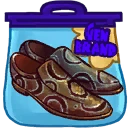 **Cobra Skin Loafers**: Increases movement speed and jump height. *(Flavor: Smooth like a mudlover.)*
-  **Wraith Stone**: Heal additional health by killing critters. *(Flavor: Life sucks, death even more.)*
-  **Piggy Bank**: Gives 100 Solar. *(Flavor: This product was brought to you by Zork industries, exploiting Zurians since 2780.)*
-  **Baby Kuri Mammoth**: Reduces the effect of all debuffs *(Flavor: "LOOK!!! A FLYING ELEPHANT!")*

