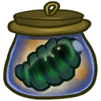
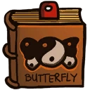
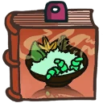
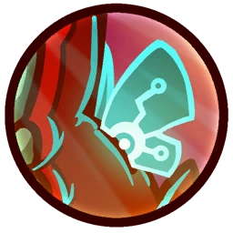

# Genji the Pollen Prophet

## Backstory
Genji is one of the last of his species: an Entin. The Entin are rapidly reproducing caterpillars with a high libido and no sense of limitation. Any planet the Entin visit, they leave ravaged in their wake. They have been labeled a pest in need of extermination for eating entire continents worth of crops and terrorizing the local populace with late night techno raves. As a result, their kind has been bugsprayed to the brink of extinction.

Trying to better their ways, the remaining Entin have created the Order of Popae Monks on the fungi moon Pulvan. Fasting heavily they devote everything to their beloved deity: The Grand Space Butterfly!

Genji sinned with snacks and dirty literature however, and after repeated solitary cocoonfinements failed to make him better his ways, he was sent out on an emergency soul-cleansing pilgrimage through the galaxy.

Joining the Awesomenauts to cut back on the traveling costs of his journey, Genji has been the scourge of many a ship's pantry and is rumored to be the main reason some of the smaller more edible-looking 'naut recruits have gone missing.

## Base Stats
- **Health:**: 1250 (2200)
- **Movement Speed:**: 8.02
- **Attack Type:**: Medium Range
- **Role:**: Support
- **Mobility:**: Tactical

## Abilities & Upgrades
### Cocoon
**Description:** Entin silk is not only very fashionble in some parts of the galaxy, but it's also one of the most sturdy materials around! Gurgling and spitting out a ball of the webbed silk, Genji can envelop his enemies in a cocoon, making them unable to attack or be attack for a short period of time.

- **Cooldown**: 10s
- **Duration**: 2
- **Range**: 6

#### Upgrades
-  **Butterfly Nebula Dust**: Adds a slowing effect to cocoon *(Flavor: The sacred glowing dust is only available to monks who have completed the trial of the deep sleep.)*
-  **The Last Pieridae Transformae**: Coccooning enemies spawns a droid. Enables coccoon to isntantly kill enemy droids. *(Flavor: This rare butterfly has been hunted to almost extinction for its transforming capabilities.)*
-  **Jagra Eggs**: Adds a lifestealing effect to cocoon *(Flavor: Jagra worms dwell on the fungus moon Pulvan. They can produce over 10.000 eggs a day. A delicacy under catterpillars.)*
-  **Misfortune Cookie**: Makes cocoon reduce the health of the target *(Flavor: This batch of flawed fortune cookies contains offensive and vulgar language.)*
-  **Prefab Cocoons**: Lets the cocoon explode violently, dealing damage to nearby enemies *(Flavor: Easy to use folding cocoon for canopy camping.)*
-  **Moon Nectar**: Makes cocooned enemies drop healing nectar *(Flavor: Highly addictive substance also known as "nectar of the gods". Prohibited in many starsystems.)*

### Butterfly Shot
**Description:** Carrying the staff of the Popae office, Genji can shoot ethereal butterflies from its tip, sending them out in a flurry and making them return to cause another hit on their way back!

- **Damage**: 65 (102.05)
- **Attack Speed**: 75
- **Range**: 7.4

#### Upgrades
-  **Storm Drum**: Adds a storm effect to butterfly shot *(Flavor: Beat that drum like it owes you money!)*
-  **Plastic Praying Beads**: Increases base damage of butterfly shot *(Flavor: Universal multi-religion praying beads.)*
-  **Glow Bracelets**: Increases attack speed of butterfly shot and reduces the cooldown of storm drum if the upgrade has been purchased. *(Flavor: Rave all night long!)*
-  **Caterpillar King Statue**: Makes butterfly shot heal allied Awesomenauts based on a percentage of its damage value. *(Flavor: Small statue of Julnas the hungry.)*
-  **Space-Hippo Manure Incense**: Adds a damage over time effect to butterfly shot *(Flavor: Burns slowly not advisable to species with nostrils.)*
-  **Wool Shawl**: Increases the range of butterfly shot *(Flavor: Keeps your throat and silk glands nice and warm.)*

### Monarch Blessing

**Description:** Offering a prayer to the great and allmighty Space-Butterfly, Genji receives such a powerful blessing that it spills from his body to every nearby ally, wrapping them in a glowing blanket of protective goodness!

- **Shield**: 20%
- **Cooldown**: 14s
- **Duration**: 3s
- **Range**: 8

#### Upgrades
-  **Hidden Leaves**: Increases damage absorption of monarch blessing *(Flavor: "Popae 1:23 Staring into the vastness of space the great papillon realized that it was not him looking at the universe, it was the universe looking at him.")*
-  **Gettin' Out of Da Hood**: Adds an effect to monarch blessing that increases the speed of teammates *(Flavor: It's signed by Froggy G. himself!)*
-  **The Cat Pillar**: Adds a healing effect to monarch blessing *(Flavor: New edition: Carmen covered in moonnectar tell us her deepest secrets.)*
-  **Bronco Yeast**: Reduce incoming damage by an additional flat amount *(Flavor: Free popcorn car inside!)*
-  **Kremzon Calendar**: Reduces the cooldown of monarch blessing *(Flavor: This ancient cyclus calendar has an end date of March 2013.)*
-  **Spiritual Cooking**: Monarch Blessing now also increases the damage of affected allies.. *(Flavor: Nutricious almost vegan recipes for very hungry caterpillars.)*

### Flutter Jump

**Description:** Genji, as the chosen avatar to represent the Space-Butterfly in battle, is granted spectral wings to extend his jump for those crucial seconds that could mean the difference between life or a one-way ticket to the allmighty Bugzapper in the sky.

- **Jump Height**: 7.2
- **Additional Jump Height**: 4
- **Jumps**: 3 (Hover)
- **Max Hover Duration**: 1s

#### Upgrades
-  **Power Pills Turbo**: Increases maximum health. *(Flavor: Insert pill into rear end of digestive tract.)*
-  **Med-i'-can**: Automatically regenerate health. *(Flavor: Hello... anyone there? Please get me out of here!!!)*
-  **Space Air Max**: Increases movement speed. *(Flavor: Fashionable and Fast.)*
-  **Barrier Magazine**: Provides a damage absorbing shield. *(Flavor: Free personal shield with this month's edition of The Barrier! Read all about Zork's imperium.)*
-  **Piggy Bank**: Gives 100 Solar. *(Flavor: This product was brought to you by Zork industries, exploiting Zurians since 2780.)*
-  **Baby Kuri Mammoth**: Reduces the effect of all debuffs *(Flavor: "LOOK!!! A FLYING ELEPHANT!")*

