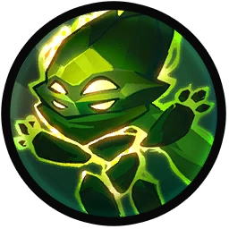
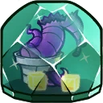
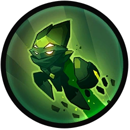

# Ix the Interloper

## Backstory
Ix was a courageous Luxuxi spirit who roamed the crystal planet of Luxor. Carefree and totally zenned out, the infinite crystal reflections were all the family and friends Ix needed. But then the Disaster struck. Intergalactic megacorporations started to drill Luxor’s dark side on a massive scale, as it housed unusually energetic crystals.

At first Ix tried to ‘discourage’ the miners in various ways. Most annoying was when he swapped the sugar for crystals, causing several aliens to break their teeth and having to stop using sugar in their coffee altogether. Despite the meddling of this ethereal interloper however, the miners kept drilling with dogged determination.

In a flash of self-righteous outrage over this, Ix merged its life force with some high-energy crystals. This unprecedented merging of forces finally gave Ix a corporeal form. Harnessing the energies of this new crystalline body, Ix razed the miner’s facilities to the ground. The destruction of their Zork industries porta potties turned out to be the last straw, as the miners finally gave up and left.

Feeling particularly good about himself after this deed, Ix decided to keep harassing intergalactic mining operations. After a while Blabl Zork got wind of this raw talent for drill destruction. He then convinced Ix to join the Awesomenauts by presenting the mercenary team as an environmental force for good.

## Base Stats
- **Health:**: 1250 (2200)
- **Movement Speed:**: 8
- **Attack Type:**: Medium Range
- **Role:**: Support
- **Mobility:**: Swift

## Abilities & Upgrades
### Psionic Bond / Displace
**Description:** Throw a crystal against another naut to create a bond, healing allies or damaging enemies upon connection. While bonded, use the skill again to switch places with the naut. The bond breaks when the line reaches its limit, when it collides with a turret/team wall or when it expires.

- **Heal**: 160 (251.2)
- **Heal over time**: 75 (117.75)
- **Damage**: 160 (251.2)
- **Damage per second**: 65 (102.05)
- **Duration**: 3s
- **Cooldown**: 8s
- **Cooldown (Displace)**: 12s

#### Upgrades
-  **Crystal Leaves**: Increases the base healing and base damage of psionic bond. *(Flavor: These razor sharp leaves used to grow on Luxor's Crystallite Trees.)*
-  **Vegan Sewer Pizza**: You and your ally gain a shield after displacing that reduces incoming damage. *(Flavor: Before buying this, be sure to tell everyone you're eating a VEGAN pizza.)*
-  **Mammoth Hair Scarf**: Adds a speed bonus to allies and a slow to enemies during psionic bonds *(Flavor: Knitted with Luxor crystal knitting needles. It's very hip.)*
-  **Overexposed Nature Photo**: Applies part of the healing given to allies to Ix as well.. *(Flavor: Memories...)*
-  **Tree Hugger**: Makes enemies weaker and allies stronger against Awesomenauts during psionic bond. *(Flavor: These long armed creatures are covered in nasty glass splinters.)*
-  **Root Tea**: Increases your Radiate attack speed when the bond ends. *(Flavor: Feel the warm radiation in your stomach.)*

### Radiate
**Description:** Shoot a crystalline bolt and short ranged scattering crystals.

- **Bolt damage**: 60 (94.2)
- **Scatter damage**: 12 (18.84)
- **Attacks per second**: 2.2
- **Scatter amount**: 3
- **Bolt range**: 6.6
- **Scatter range**: 2.9

#### Upgrades
-  **Personality Crystal**: Increases the range of radiate bolt and scatter by 35%. *(Flavor: Instructions: hold above head for perfect mind control.)*
-  **Crystal Crunch**: Adds a lifesteal effect to Radiate bolt. *(Flavor: Disclaimer: It's pretty bad for your teeth.)*
-  **Time-Travelled Diamond**: Increases the base damage of Radiate bolt. *(Flavor: Discovered by an old scientist who took some coal through his time machine.)*
-  **Shrubbery Gems**: Increases the amount of scattering crystals. *(Flavor: These gems grow in the wilderness used as currency on many planets.)*
-  **Luxor's Purest Crystal**: Increases the damage of Radiate bolt while having an active bond. *(Flavor: The unfathomable power of the heart lies within.)*
-  **Prismatic Moonstone Dust**: Leave a dust trail every third radiate bolt shot. *(Flavor: WARNING: Don't breath this!)*

### Refract

**Description:** Disperse into energized crystals to become impervious to any damage and crowd control effects.

- **Duration**: 0.8s
- **Cooldown**: 10s
- **Invulnerable**: Yes
- **Crowd control immunity**: Yes

#### Upgrades
-  **Diamond Pickaxe**: Knocks back and stuns enemies at the end of Refract. *(Flavor: Perfect for cubical excavation. Property of Psystone mining co.)*
-  **Shredded Mining Permit**: Enemies that surround you during Refract will receive amplified damage. *(Flavor: You shall not pass!)*
-  **Broken Solar Tree**: Adds a self-healing effect while using Refract. *(Flavor: These trees almost went extinct in 2014, but made a strong return in the following years.)*
-  **Salt Miner**: Creates spinning flying rocks around Ix that damage enemies. *(Flavor: This little fellow is always in a bad mood.)*
-  **Zork Industries Porta Potty**: Receive a speed boost after using Refract. *(Flavor: "Out of service")*
-  **Robot Wrecking Ball**: Halves the cooldown of Refract after a threshold of damage is blocked. *(Flavor: Part of a dismantled LUX mining robot.)*

### Crystallized Ascension

**Description:** Ascend into the air and stay afloat by using the crystal's powers.

- **Jumps**: 2
- **Jump height**: 7.8
- **Hover time**: 2s
- **Hover extra height**: 12

#### Upgrades
-  **Power Pills Turbo**: Increases maximum health. *(Flavor: Insert pill into rear end of digestive tract.)*
-  **Med-i'-can**: Automatically regenerate health. *(Flavor: Hello... anyone there? Please get me out of here!!!)*
-  **Space Air Max**: Increases movement speed. *(Flavor: Fashionable and Fast.)*
-  **Wraith Stone**: Heal additional health by killing critters. *(Flavor: Life sucks, death even more.)*
-  **Piggy Bank**: Gives 100 Solar. *(Flavor: This product was brought to you by Zork industries, exploiting Zurians since 2780.)*
-  **Baby Kuri Mammoth**: Reduces the effect of all debuffs *(Flavor: "LOOK!!! A FLYING ELEPHANT!")*

