# Jimmy And The Lux5000

## Backstory
Jimmy, Amy and the LUX5000 Toddletron are a mighty team. They have won numerous fights in robobrawls held in the many arenas and slums of Circuit City on Calias. The twins love to crush enemies and cause mayhem with the Toddletron's metal wrecking balls, which are basically two big rattles from their perspective. After each won fight Jimmy and Amy share a bottle of the finest Bovinian milk and watch cartoons before nap-time.

Being big fans of the Awesomenauts they skipped the seasonal diaper league tournament and joined the team for some grown up fights.

## Base Stats
- **Health:**: 1550 (2728)
- **Movement Speed:**: 8
- **Attack Type:**: Melee
- **Role:**: Fighter
- **Mobility:**: Tactical

## Abilities & Upgrades
### LUX Charge
**Description:** Start charging into one direction to knock enemies back and deal damage per hit. Your movement speed increases and you receive a damage absorbing shield.

- **Damage Per Hit**: 40 (62.8)
- **Movement Speed**: +62%
- **Cooldown**: 9.5s
- **Shield**: 25%
- **Duration**: 2s

#### Upgrades
- 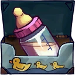 **Bovinian Breastmilk**: Increases the shield of LUX Charge by 10%. *(Flavor: Chunkiest of all Bovinian's milk products. It's produced in the second spring on Daisy V.)*
- 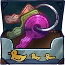 **Plutonium LUX Keys**: Increases the speed of LUX charge, but reduces its duration. *(Flavor: The keys have some distinct bite marks)*
- 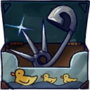 **Danger Pins**: Unleash a damaging burst in front of you at the end of charge. *(Flavor: This batch of safety pins is not suited for retail.)*
- 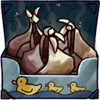 **Dirty Diapers**: Reduces the cooldown of LUX Charge. *(Flavor: Feel the explosion in your pants!)*
- 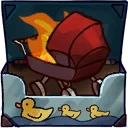 **Flaming Stroller**: Leave a trail of flames when using LUX Charge on the ground that deals damage over time. *(Flavor: Get on the highway to hell!)*
- 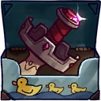 **Castle Icecream Flavoured Pacifier**: Convert all damage that was shielded during LUX Charge into health at the end. *(Flavor: Created by the Gelati house of the Frozen Teat.)*

### Rattle Smash
**Description:** Jimmy smashes the LUX5000's rattle arms for damage. Each third smash unleashes a rattle area effect that deals an initial burst and three after bursts.

- **Damage**: 105 (164.85)
- **Attacks per second**: 1.5
- **Third smash damage**: 150 (235.5)
- **After bursts damage**: 40 (62.8)

#### Upgrades
- 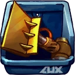 **Flip Arm Add-On**: Increases the base damage of rattle smash. *(Flavor: Flip your enemies over with this giant shovel.)*
- 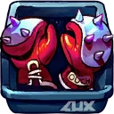 **Steel Boxing Gloves**: The next rattle after using a charge or barrage will trigger a damage absorbing shield. *(Flavor: One size fits all, comes with magnetic arm connectors.)*
- 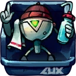 **Nano Repair Bots**: Adds a lifesteal effect to the Rattle wave. *(Flavor: These small bots can quickly fix any kind of damage your fighting bot has endured.)*
- 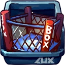 **Pop Out Cage**: Increases the size of rattle wave. *(Flavor: This steel fighting cage easily unfolds in the blink of an eye.)*
- 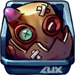 **Skullplate Trophy**: Increases your attack speed when below 75% health. *(Flavor: The decapitated head of one of history's greatest robo fighters: Sir Punchalot.)*
- 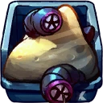 **Fresh Sandpit Sand**: Creates a small earthquake that moves forward when using rattle smash on the ground, dealing damage to everyone in its path. *(Flavor: WARNING: CHECK OUT FOR GIANT KILLER WORMS BEFORE FIRST USE!  Imported from Sorona.)*

### Missile Barrage
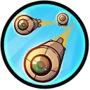

**Description:** Go into the missile barrage mode and unleash long-ranged rockets unto your enemies, dealing damage. Press the button again to cancel the barrage.

- **Damage**: 170 (266.9)
- **Missiles**: 4
- **Cooldown**: 10s
- **Duration**: 1.4s

#### Upgrades
- 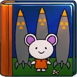 **Adventures In Rocketland**: Increases base damage of missile barrage. *(Flavor: "Explore a wonderous and explosive world together with your favorite hero: Micey".)*
- 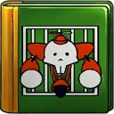 **Baby's First Cage Fight**: Reduces the cooldown of barrage by 2s. *(Flavor: "Micey goes on his first fight with his big robotic LUX armor.")*
- 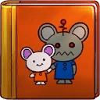 **Robo Daddy And Robo Mommy**: Adds a damage reducing shield to barrage. *(Flavor: "Together with his robotic parents, Micey visits a robo wrestling manager.")*
- 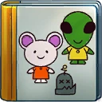 **The Very Hungry Zurian**: Increases the damage and size of the last missile barrage rocket. *(Flavor: "Micey finds a hungry zurian in the garden, munching on his robotic friends".)*
- 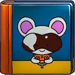 **Micey The Mech-Pilot**: Adds a knockbacking burst at the end of Missile Barrage. *(Flavor: The book has a message written on the first page: "To my beloved children: Jimmy and Amy. May you become the best robo fighters in the galaxy. Love Dad.")*
- 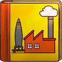 **Micey And The Missile Factory**: Adds two weaker missiles to each missile barrage shot. *(Flavor: "After buying a salvo pack, Micey wins a trip to the missile factory on planet Russia.)*

### Stroller-Jet Boost Jump
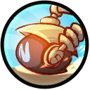

**Description:** Stroller-jet boost jump.

- **Movement speed**: 8
- **Jump Height**: 8.4
- **Jump Duration**: 0.5s
- **Jumps**: 1

#### Upgrades
-  **Power Pills Turbo**: Increases maximum health. *(Flavor: Insert pill into rear end of digestive tract.)*
-  **Med-i'-can**: Automatically regenerate health. *(Flavor: Hello... anyone there? Please get me out of here!!!)*
-  **Space Air Max**: Increases movement speed. *(Flavor: Fashionable and Fast.)*
-  **Baby Kuri Mammoth**: Reduces the effect of all debuffs *(Flavor: "LOOK!!! A FLYING ELEPHANT!")*
-  **Piggy Bank**: Gives 100 Solar. *(Flavor: This product was brought to you by Zork industries, exploiting Zurians since 2780.)*
- 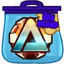 **Overdrive Gear**: Reduces the cooldown of all your skills. *(Flavor: Let's put it into Overdrive!)*

