# Ksenia

## Backstory
Ksenia was once the best hair dresser in the galaxy. Year after year she won the renowned Venus hair style tournament with her outrageous hairstyle creations. She enjoyed the great fame that came with the status as master hair dresser, unfortunately her father Vladimir Pewchenko a rich weapons manufacturer on planet Russia (formerly known as the moon) had other plans for her.

With a virtual reality hood dryer showing her a hair cutting simulator, he made her into one of the best assassins in the galaxy. While thinking she was cutting hair, in reality she was cutting down Pewchencko's enemies.

With no competition left her father assigned her to the Awesomenauts, where she still wears the VR hood. Many suspect that Ksenia is actually just watching soap opera's on her hood and perfectly knows what she is doing.

## Base Stats
- **Health:**: 1250 (2200)
- **Movement Speed:**: 8.46
- **Attack Type:**: Ranged
- **Role:**: Assassin
- **Mobility:**: Swift

## Abilities & Upgrades
### Scissors Throw
**Description:** Thow fast flying scissors that deal bonus damage on enemy Awesomenauts based on their maximum health. Scissors can also be picked up if they hit terrain.

- **Damage**: 100 (157)
- **Bonus damage**: 4% of max HP
- **Maximum Scissors**: 4
- **Attack Speed**: 240
- **Recharge time**: 3s
- **Range**: 11.2
- **Cooldown**: 0.33s

#### Upgrades
- 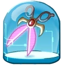 **Laser Bladed Scissors**: Increases the base damage of scissors. *(Flavor: WARNING: These blades will cut anything, so watch your limbs!)*
- 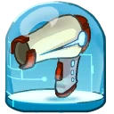 **Abrasive Hair Blaster**: Killing creeps and droids will yield scissors. *(Flavor: For heavy and thick alien hair that just won't dry with a normal hair dryer.)*
- 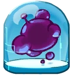 **Skroggle Hair Gel**: Increases the range of scissors throw. *(Flavor: This purple sticky stuff is the best gel in the galaxy.)*
- 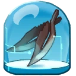 **Steel Feathers**: Each hit with your scissors throw will reduce the cooldown of vanish. *(Flavor: Note from Jenny: I found a whole bunch of them in the cargo bay. I put them in my hair, they look lovely!)*
- 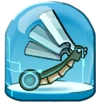 **Occam's Razor**: Enemies hit by scissors throw are slowed. *(Flavor: Keep it simple, more blades is better.)*
-  **Interstellar Hair Trophy**: Adds a knockback effect to thrown scissors. *(Flavor: This trophy is reserved for Ksenia, because she wins it every year. Bob Payot - Official judge of the galactic hair style competition.)*

### Cut and Trim
**Description:** Give your opponents a haircut with a combo of 3 cuts that increase in damage with every hit.

- **Damage**: 64 (100.48) | 88 (138.16) | 159 (249.63)
- **Attack Speed**: 150
- **Range**: 3.8
- **Combo Timeout**: 2s

#### Upgrades
- 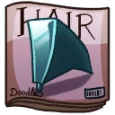 **Steel Mohawk**: Increases base damage of cut and trim against enemy awesomenauts. *(Flavor: Look sharp as a blade!)*
- 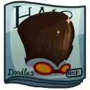 **Frog Afro**: When there are less than two enemy Awesomenauts near, your cut and trim will deal more base damage. *(Flavor: This wet afro style is very popular among young folks.)*
- 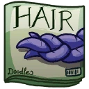 **Braided Tentacles**: Adds lifesteal to your cut and trim attacks. *(Flavor: Now with a new better technique to keep those tentacles in place!)*
- 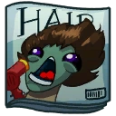 **Fury Blowout**: Every third hit with cut and trim will let you gain a scissors. *(Flavor: Love the wind in your face? Then this blowout is for you!)*
- 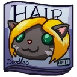 **Bob Cat**: Every third hit with cut and trim will increase the damage of the next thrown scissors. *(Flavor: Note from management: what is this bob cat doing here? Jenny please remove it and clean up that dinosaur pee in aisle #1 while you are at it!)*
- 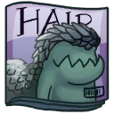 **Scaled Mullet**: Killing an enemy or neutral unit will increase your movement speed. *(Flavor: A good hairstyle for underwater and prison.)*

### Vanish
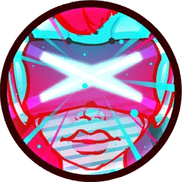

**Description:** Roll into stealth for a short time and silence your opponents when you break stealth with an attack.

- **Stealth Time**: 4s
- **Silence Duration**: 1s
- **Cooldown**: 13s

#### Upgrades
- 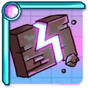 **Spare 4th Wall**: Increases the stealth duration of vanish. *(Flavor: When you accidently break your 4th wall, this spare make sure no one notices you.)*
- 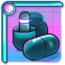 **Deja Vu Blocker**: Increases the silence duration on attacks after using vanish. *(Flavor: When?.. Who?.. What black cat?)*
- 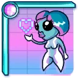 **Virtual Girl**: Makes you invincible during the roll into stealth and removes body collision while in stealth. *(Flavor: The perfect guide for your virtual adventures!)*
- 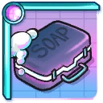 **The Gorge and the Beautiful**: Reduces your knife recharge time while being stealthed. *(Flavor: All 12 hypnotizing television seasons in one box. A story about a beautiful Namala girl who falls in love with one nasty Gorge gobbler.)*
- 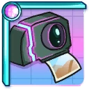 **Remembrance Machine**: Leaves a trail of caltrops when using vanish. *(Flavor: Ahh.. blue skies on Mars. How ridiculous they are green.)*
- 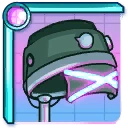 **Virtual Reality Hairdryer**: Increases the range of the opening roll of vanish. Also increases the length of your caltrop trail if you bought the upgrade. *(Flavor: Watch your favorite television shows and get your hair did at the same time.)*

### Acrobatic Double Jump
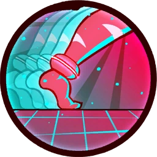

**Description:** Double Jump. Press the button to jump again.

- **Jump Height**: 5.6
- **Additional Jump Height**: 5.6
- **Jumps**: 2

#### Upgrades
-  **Power Pills Turbo**: Increases maximum health. *(Flavor: Insert pill into rear end of digestive tract.)*
-  **Med-i'-can**: Automatically regenerate health. *(Flavor: Hello... anyone there? Please get me out of here!!!)*
-  **Space Air Max**: Increases movement speed. *(Flavor: Fashionable and Fast.)*
-  **Wraith Stone**: Heal additional health by killing critters. *(Flavor: Life sucks, death even more.)*
-  **Piggy Bank**: Gives 100 Solar. *(Flavor: This product was brought to you by Zork industries, exploiting Zurians since 2780.)*
-  **Baby Kuri Mammoth**: Reduces the effect of all debuffs *(Flavor: "LOOK!!! A FLYING ELEPHANT!")*

