# Leon Chameleon

## Backstory
Leon's life is a life of crime, women, and borrowing without returning. He lost his arm in a unfortunate jeu de boules incident and spends most of his time smoothly escaping debt collectors. He found himself breaking into the bedroom of the prime minister's wife, while looking for the wine cellar.

He knew no amount of charm could save him this time and planned his escape, which was eventually delayed because he refused to escape in anything but a space yacht.

Leon joined the Awesomenauts for some quick cash, spending it on beautiful women and exquisite meals. In combat, he puts his natural reptile abilities to some good use and slices up his enemies with great precision. Combat is a form of art for this green gentleman.

## Base Stats
- **Health:**: 1300 (2288)
- **Movement Speed:**: 8.3
- **Attack Type:**: Melee
- **Role:**: Assassin
- **Mobility:**: Swift

## Abilities & Upgrades
### Tongue Snatch
**Description:** Leon takes French kissing a bit too serious, slapping his tongue in your face, grabbing you by the throat and pulling you towards him in one flying swing. Chicks go wild for it!

- **Damage**: 150 (235.5)x2
- **Cooldown**: 7s
- **Range**: 6.6

#### Upgrades
- 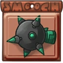 **Spiked Tongue Piercing**: Increases base damage of tongue snatch *(Flavor: Get kinky with this spiky accessoire.)*
- 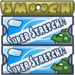 **Tongue Stretcher**: Increases range of tongue snatch. *(Flavor: Instructions: Apply sticky tape to tip of tongue, then pull and glue to the back of your head.)*
- 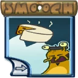 **Cheese & Garlic Mints**: Adds a silencing effect to tongue snatch. *(Flavor: Reek like a real human.)*
- 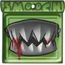 **Steel False Teeth**: Adds a shield upon successfully pulling an enemy Awesomenaut. *(Flavor: Now you can eat everything, even your car!)*
- 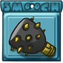 **Morning Star Piercing**: Increases base damage of tongue snatch against enemy Awesomenauts. *(Flavor: Newest in our line of killer jewelry.)*
- 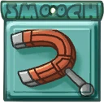 **Spectacles Magnet Piercing**: Adds a blinding effect to your tongue snatch. *(Flavor: I bet they won't see this coming.)*

### Slash
**Description:** Our tailed rogue loves to stab people in the back, and there is one thing you need for that, a razorsharp lasersword. Also a great tool for making ratatouille.

- **Damage**: 95 (149.15)
- **Attack Speed**: 136.4
- **Range**: 3.2

#### Upgrades
- 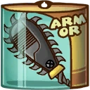 **Chainsaw Addon**: Increases the damage of slash against enemy Awesomenauts. *(Flavor: In the French cuisine, you need a good knife.)*
- 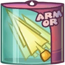 **Sharp Edged Razors**: Increases the attack speed of slash. *(Flavor: Cut any vegetable or fiend in a blink of an eye.)*
- 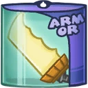 **Backstab Blade**: Adds an extra amount of damage when striking the back of a target with slash. *(Flavor: The backside of the blade is extra sharp.)*
- 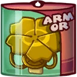 **Clover of Honour**: Increases the damage of your second hit. *(Flavor: Awarded to the heroes of the first AI war or whoever has 200 solar.)*
- 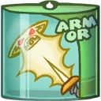 **Hungry Sword**: Adds a lifesteal effect to slash. *(Flavor: Because war is give and take.)*
- 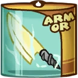 **Electrifier**: Adds a slowing effect to slash. *(Flavor: Batteries not included.)*

### Cloaking Skin
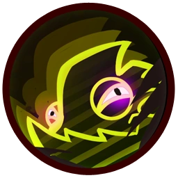

**Description:** As a great tactician, Leon knows the element of surprise can be very useful in combat. Using his natural stealth ability in combination with robotic dummies, he can fool anyone on the battlefield.

- **Cooldown**: 10s
- **Duration**: 8s
- **Dummy Health**: 400 (704)
- **Dummy Lifespan**: 18s
- **Damage**: 50%
- **Dummy Attack**: Yes

#### Upgrades
- 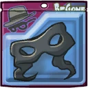 **Surprise Party Mask**: Adds extra damage to the decloaking first slash. *(Flavor: SURPRISE! Happy stab-you-in-the-neck-day!)*
- 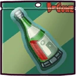 **Pinot Noir**: You will regenerate health when you're cloaked. *(Flavor: Fruity, but with a horrible metallic aftertaste.)*
- 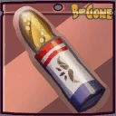 **French Baguette**: Increases movement speed while in stealth. *(Flavor: Bread sword fight!!!)*
- 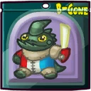 **Basic AI Chip**: Makes your replica dummy walk around. *(Flavor: It's alive! It's ALIVE!)*
- 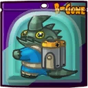 **Extra Battery Pack**: Increases the lifespan and health of the replica dummy. *(Flavor: For those long lonesome nights, when you need a friend.)*
- 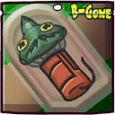 **Blow Up Doll**: Makes your replica dummy explode on death, damaging enemy Awesomenauts. *(Flavor: It's dead! It's DEAD!)*

### Reptile Jump
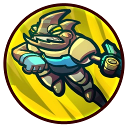

**Description:** Being a reptile has its advantages. Strong leg muscles give Leon the ability to leap high into the air. His tail keeps him stable while mid-air, giving him an agile advantage over his enemies.

- **Jump Height**: 9.2
- **Jumps**: 1

#### Upgrades
-  **Power Pills Turbo**: Increases maximum health. *(Flavor: Insert pill into rear end of digestive tract.)*
-  **Med-i'-can**: Automatically regenerate health. *(Flavor: Hello... anyone there? Please get me out of here!!!)*
-  **Space Air Max**: Increases movement speed. *(Flavor: Fashionable and Fast.)*
-  **Wraith Stone**: Heal additional health by killing critters. *(Flavor: Life sucks, death even more.)*
-  **Piggy Bank**: Gives 100 Solar. *(Flavor: This product was brought to you by Zork industries, exploiting Zurians since 2780.)*
-  **Baby Kuri Mammoth**: Reduces the effect of all debuffs *(Flavor: "LOOK!!! A FLYING ELEPHANT!")*

