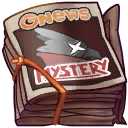
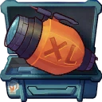
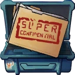
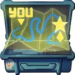
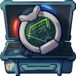
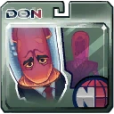
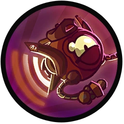

# Max Focus

## Backstory
Originally a security camera who was accidentally turned sentient by Professor M. Yoolip, Max quickly found a job with the Channel 7 Galactic News when that professor somehow slipped out of time. For years, Max happily caught the juiciest news from the most compromising angles.

When the war between the Ones and Zeroes broke out, Max developed a real taste for war reporting. Craving even bigger explosions and spectacle, Max decided it was time to start making the news himself and joined the Awesomenauts.

## Base Stats
- **Health:**: 1250 (2200)
- **Movement Speed:**: 8.1
- **Attack Type:**: Long Range
- **Role:**: Harasser
- **Mobility:**: Aerial

## Abilities & Upgrades
### Scene Illumination
**Description:** Light up the scene with a deadly stream of lights, that also deal damage.

- **Attack Speed**: 600
- **Damage**: 50 (78.5)
- **Duration**: 1.5s
- **Cooldown**: 10s

#### Upgrades
-  **From Pond to Podium: Nate Frogg Exposed**: Increases the speed and range of Scene Illumination projectiles. *(Flavor: "This goes out to all the Froggs I've known since I was a tadpole!")*
-  **Intergalactic Police's Dirty Secret!**: Shoot two projectiles instead of one at a time. Projectiles deal less damage. *(Flavor: Apparently this secret does its dirty work using nothing but an ancient laserbow.)*
-  **UFO Spotted At Starstorm Station!**: Increases Max's movement speed during Scene Illumination. *(Flavor: "Those lights moved way too erratic to be a starship." - anonymous source.)*
-  **Ted McPain's Secret Love Life Caught on Film!**: Increases the duration of Scene Illumination. *(Flavor: Exposing the truth behind the missing pants.)*
-  **Sadak Mysteries: Paranormal Activity?**: Increases the damage of Scene Illumination. *(Flavor: "She just vanished when this girl-shaped hole appeared. You can't explain that.")*
-  **Brutalities of the Kraken Unveiled!**: Make the last projectile of Scene Illumination deal extra damage. *(Flavor: What the prestigious naval family didn't want you to see!)*

### Flood Light
**Description:** Briefly overexpose your scene with a nuclear powered floodlight.

- **Attack Speed**: 120
- **Damage**: 90 (141.3)
- **Range**: 4.4
- **Spread**: 50°

#### Upgrades
-  **Hidden Microphone**: Increases the attack speed of Flood Light. *(Flavor: You see this microphone? AAaaaaaand it's gone.)*
-  **Flying Camera**: Enables flying backwards and removes the slowdown while firing Flood Light. *(Flavor: Guaranteed to be free from rebellious AI since the devastating drone swarms of 3268!)*
-  **10¹⁰x Zoom Telelens**: Increases the range of Flood Light. *(Flavor: With this lens you can catch Lady Haha's new pimple from the other side of the planet.)*
-  **Incriminating Dirt**: Increases the damage of Flood Light. *(Flavor: "We got dirt on everyone! Got 'em covered in dirt!")*
-  **Addresses of the Stars!**: Increases the damage of Flood Light when not firing for two seconds. *(Flavor: They all live down the street, basically.)*
-  **Galactic Police Scanner**: Deal more damage by adding spreading projectiles to Flood Light. *(Flavor: "2-40 going down at our bottom turret! All units, respond!")*

### Slow-mo Shot

**Description:** Nail those slow-motion shots by launching an area that slows time itself.

- **Slowdown**: 50%
- **Duration**: 2.2s
- **Size**: 6.8
- **Speed**: 7
- **Cooldown**: 12s

#### Upgrades
-  **Katy Kork from The Day Show**: Increases the slowing effect of Slow-mo Shot. *(Flavor: Known as "Okeanos Sweetheart")*
-  **Rob Bourgogne from Channel 44 News**: Gain health for every enemy slowed. *(Flavor: Rob's massive endowment is actually an amazing optical illusion.)*
-  **Hairy King from Hairy King's Life**: Increases the size of Slow-mo Shot. *(Flavor: From Zurian to Kremzon, everyone wants to be interviewed by this Kuri.)*
-  **Walm Krunkbite from See-Bees News**: Increases the lifetime of Slow-mo Shot. *(Flavor: Named the "Most trusted Omean on Okeanos", though that's not saying much.)*
-  **Don Steward from The Frequent Show**: Reduces the cooldown of Slow-mo Shot. *(Flavor: Once leveled a city by raising a "Rally for Reasonability".)*
-  **Pete Jennirks from Galactic News**: Decreases the speed of Slow-mo Shot. *(Flavor: When the war between the Ones and Zeroes first started, Peter was there.)*

### Single-lens Reflex Propulsion

**Description:** Fly everywhere to catch the perfect angles.

- **Flying**: Yes

#### Upgrades
-  **Power Pills Turbo**: Increases maximum health. *(Flavor: Insert pill into rear end of digestive tract.)*
-  **Med-i'-can**: Automatically regenerate health. *(Flavor: Hello... anyone there? Please get me out of here!!!)*
-  **Space Air Max**: Increases movement speed. *(Flavor: Fashionable and Fast.)*
-  **Baby Kuri Mammoth**: Reduces the effect of all debuffs *(Flavor: "LOOK!!! A FLYING ELEPHANT!")*
-  **Piggy Bank**: Gives 100 Solar. *(Flavor: This product was brought to you by Zork industries, exploiting Zurians since 2780.)*
-  **Overdrive Gear**: Reduces the cooldown of all your skills. *(Flavor: Let's put it into Overdrive!)*

