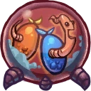
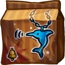
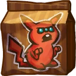
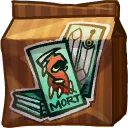
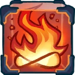
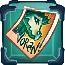
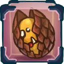
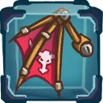
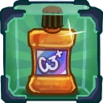
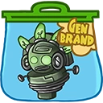

# Nibbs

## Backstory
Nibbs is a dragon warrior in service to the Sisterhood of Coba. This demonic group was bound to the Omicron dimension who, as soon as the Starstorm ripped a hole in the continuum, started an invasion of conquest.

Right after going through the portal, Nibbs's ship landed on the space station. Scouting around, she mistook Gnaw's tail for a juicy piece of fruit. After he was bitten, the startled Gnaw led her right back to the Awesomenauts who managed to convince her to stay with a wide variety of exotic treats.

## Base Stats
- **Health:**: 1250 (2200)
- **Movement Speed:**: 7.4
- **Attack Type:**: Melee
- **Role:**: Assassin
- **Mobility:**: Tactical

## Abilities & Upgrades
### Orb Of Omicron
**Description:** Send out an orb to which you can teleport with a second press.

- **Damage**: 225 (353.25)
- **Cooldown**: 7s
- **Range**: 12.4
- **Speed**: 18
- **Hold Position**: 2s

#### Upgrades
-  **Blue & Orange Berries**: When exiting the orb of Omicron you gain max frenzy. *(Flavor: These berries are great for making cake and will make it taste unrealistically good!)*
-  **Wormhole**: Increases the range of the orb of Omicron. *(Flavor: Note from management: This wormhole is not for interstellar travel! Don't be stupid or you will lose your head!)*
-  **Eye Of Coba**: Increases the base damage of orb of Omicron. *(Flavor: When gazing into the eye you see the wrath of the Coba sisterhood burning within.)*
-  **Beryl Scale Cloak**: When exiting orb of Omicron you pull enemies towards you. *(Flavor: Made from Omicron dragon scale, this cloak keeps you nice and warm.)*
-  **Mobile Analytic Laboratory Zurian**: Remove the cooldown of orb of Omicron when you activate orb of Omicron but don't teleport. *(Flavor: Trained to scout new wormholes and other spacebridges.)*
-  **Lion Tail**: Slows the enemies you hit with orb of Omicron. *(Flavor: The tail got cut off when the lion tried to move through a wardrobe portal.)*

### Dragon Frenzy
**Description:** Strike with your claws. Each hit will give a stack of frenzy, increasing your attack speed.

- **Damage**: 65 (102.05)
- **Attack speed**: 133.3
- **Frenzy attack speed**: +10.7%
- **Frenzy max stacks**: 4
- **Duration**: 3s
- **Range**: 3.5

#### Upgrades
-  **Dragon Speaker Idol**: Increases the attack speed increase on dragon frenzy. *(Flavor: Crafted from a pyroclastic rock of the Darkhorn volcano on Uroth.)*
-  **Demonic Animal Necklace**: Reduces the cooldown of orb of Omicron and fire breath when used at 4 stacks of frenzy. *(Flavor: Contains the soul of the bottlenose dolphin, a vile and evil beast.)*
-  **Special Offer Skrogchu**: Increases the duration of dragon frenzy. *(Flavor: This skroggle infested creature can be offered to your god of choice.)*
-  **Skull Dundun's**: Increases the base damage of dragon frenzy. *(Flavor: Drum made from authentic grey man skulls, for nice round sounds!)*
-  **Misery Tarot Cards**: Increases Nibbs health regen while at max frenzy. *(Flavor: Example card #04: The Friendzoner.Interpretation: You are close to your goal but you will not reach it.)*
-  **Chilas Wax Candle**: Adds a slow to dragon frenzy when you have 4 stacks of frenzy. *(Flavor: Juvenile Suraani cubs use these to practice their firebreathing skills.)*

### Fire Breath

**Description:** Hold your position and unleash your fiery breath on your foes.

- **Damage**: 15 (23.55)
- **Awesomenaut Damage**: 32 (50.24)
- **Attack Speed**: 1200
- **Cooldown**: 10.5s
- **Duration**: 1.5s
- **Range**: 7.2
- **Size**: 2.4
- **Speed**: 16

#### Upgrades
-  **Eternal Flame**: Shoots fire balls during fire breath that slowly move forward. *(Flavor: Lasts forever**In Omega time it will last for about 53 min and needs to be connected to a power outlet.)*
-  **Autographed Picture Of Voran**: Increases the base damage of fire breath on enemy Awesomenauts. *(Flavor: Voran the only dragon male is super hot!)*
-  **Chocolate Monster Egg**: Grants a damage reducing shield when using fire breath. *(Flavor: Warning! Don't eat the chocolate outer layer, it is disgusting! There is a delicious mini monster inside! Bon appetite!)*
-  **Dragon Wing Prosthetic**: Increases the range of fire breath. *(Flavor: Must be used with a proper dragon pilot.)*
-  **Sunscreen Mouthwash**: Increases the movement speed after using fire breath. *(Flavor: Protection up to 1600 degrees, now with Whitening!)*
-  **Darkenstone**: If you have max stacks of frenzy, you deal bonus damage. *(Flavor: These soul draining stones can be found in black meteorites and are crafted into jewels by Zurian slaves because they don't have souls.)*

### Dragon Jump

**Description:** Nibbs can double jump. Press the button in mid-air to jump again.

- **Jump Height**: 6.6
- **Additional Jump Height**: 5.5
- **Jumps**: 2

#### Upgrades
-  **Power Pills Turbo**: Increases maximum health. *(Flavor: Insert pill into rear end of digestive tract.)*
-  **Med-i'-can**: Automatically regenerate health. *(Flavor: Hello... anyone there? Please get me out of here!!!)*
-  **Red Sneakers**: Nibbs gains extra movement speed and leaves a trail of flames. *(Flavor: Don't follow the yellow road!)*
-  **Baby Kuri Mammoth**: Reduces the effect of all debuffs *(Flavor: "LOOK!!! A FLYING ELEPHANT!")*
-  **Piggy Bank**: Gives 100 Solar. *(Flavor: This product was brought to you by Zork industries, exploiting Zurians since 2780.)*
-  **Starstorm Statue**: Increases all damage you deal. *(Flavor: Made out of scraps and offerings it reads "SHIVA")*

