# Penny Fox

## Backstory
As an honorary Star Scout, Penny's lifestyle was one of exploration and adventure. During her years out scout-badge-hunting among the stars on her trusty space-scooter, she saw many wonderous places and lifeforms.

One of the many hobbies that developed during these years, is the collecting and stuffing in jars of those same wonderous lifeforms and various other doodads. Cataloguing and archiving everything in neatly labeled containers for her own private collection is something Penny takes great pride in.

While adding the latest uncooperative alien lifeform to her jar collection, she contemplated the meaning of life, the universe and everything. Looking back on all those innocently staring eyes from the rows upon rows of jars, Penny realised that there was so much more a sole Star Scout could do with a butterfly net! She swore a vow on scout's honor to stuff the galaxy's evil doers into her jars, making the universe a better place for the cute and the cuddly!

Without a second thought she jumped on her scooter and set off toward the stars. It was well beyond the point of no return when she realised that her trusty yet rather dated mode of transportation might not be up to the task of traversing the universe without the not-so-annual tune-up she forgot for the fifth year in a row.

As the scooter shuddered to an embarrassing stop somewhere in the Raki system, she kept her calm and assessed the situation. A brief scan for spare parts showed a strange uncharted derilict station in the vicinity which seemed to have everything she needed to fix her broken mode of transport. Awkwardly making her way toward it using the Star Scout approved Deep-Space Breast Stroke, she found the name "Starstorm" emblazened on the hull of this grimy time-worn, and seemingly abandoned spacestation.

During her searches inside the bowels of the station, she found a mysterious robotic claw artifact. Curiosity being known to killing the inferior feline species, this confident canine locked it immediately to her wrist and was suddenly awash with power.

Unbeknownst to Penny, she had just taken the first step toward the biggest adventure of her life!

## Base Stats
- **Health:**: 1250 (2200)
- **Movement Speed:**: 8.1
- **Attack Type:**: Melee/Ranged
- **Role:**: Assassin
- **Mobility:**: Swift

## Abilities & Upgrades
### Pounce
**Description:** Consume up to 4 charges to charge forward, knocking back enemies you come in contact with. Each charge increases the range, knockback and damage.

- **Damage**: 87 (136.59)
- **Damage per charge**: +48 (75.36) per charge
- **Cooldown**: 7s
- **Distance**: 9 | 10.26 | 11.6 | 13.02
- **Stun Duration**: 0.4s
- **Knockback**: 0.6 | 0.8 | 0.95 | 1
- **Area of Effect**: 5

#### Upgrades
- 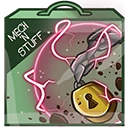 **Electric Bike Lock**: Increases the damage of Pounce. *(Flavor: Returned by the Sunny-daisy School.)*
- 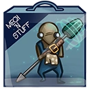 **Zurian Mechanic**: Retain 1 charge when hitting an enemy with pounce. *(Flavor: "Have you tried turning it off and on again? ..is the button glowing? ..well you need to turn it on then.")*
- 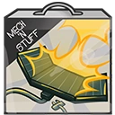 **Photovoltaic Lightning Charger**: Reduces the cooldown of pounce. *(Flavor: Only one charge allowed! The SuperDRM selfdestructs the charger after unplugging.)*
- 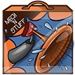 **Big Bang Horn**: Increases the stun duration of pounce. *(Flavor: SO LOUD YOU CAN HEAR IT IN SPACE!* *You can't hear it in space.)*
- 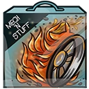 **Volatile Wheels**: Increases the speed and distance travelled by pounce. *(Flavor: How to have fun: 1.) Light the wheels 2.) Drive and watch it all burn! Remember: don't do this at home kids!.. Do it at your neighbors!)*
- 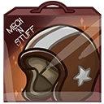 **Stunt Helmet**: Increases the knockback of Pounce. *(Flavor: Original helmet with signature of Voltron himself, most badass stuntman in the universe!)*

### Claw
**Description:** Penny strikes with her claw awarding a charge when hitting an enemy. Max 4 charges.

- **Damage**: 88 (138.16)
- **Attacks per second**: 2
- **Range**: 3.2

#### Upgrades
- 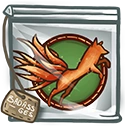 **The Nine Tails Badge**: Increase your movement speed, based on the amount of active charges you have. *(Flavor: Move so fast it is like you are in multiple places at the same time.)*
- 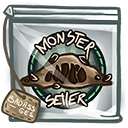 **Cookie Monster Badge**: Increases the base damage of Claw per active charge against enemy Awesomenauts. *(Flavor: You, cookie showing and me, hunger growing! So share it maybe?!)*
- 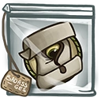 **Living Treasure Map Badge**: Increases the attack speed of Claw. *(Flavor: Awarded to scouts who can find the treasure by solving the riddles it speaks.)*
- 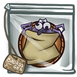 **Spiderbird Collector Badge**: While at 4 charges your Claw becomes a ranged attack. *(Flavor: To become an Akela scout, the fox troopers need to gather a bag full of hard to catch spiderbirds.)*
- 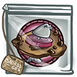 **Herring Snack Badge**: Instantly heal yourself for each charge whenever you spend charges. *(Flavor: Mastered the impossible cookie recipe trial!)*
- 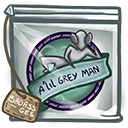 **Grey Man Group Badge**: Increases the maximum amount of charges to 5. *(Flavor: These musical creatures play the flute well! But you have bested these creatures in a flute-down!)*

### Energy Pulse
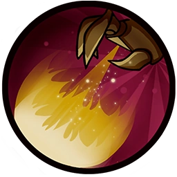

**Description:** Consume up to 4 charges to shoot a piercing energy pulse that amplifies damage. Each charge increases the damage.

- **Damage per charge**: 90 (141.3) per charge
- **Cooldown**: 7s
- **Range**: 5.5
- **Amplify Damage**: +10%
- **Amplify Duration**: 3.5s

#### Upgrades
- 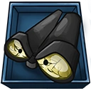 **Scout Binoculars**: Incrases the range of Energy Pulse. *(Flavor: SPECTATOR MODE!!!)*
- 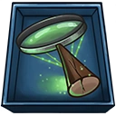 **Death Lens**: After landing an Energy Pulse, your next Claw becomes ranged and deals increased damage. *(Flavor: Warning! Too much energy through the darkside will destroy planets!)*
- 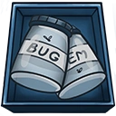 **Bug Jars**: Increases the damage per charge of Energy Pulse. *(Flavor: Gotta catch'em all!)*
- 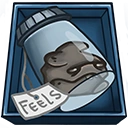 **Sentient Rock**: Adds a silencing effect to Energy Pulse. *(Flavor: These depressed and coldhearted creatures are found on the deserts of Sorona.)*
- 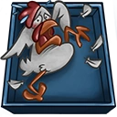 **Chicken In Lunchbox**: Enemies hit by Energy Pulse will receive extra damage. *(Flavor: Please don't eat me! I have a family!)*
- 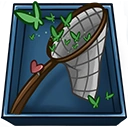 **Heartshaped Net**: Changes Pulse cooldown. *(Flavor: Disclaimer: doesn't actually catch hearts... Ba dum tss!)*

### Leap
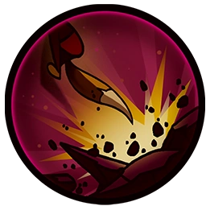

**Description:** Being super agile, Penny can leap up to perform a triple jump.

- **Jump Height**: 9 (11 Foxy Boots)
- **Additional Jump Height**: 4
- **Jumps**: 3 (4 Foxy Boots)

#### Upgrades
-  **Power Pills Turbo**: Increases maximum health. *(Flavor: Insert pill into rear end of digestive tract.)*
-  **Med-i'-can**: Automatically regenerate health. *(Flavor: Hello... anyone there? Please get me out of here!!!)*
- 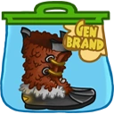 **Foxy Boots**: Increases movement speed, enables a quadruple jump. *(Flavor: For chicks with drive who don't take no jive!)*
-  **Baby Kuri Mammoth**: Reduces the effect of all debuffs *(Flavor: "LOOK!!! A FLYING ELEPHANT!")*
-  **Piggy Bank**: Gives 100 Solar. *(Flavor: This product was brought to you by Zork industries, exploiting Zurians since 2780.)*
-  **Starstorm Statue**: Increases all damage you deal. *(Flavor: Made out of scraps and offerings it reads "SHIVA")*

