# Professor Milton Yoolip

## Backstory
Yoolip has been a scientist for the greater part of his life on the transistor planet Calias. Creating wondrous inventions and contraptions like the dog aura reader, the nightmare-to-VHS recorder, the random number phone, the cereal-to-milk ratio calculator and an actual time machine. One day after combining the time machine into some comfy slippers, he teleported to the Mesozoic era and found himself surrounded by some scientist hungry velociraptors.

Barely escaping the predators he lost one of his slippers. Being stuck in time he spent years to craft a new slipper to travel forward in time to return to his beloved granddaughter, Ayla. He joined the Awesomenauts team to finally spend some quality time with her and eat some over-engineered pancakes.

## Base Stats
- **Health:**: 1500 (2640)
- **Movement Speed:**: 7.8
- **Attack Type:**: Melee
- **Role:**: Support
- **Mobility:**: Tactical

## Abilities & Upgrades
### Gripping Gaze
**Description:** Throw out a third eye that will stun you and the targeted enemy Awesomenaut as well as deal damage to them while it is active.

- **Damage per second**: 175 (274.75)
- **Stun duration**: 1.2s
- **Cooldown**: 9.5s

#### Upgrades
- 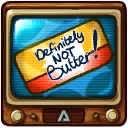 **Definitely Not Butter**: Increases snare duration of gripping gaze. *(Flavor: With that classic antifreeze blueish hue and taste, yummy!)*
-  **Walking Fridge**: Increases the range of your gripping gaze. *(Flavor: Caution! Tie down at night due to sleepwalking errors.)*
- 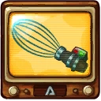 **Remote Controlled Whisk**: While gripping gaze is active, you gain a damaging field around you. *(Flavor: With a baffling 4000 RPM this beast whips your batter to perfection!)*
- 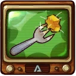 **Beard Trimming Fork**: Increases the base damage of gripping gaze *(Flavor: "Ohh I found some Bovinian cheddar, nice!")*
- 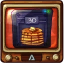 **Pancake 3D Printer**: While Gripping Gaze is active, you receive a shield that absorbs damage. *(Flavor: Note from management: Jenny, where did you find this piece of junk, it only prints stupid flat pancakes! That's not 3D! Sheez! Change the Label!)*
-  **Syrup Pouring Robot**: Adds a lifesteal to your gripping gaze *(Flavor: 50% off! The aiming is a bit off. Comes with free pack of napkins.)*

### Wrench Smack
**Description:** Professor Yoolip whacks his trusty wrench on the head of enemies. On top of that, it heals allied droids.

- **Damage**: 95 (149.15)
- **Attacks per second**: 2
- **Droid Heal**: 10 (15.7)
- **Summon Heal**: 30 (47.1)

#### Upgrades
-  **Bunny Burner**: Increases the damage of your wrench smack. *(Flavor: Perfect for chemistry in the wild. The bunny will burn violently for half an hour.)*
-  **Laboratory Centrifuge**: Hitting sawblade droids will mark them and on death they will drop a healthpack. *(Flavor: When you don't like your drinks to be shaken or stirred, but sedimented.)*
- 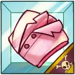 **Badly Washed Lab Coat**: Hitting enemies with your wrench smack will reduce the cooldown of your robo dinos. *(Flavor: Laundry guide: There is a care symbol with an ellipse and three stripes through it. A double banana with two dots on the left and a star with a mammoth face.)*
- 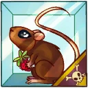 **Lab Rats**: Adds an amplify damage effect to wrench smack. *(Flavor: With this easy kit you can infest your clean and bleak lab with some snugly dirty rodents.)*
- 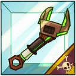 **Sonic Wrench**: Increases droid and summon heal of wrench smack. *(Flavor: The wrench has many uses but mainly functions as an alien smacking device.)*
- 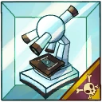 **Quark Microscope**: Picking up healthpacks will increase your wrench smack attack speed for the next smacks. *(Flavor: A high powered microscope based on Sadak technology.)*

### Summon Robo Dinos

**Description:** Create robo dinos that will walk forward and attack enemies.

- **Damage**: 75 (117.75)
- **Attacks per second**: 3.1
- **Duration**: 3.5s
- **Cooldown**: 12s

#### Upgrades
-  **Holo Pet Food**: Bitten Awesomenauts deal less damage. *(Flavor: Universal food for your holo pet, they don't need it but they will love it!)*
-  **Antigravity Ball**: Increases the lifetime of robo dinos. *(Flavor: Used for hover bikes and other flotation mobiles. You can also play fetch with it together with your flying pets.)*
- 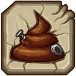 **Dino Poop**: Let robo dinos drop healthpacks every second. *(Flavor: Even though it is digital it still smells really bad.)*
- 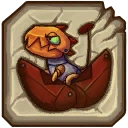 **Egg Hatcher**: Adds an extra robo dino. *(Flavor: This machine holds a strange looking egg, scratching sounds can be heard from within.)*
- 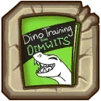 **Dino Training For Dummies**: Increases the damage of robo dinos when they bite targets under the effect of a crowd control debuff (stun, snare, silence, slow and blind). *(Flavor: Lesson #1 DINOSAURS ARE JUST BIG DUMB CARNIVOROUS CHICKENS, YOU CAN'T LEARN THEM ANYTHING!  Lesson #2 GO BUY A DOG!)*
- 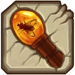 **Walking Rod**: Increases the speed of summoned Robo-Dinos after deploying or until they bite something. *(Flavor: Crafted from Mesozoic oak, there is a glass container on top holding what seems to be a young grime fly.)*

### Sadak High Jump

**Description:** Sadak High Jump

- **Jump Height**: 8.22
- **Jumps**: 1

#### Upgrades
-  **Power Pills Turbo**: Increases maximum health. *(Flavor: Insert pill into rear end of digestive tract.)*
-  **Med-i'-can**: Automatically regenerate health. *(Flavor: Hello... anyone there? Please get me out of here!!!)*
- 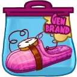 **Relativity Slippers**: Increases your movement speed and receive a speed boost after being freed from Gripping Gaze. *(Flavor: The slipper has been chewed on and the teleportation system doesn't seem to work anymore.)*
-  **Baby Kuri Mammoth**: Reduces the effect of all debuffs *(Flavor: "LOOK!!! A FLYING ELEPHANT!")*
-  **Piggy Bank**: Gives 100 Solar. *(Flavor: This product was brought to you by Zork industries, exploiting Zurians since 2780.)*
-  **Overdrive Gear**: Reduces the cooldown of all your skills. *(Flavor: Let's put it into Overdrive!)*

