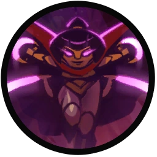
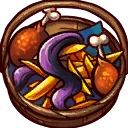
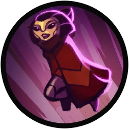

# Qi'Tara

## Backstory
From the wild meadows on Gromdom comes the beautiful and deadly Chilasi princess Qi'Tara. A four limbed warrior wielding laser coated chakrams. Shrouded in mystery, no one actually knows why she would ever be part of the royal court of the Scargi, considering the insectoid Chilasi and snail-like Scargi have been in a long dispute over the giant splumb gardens scattered across the planet. These two realms came to a head when the Chilasi vehemently maintained that the Splumb potatoes are a form of fruit yet the Scargi are extremely sure that it's, in fact, a vegetable. This could, naturally, only be settled with war. Some say she seduced the Scargi emperor to provoke her father, the king, others say she just did it to for his juicy splumbs.

For years she worked her way up in the Scargi military to become a royal guard in the order of the Scargi emperor and gained the title of femme fatale haricot beurre. Don't be fooled by her captivating looks because this deadly warrior has the best k/d in Scargi space.

She does have one guilty pleasure: every spare moment not seducing her enemies she can be found behind a frying pan, nibbling on some fried splumb taters. Her perfect curves stay in shape because of her hightened metabolism, but rumor has it that she is so obsessed with her looks that she even rubs her carapace with the yellow fruit to give it a golden shine. Never tell her that she has a problem, though, because she will cut you into tiny tiny pieces with her venom bladed chakrams.

Being from a different kingdom she has always been a bit of an outsider, but the renegades took her in as if she was family, After the incident at the palace she hid in the hot wastelands where the Scargi wouldn't be able to track her. This game of hide and seek is over and Qi'Tara's poisoned blades long for revenge.

## Base Stats
- **Health:**: 1300 (2288)
- **Movement Speed:**: 8.4
- **Attack Type:**: Melee
- **Role:**: Assassin
- **Mobility:**: Swift

## Abilities & Upgrades
### Chakram Shift
**Description:** Throw out a chakram that deals damage and sticks to enemy nauts. You can warp to an attached chakram with a second press, dealing area damage and leaving another chakram behind, which you can then teleport back to with a third press, dealing damage upon returning.

- **Chakram damage**: 180 (282.6)
- **Shift damage**: 180 (282.6)
- **Duration**: 3.5s
- **Cooldown**: 9s

#### Upgrades
-  **Eyelash Guillotine**: Increases the shift damage. *(Flavor: Trim that eye bush.)*
-  **Matching Mirror**: Increases the duration that the chakram stays on the target. *(Flavor: Ranks your looks every day and compares it to millions of aliens among the stars.)*
-  **Gunpowder Box**: Enemies directly hit by the shift will get amplified damage. *(Flavor: Powder your nose for an explosive look.)*
-  **Peel Off Face Mask**: Enemies hit by the shift will be weakened. *(Flavor: If you like to take your face... off.)*
-  **Rakki Comb**: Increases damage vs. droids. *(Flavor: The thin sharp teeth of this animal makes it a perfect comb. Don't get bitten though, they are quite venomous.)*
-  **Laser Lipstick**: You and allied nauts will receive a movement speed bonus around you when you throw your chakram. *(Flavor: Nice and crisp style. Comes with every imaginable color.)*

### Poisonous Blade
**Description:** Slash and inflict a stacking poison onto your enemies.

- **Damage**: 50 (78.5)
- **Damage over time**: 65 (102.05)
- **Duration**: 4s
- **Attack speed**: 150

#### Upgrades
-  **Skroggle Eyeshadow**: Increases the damage over time of Poisonous blade. *(Flavor: The aggressive acid base makes this the longest lasting eyeshadow out there!)*
-  **Portuguese Warblade**: Adds base damage when striking the back of a target with poisonous blade. *(Flavor: The tentacles on this blade hurt like a zurian.)*
-  **Coba Serpent**: Increases the damage of the first strike with poisonous blade after shifting to your target. *(Flavor: Instructions: Never open bottle between sunrise and sunset. At night they turn to stone and are safe to handle.)*
-  **Silent Killer**: Increases the damage of poisonous blade when hitting enemies who are stunned, slowed, silenced, blinded and/or snared. *(Flavor: These vaporous and deadly creatures dwell in the sewers of Calias.)*
-  **Lily Of The Isle**: After hitting an enemy 'naut with chakran shift, your poisonous blade will become a ranged attack *(Flavor: Although the flowers are seductively beautiful, the pollen it contains are a very dangerous neurotoxin.)*
-  **Chilasi Chakram**: Damage over time from poisonous blade is applied faster. *(Flavor: Given down from queen to queen, the chakram is a true warrior princess weapon.)*

### Seven Star Strike

**Description:** Temporarily increase your movement and attack speed and make your poisonous blade attacks affect targets in an area. Also increases the damage and duration of the damage over time effect.

- **Attack speed**: +30%
- **Damage over time**: +100%
- **Damage over time duration**: +100%
- **Duration**: 3s
- **Cooldown**: 12s
- **Lifesteal**: 10%

#### Upgrades
-  **Splumb Croquette**: Increases the duration of seven star strike. *(Flavor: This crispy treat is the best way to make up for  broken promisses and celebrate any festivities.)*
-  **Mobile Fryer**: Grants a movement speed bonus when seven star strike is active. *(Flavor: Easy to carry, fry your splumbballs on the go!)*
-  **Hairdresser Fries**: Increases the strike damage when there are multiple enemy nauts near. *(Flavor: Greasy fries topped with a layer of space rat meat and fresh cut hairs makes this one of the unhealthiest foods in the galaxy.)*
-  **Salty Seal**: Grants Qi'Tara a shield that reduces the duration of slows, stuns, snares, chains, gravity and time warps while it's active. *(Flavor: Instructions: rub the beast gently to season your food. Do not shake it! It will get upset.)*
-  **Baby Plumbmin Oil**: Increases the lifesteal effect of seven star strike. *(Flavor: 100% vegetable yellow plumbmin oil. Warning: can contain traces of red and blue plumbmin.)*
-  **Killer Tomato Ketchup**: Increases the damage over time during seven star strike *(Flavor: It's just tomato ketchup, move along!)*

### Chilasi Robe-powered Double Jump

**Description:** Chilasi Robe-powered Double Jump

- **Jumps**: 2

#### Upgrades
-  **Power Pills Turbo**: Increases maximum health. *(Flavor: Insert pill into rear end of digestive tract.)*
-  **Med-i'-can**: Automatically regenerate health. *(Flavor: Hello... anyone there? Please get me out of here!!!)*
-  **Space Air Max**: Increases movement speed. *(Flavor: Fashionable and Fast.)*
-  **Wraith Stone**: Heal additional health by killing critters. *(Flavor: Life sucks, death even more.)*
-  **Piggy Bank**: Gives 100 Solar. *(Flavor: This product was brought to you by Zork industries, exploiting Zurians since 2780.)*
-  **Baby Kuri Mammoth**: Reduces the effect of all debuffs *(Flavor: "LOOK!!! A FLYING ELEPHANT!")*

