# Raelynn

## Backstory
Raelynn loves big guns. After highschool she went straight into the E.L.F. army to fight against the invading robots, just before the first AI war.

She was trained by the best and excelled in long range weaponary. Within a year she was given the honor of joining an elite squad called the SkyHawks, where she met the love of her life: her Pulserifle "Cuddles".

For years they did covert missions together as a team to disrupt robot production and steal robot technologies. They were feared by all robots (well...the ones with emo-chips).

Until that one deep space mission to AI station 404 in the year 3009, where she ran into a robot ambush, and "Cuddles" was brutally taken away from her. Raelynn was put into cryostasis. Decades passed until a small mercenary team found her hidden on the planet. There she was rejoined with "Cuddles" and many warm 'hugs' were given that day to all robots on 404.

## Base Stats
- **Health:**: 1300 (2288)
- **Movement Speed:**: 7.8
- **Attack Type:**: Long Range
- **Role:**: Harasser
- **Mobility:**: Balanced

## Abilities & Upgrades
### Timerift
**Description:** An expandable wall held within a nifty grenade! With this gadget, Raelynn can create some cover out of just about any terrain. Also great for blocking off annoying ex-es.

- **Damage/s**: 57 (89.49)
- **Attack Speed**: 250
- **Slowing Power**: 65%
- **Cooldown**: 11s
- **Height**: 5
- **Width**: 2
- **Duration**: 4s

#### Upgrades
- 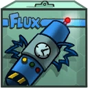 **Higgs Grenade**: Increases height of Timerift. *(Flavor: Gives you that extra mass when you need it.)*
- 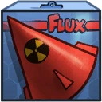 **Nuclear Warhead**: Increases attack speed of Timerift. *(Flavor: Old antique weapon. On the back it says "Dear John".)*
-  **Retro Spaceship**: Increases slow of Timerift. *(Flavor: Orginal owner: Rick Rocket)*
-  **T-800 Dome**: Makes Timerift spawn a droid. *(Flavor: WARNING: Don't tell the robot where to find John.)*
- 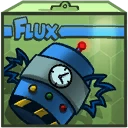 **HC-Bomb**: The next protoblaster shot after using Timerift will do more damage. *(Flavor: Destroys spacetime (Psi universe not included).)*
- 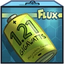 **1.21 Gigawatt Battery**: Increases duration of Timerift. *(Flavor: Stolen plutonium core.)*

### Protoblaster
**Description:** Cuddles all folded up into a widdle gun makes most go “d’awwww” upon seeing it. This reaction usually transitions smoothly into a highpitched scream as they find out what “cuddling” really means.

- **Damage**: 75 (117.75)
- **Attackspeed**: 150
- **Range**: 8

#### Upgrades
-  **Skull Bracelet**: Increases base damage of shots. *(Flavor: Makes you look really tough!)*
-  **Unknown Alien Hand**: Your shots will pierce through enemies, hitting additional enemies in their path. *(Flavor: Points home.)*
-  **Monkey Hand**: Increases the range of shots. *(Flavor: Belonged to a thief monkey.)*
-  **Lucky Cat Air Freshener**: Increases base damage of shots against enemy Awesomenauts. *(Flavor: Fills your spaceship with the sweet smell of cat.)*
-  **Joe Doll**: Increases attack speed of shots *(Flavor: Dangerously fast bike not included.)*
-  **Receding Ponytail**: Increases base damage of shots. *(Flavor: Worn by famous movie actor.)*

### Snipe
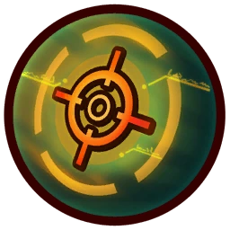

**Description:** Cuddles folds out to form a supercute variable Sniper-Pulserifle! Able to zap any target over great distances, the resulting beam will take out most of the surroundings along with the target. If you see a laser-point, best run!

- **Damage**: 460 (722.2)
- **Cooldown**: 10s
- **Range**: 18.36
- **Arming Time**: 0.65s (+0.55s Animation)
- **Max Aiming Time**: 1.8s
- **Knockback**: 0.7

#### Upgrades
- 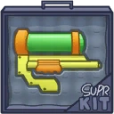 **Pump Rifle**: Increases the base damage of Snipe. *(Flavor: Pump up the base...damage.)*
- 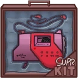 **Casettedeck Magazine**: Reduces cooldown of Snipe. *(Flavor: Listen to some good music, while you wait for your next shot.)*
- 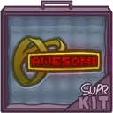 **Laserpointer**: Adds a blinding effect to Snipe. *(Flavor: Don't point at eye(s).)*
- 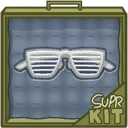 **Flashy Glasses**: Increases the base damage of Snipe while lowering the range. *(Flavor: Deal with it.)*
- 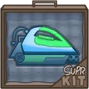 **Iron Rifle**: Gain a debuff immunity shield when activating Snipe. *(Flavor: Straightens out your bullets.)*
- 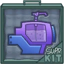 **Gryc Lubricator**: Increases the range of Snipe. *(Flavor: Made from real Grycworm intestines.)*

### Six Million Solar Human Jump
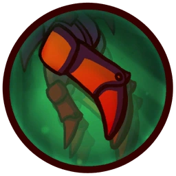

**Description:** Six Million Solar human jump.

- **Jump Height**: 7.6
- **Jumps**: 1

#### Upgrades
-  **Power Pills Turbo**: Increases maximum health. *(Flavor: Insert pill into rear end of digestive tract.)*
-  **Med-i'-can**: Automatically regenerate health. *(Flavor: Hello... anyone there? Please get me out of here!!!)*
-  **Denny's Boots**: Increases movement speed and extra when out of combat *(Flavor: Let your imagination run wild!)*
-  **Wraith Stone**: Heal additional health by killing critters. *(Flavor: Life sucks, death even more.)*
-  **Piggy Bank**: Gives 100 Solar. *(Flavor: This product was brought to you by Zork industries, exploiting Zurians since 2780.)*
-  **Baby Kuri Mammoth**: Reduces the effect of all debuffs *(Flavor: "LOOK!!! A FLYING ELEPHANT!")*

