# Rocco

## Backstory
When a job's too dirty for The Intergalactic Police Department to take on, they call Rocco. This old Bird's the most relentless, gruff and tough-as-talons hitman vigilante this side of the Milkyway. Rocco is feared by the most dangerous solar cartel gang bosses, Shisu mobsters and other crazed alien psychopaths for his "ravenous methods". Not shunning any kind of weapon, Rocco prefers his ACOG Blackout G-Mag Laserbow, which has got him out of a tight spot more than once.

Rocco's aggressive behaviour did result in a lot of powerful enemies however, including a corrupt Galaxial congressman who made him a wanted man, and forced him to quit the force but instead of a retirement at the Kentucky Friends and Poultry Retreat he joined the Awesomenauts to plot his next move on his path to rid the universe of all space-scum.

## Base Stats
- **Health:**: 1350 (2376)
- **Movement Speed:**: 7.8
- **Attack Type:**: Ranged
- **Role:**: Fighter
- **Mobility:**: Balanced

## Abilities & Upgrades
### Precision Shot
**Description:** Draw your bow and fire an arrow that will fly through terrain and hits enemy Awesomenauts.

- **Damage**: 330 (518.1)
- **Cooldown**: 7.5s
- **Range**: 20
- **Range Max Charge**: Unlimited
- **Charge Speed**: 1s
- **Speed**: 30
- **Size**: 4

#### Upgrades
- 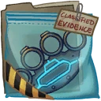 **Classics**: Increases the base damage of max charged precision shot. *(Flavor: Can't beat a classic!)*
- 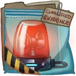 **Magnetic Police Light**: Increases the speed of precision shot. *(Flavor: This police light runs on bio fuel cells and sticks to any spacecraft!)*
- 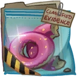 **Birdseed Donuts**: Reduces the cooldown of vengeance or increases its duration when it's active after hitting a precision shot. *(Flavor: These donuts are spiked with superfood killi seeds!)*
- 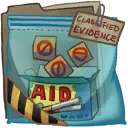 **Nicotine Patches**: Every successful hit with precision shot will reduce its cooldown. *(Flavor: With nicotine from the nightshade farms on Kapral within the Omicron.)*
- 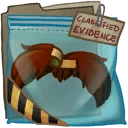 **Sticky Cops Moustache**: Increases the speed of rapid arrows when hitting an enemy Awesomenaut with a precision shot. *(Flavor: If you can't grow one, you buy one!)*
- 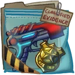 **Badge and Gun**: Makes precision shots explode on impact and deal damage in an area. *(Flavor: Welcome back to the force!)*

### Rapid Arrows
**Description:** Fire rapid arrows that will change into slowing arrows while vengeance is active.

- **Arrows**: 2
- **Damage**: 45 (70.65)
- **Attack speed**: 145
- **Range**: 9
- **Spread**: 10°

#### Upgrades
- 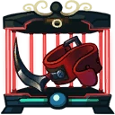 **Cockfight Spurs**: Increases the base damage of rapid arrows. *(Flavor: EVIDENCE for case #417 A: This illegal weapon should not leave the evidence locker!)*
- 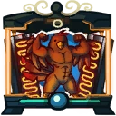 **Chicken Grill**: Adds an additional arrow to your rapid arrows. *(Flavor: "Chicks dig a brown tan!" - Gustavo Pollos the famous actor of the tv show "Breaking Eggs".)*
- 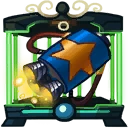 **Rocketpack**: Increases the range of rapid arrows. *(Flavor: Covered in penguin blood, this is probably a relic from the Frozen Yoghurt War.)*
- 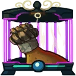 **Cutlet Frills Ghilly Suit**: When there are no enemies near you, your rapid arrows will deal more damage. *(Flavor: Stay hidden and delicious!)*
- 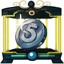 **SWCA Coin**: Rapid arrows will split after hitting enemies. These arrows deal less damage. *(Flavor: This coin represents 5 years of membership of Shiny Weapons Hoarders Anonymous!)*
- 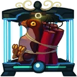 **Defused Hawk Bomb**: Hitting enemies with rapid arrows will now reduce the cooldown of precise shot. *(Flavor: "This prop bomb was used in the best movie ever made." - Mr. Heathside)*

### Vengeance
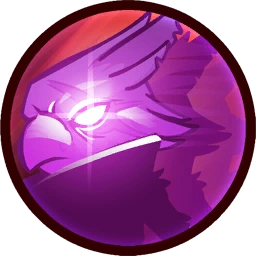

**Description:** Removes the movement penalty while shooting and adds a slow effect to your arrows for a set amount of time. Hitting enemies with your rapid arrows increases the duration of vengeance.

- **Cooldown**: 16s
- **Duration**: 5s
- **Extra duration per hit**: 0.1s
- **Slow**: 15%
- **Slow duration rapid arrows**: 1s
- **Slow duration precise shot**: 3.5s

#### Upgrades
- 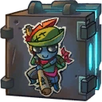 **Little Johnny**: Adds a stun effect to your fully charged precision shot after flying for a short distance while vengeance is on. *(Flavor: Better be careful, that toothpick looks sharp!)*
- 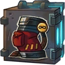 **Endless Quiver**: Increases the duration of vengeance when hitting enemies with rapid arrows. *(Flavor: Warning! Only stores holo arrows infinity, other objects are destroyed in this hyperspace container.)*
- 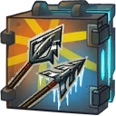 **Vulpe Bow String**: Increases the slowing effect of rapid arrows while vengeance is on. *(Flavor: Harvesting the valuable fur of Vulpes is a dangerous undertaking. The rare material is often found on the blackmarket for extortionate prices.)*
- 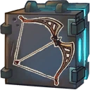 **Quickdraw Bow**: Adds 1 homing arrow to your rapid arrows that will seek out enemy Awesomenauts. *(Flavor: Shoot faster than your own shadow.)*
- 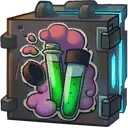 **Mirakuru**: Increases health regen when vengeance is on. *(Flavor: This mix of Pulvan herbs is believed to be a muscle enhancer.)*
- 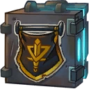 **Assassin Flags**: Increases your movement speed while vengeance is active. *(Flavor: These flags are normally hidden to be found by murderers as a nice mix of activities.)*

### Bird Hop
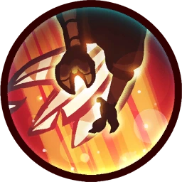

**Description:** Bird hop. Hold the button to jump higher.

- **Jump Height**: 10.64
- **Jumps**: 1

#### Upgrades
-  **Power Pills Turbo**: Increases maximum health. *(Flavor: Insert pill into rear end of digestive tract.)*
-  **Med-i'-can**: Automatically regenerate health. *(Flavor: Hello... anyone there? Please get me out of here!!!)*
-  **Space Air Max**: Increases movement speed. *(Flavor: Fashionable and Fast.)*
- 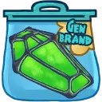 **Wraith Stone**: Heal additional health by killing critters. *(Flavor: Life sucks, death even more.)*
-  **Piggy Bank**: Gives 100 Solar. *(Flavor: This product was brought to you by Zork industries, exploiting Zurians since 2780.)*
-  **Baby Kuri Mammoth**: Reduces the effect of all debuffs *(Flavor: "LOOK!!! A FLYING ELEPHANT!")*

