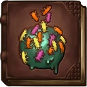
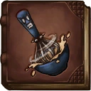
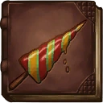
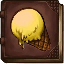
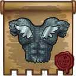
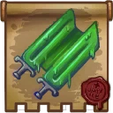
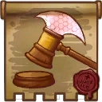

# Scoop of Justice

## Backstory
The Scoop of Justice or Scoop for short, is a brave Gelati knight. The Gelati are brilliant craftsmen famous for their delicious Castle Ice Cream. The gelatinous knights gather snow and ice from different planets and mix them with sweet candies and fruits. Although cocoa trees haven't been seen for ages and they are thought to be extinct, the Gelati see it as their holy duty to find a real piece of chocolate and create the ultimate flavour of ice cream: stracciatella.

On AI Station 205 the Awesomenauts are gathered to protect the universe from the dangerous 'Sisterhood of Coba'. The Sisterhood is planning an invasion from the Omicron dimension, using a space bridge in the eye of the space storm. Scoop was assigned by the lords of his house, the house of the triple scoop, to aid the Awesomenauts in protecting the universe from the new Omicron threat. Secretly Scoop also hopes to find a chocolate bar on one of Zork's vendor machines.

## Base Stats
- **Health:**: 1600 (2816)
- **Movement Speed:**: 7.8
- **Attack Type:**: Melee
- **Role:**: Tank
- **Mobility:**: Balanced

## Abilities & Upgrades
### Frozen Hammer
**Description:** Throw out a hammer of ice that snares multiple enemies. The longer it flies, the more damage you deal and the longer the snare lasts.

- **Minimum Damage**: 150 (235.5)
- **Maximum Damage**: 230 (361.1)
- **Cooldown**: 7.5s
- **Minimum snare duration**: 0.2s
- **Maximum snare duration**: 0.8s
- **Range**: 17

#### Upgrades
-  **Fruity Sprinkles**: Increases the snare duration of the frozen hammer. *(Flavor: These little fruity bugs come in all kinds of flavors.)*
-  **Brutally Whipped Cream**: Increases the base damage of the frozen hammer. *(Flavor: Whipped mercilessly by over angry Kremzons.)*
-  **Twister Lance**: Increases the range of the frozen hammer. *(Flavor: Never bring a popsicle to a gunfight.)*
-  **Ice Cream Van Music**: Reduces the cooldown of frozen hammer. *(Flavor: Best tracks of 3586, including "Bananasplit beats by the wizard formally known as Merlin" and "Counting sprinkles by the Kings of Freon")*
-  **Snow Shovel**: Gives the frozen hammer a healing effect for each target hit. *(Flavor: Every Gelato boy receives one of these from his father when coming of age.)*
-  **Yellow Snow Cone**: Increases your movement when you hit a target with frozen hammer. *(Flavor: Don't worry it's lemon flavor... SIKE!)*

### Sword Strike
**Description:** Scoop alternates between a direct slash and a sweeping cleave attack that heals you.

- **Slash Damage**: 105 (164.85)
- **Attack speed**: 144
- **Range**: 3.4
- **Cleave Damage**: 60 (94.2)
- **Attack speed**: 132
- **Range**: 3.9
- **Lifesteal**: 30%

#### Upgrades
-  **Chain Mail Tunic**: Increases the attack speed of your sword strike. *(Flavor: Light as a feather... like heavy steel airplane wings.)*
-  **Royal Sword In The Cream**: Increases the base damage of your sword strike. *(Flavor: The knight who manages to pull the sword out of the cream will be... EXECUTED. That's the king's sword! YOU PEASANT!)*
-  **Spoonman**: Increases the damage of all abilities when allied Awesomenauts are near. *(Flavor: These creatures grow spoons from their head. The males often fight and break their spoon. The spoonless males will be made fun of, obviously.)*
-  **Double Licker Sword**: Increases the damage and lifesteal of Cleave. *(Flavor: You can break the sword in two little tasty swords... aah brainfreeze!)*
-  **Halberd Of Justice**: Increases the damage of Sword Strike when landing a frozen hammer on an enemy Awesomenaut. *(Flavor: Slap your enemies in the face, with this long arm of the law.)*
-  **Titanium Coneshield**: When your health is below 75% you deal more damage with sword strike. *(Flavor: We'll eat our icecreams in the shade!)*

### Binding Of Justice

**Description:** Wrap yourself in healing bindings which heal you and damage your enemies.

- **Damage**: 180 (282.6)
- **Heal**: 300 (471)
- **Cooldown**: 13.5s
- **Explosion radius**: 9
- **Charge time**: 1s

#### Upgrades
-  **Milk Of Righteousness**: Increases the base heal of the binding of justice. *(Flavor: Crafted by holy Bovinian priests.)*
-  **Banner Of The Triple Scoop**: Adds damage to the binding of justice while it is active *(Flavor: The house of the triple scoop is  the biggest Gelati clan, their motto: "One scoop for the king, one for justice and one pistachio!")*
-  **Idol Of The Ice Queen**: The explosion at the end of Bindings will slow enemies. *(Flavor: Although the queen never leaves her frozen throne, she invokes the hearts of the Gelati with bravery and heroism.)*
-  **The Penguin Throne**: Increases the damage of Sword Strike after using Bindings of justice. *(Flavor: Made out of 199 frozen penguins, who surrendered in the frozen yoghurt wars.)*
-  **Penguin Squire**: Adds a heal over time to the binding of justice. *(Flavor: Some of the penguins on Rill defected to the Gelati and managed to become loyal servants.)*
-  **The Holy Cup**: Adds an ally healing area at the end of Binding of Justice, healing all allies by a percentage of your self-healing power. *(Flavor: This cup is only to be used for stracciatella ice cream.)*

### Wobbling Jump

**Description:** Being a gelatinous being helps in performing high wobbling jumps.

- **Jump Height**: 7.8
- **Jumps**: 1

#### Upgrades
-  **Power Pills Turbo**: Increases maximum health. *(Flavor: Insert pill into rear end of digestive tract.)*
-  **Med-i'-can**: Automatically regenerate health. *(Flavor: Hello... anyone there? Please get me out of here!!!)*
-  **Space Air Max**: Increases movement speed. *(Flavor: Fashionable and Fast.)*
-  **Barrier Magazine**: Provides a damage absorbing shield. *(Flavor: Free personal shield with this month's edition of The Barrier! Read all about Zork's imperium.)*
-  **Piggy Bank**: Gives 100 Solar. *(Flavor: This product was brought to you by Zork industries, exploiting Zurians since 2780.)*
-  **Baby Kuri Mammoth**: Reduces the effect of all debuffs *(Flavor: "LOOK!!! A FLYING ELEPHANT!")*

