# Sentry X-58

## Backstory
Deep in the bowels of the derelict station, an army of killer robots remain deactivated in storage containers, withering away to rust. The remaining functional robots futilely await the moment they are called back into action by masters who are now long dead. Centuries pass without any activity aboard the drifting colossal station. Not until the station’s backup systems flare back to life, providing enough energy to reactivate some of the still operational robots. One of these is known as Sentry.

Sentry is a special infiltration and reconnaissance unit whose prime directive “If you can’t beat ‘m, join ‘m, and then beat ‘m anyway cause they won’t expect it” has served his kind in many a war. Being clearly built for stealth, fooling enemy troops by mimicking anything from an umbrella to a designer coffee table, he is the first to be sent onto the battlefield to gather intel. After emerging from his stasis and discovering an enemy mercenary ship that has landed on the Starstorm, he snuck himself aboard, disguised as an inconspicuous Phone Booth.

After overhearing the crew that the robots lost the AI war and that his comrades have been turned into kitchen and household appliances, he reprogrammed himself for vengeance and planned to destroy them all! He now works, undercover, for the Awesomenauts until he has gathered enough Solar to buy a very serious tank, one with a shark printed on the front!

## Base Stats
- **Health:**: 1600 (2816)
- **Movement Speed:**: 7.77
- **Attack Type:**: Range
- **Role:**: Tank
- **Mobility:**: Tactical

## Abilities & Upgrades
### Black Hole Sun
**Description:** Enables a damage collecting black hole that can be placed with a second press, pulling enemies toward it and dealing the collected damage. Collected damage will decay after 10s.

- **Damage Conversion**: 65%
- **Minimum Damage**: 150 (235.5)
- **Maximum Damage**: 540 (847.8)
- **Shield**: 25%
- **Shield Health**: 600 (942)
- **Absorption Duration**: 1.5s
- **Cooldown**: 11s
- **Black Hole Duration**: 1.2s
- **Gravitational Force**: 5.7969 -> 11.815 (Edge -> Centre)
- **Size**: 8.2
- **Range**: 5.4

#### Upgrades
- 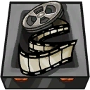 **Microfilm**: Increases the damage reduction of black hole sun. *(Flavor: Review from Cinemabeasts: "This movie is way too short... 1/5 stars")*
- 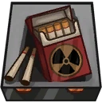 **Cyanide Cigarettes**: Increases the base damage return of black hole sun. *(Flavor: "Popular Zurian candy.")*
- 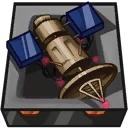 **Hacking Satellite**: Reduces the cooldown of black hole sun. *(Flavor: "This old satellite was part of the starstorm recon forces.")*
- 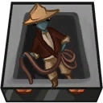 **Bug Detector**: Makes the shield deal damage to enemies who come in contact with it. *(Flavor: "This Zurian zoologist is able to identify many alien creatures.")*
-  **Night Vision Spywatch**: Increases movement while black hole sun is charging. *(Flavor: "Press the button to watch the time in the dark!")*
- 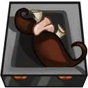 **Disguise Moustache**: Increases the base flat damage of black hole sun against enemy Awesomenauts. *(Flavor: "Made from real chameleon moustache hairs.")*

### Photon Mine Launcher
**Description:** Warbots from the X-58 line come with a high powered photon mine launcher.

- **Direct damage**: 85 (133.45)
- **Mine damage**: 70 (109.9)
- **Attack Speed**: 90.9
- **Time**: 2s
- **Range**: 6.8
- **Explosion Size**: 3.4

#### Upgrades
- 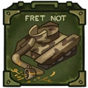 **Not So Serious Tank**: Increases the damage of photon mines. *(Flavor: "It has a dolphin on the back...")*
- 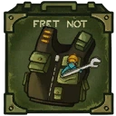 **Tactical Vest**: Adds a lifestealing effect to photon mines. *(Flavor: "Room for all your tools, oil and Zurian mechanics.")*
- 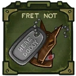 **Dog Tags**: Increases the attack speed of photon mine launcher. *(Flavor: "They look cool but they are useless, you are a dispensable warbot...")*
- 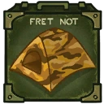 **Camouflage Tent**: Increases the speed and range of photon mines. *(Flavor: "Specifically designed for the surface of the sun.")*
- 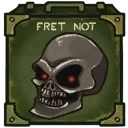 **Drive-Over Skulls**: Increases the radius of photon mine explosions. *(Flavor: "Now with extra crunchy sounds")*
- 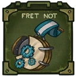 **Counter Intelligence Cross**: Photon mines will start to home on enemies over a short distance after time out. *(Flavor: "Awarded to the most non-intelligent bots in the field.")*

### Teleport Beacon

**Description:** Sentry deploys a beacon to which he can teleport. Sentry deals a damage dealing pulse at arrival.

- **Damage**: 250 (392.5)
- **Cooldown**: 15s
- **Duration**: 45s
- **Active after out of combat for**: 2s

#### Upgrades
-  **Yellow King Pages**: Increases the base damage when teleporting to the beacon. *(Flavor: "Monsters: Cookie.........Milkyway Solar..............Ribbit Spagetti.........Carcosa")*
- 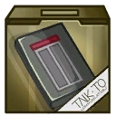 **Circuits Of Time**: Leave a decoy behind when teleporting to the beacon. After arming, the decoy will explode when enemies get near. *(Flavor: "For an excellent adventure!")*
- 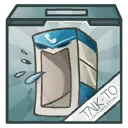 **Glass Case Of Emotion**: Reduces cooldown of Teleport Beacon. *(Flavor: "Just let it all out!")*
- 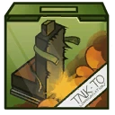 **Ejection Seat**: Adds a heal over time when teleporting to the beacon. *(Flavor: "When your landlord calls for the rent.")*
- 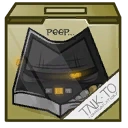 **Interrogation Answering Machine**: After teleporting to the beacon you will receive an attack speed boost. *(Flavor: "WHY ARE YOU CALLING?! WHO DO YOU WORK FOR?! LEAVE A MESSAGE!")*
- 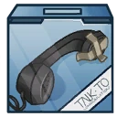 **Ringtones For The Deaf**: Adds a silencing pulse when exiting the beacon. *(Flavor: "Listen to the most beautiful silent ringtones.")*

### Energy Thruster

**Description:** Standed warbot energy thruster, for short leaps in combat.

- **Jump Height**: 8.4
- **Jump Duration**: 0.6s
- **Jumps**: 1

#### Upgrades
-  **Power Pills Turbo**: Increases maximum health. *(Flavor: Insert pill into rear end of digestive tract.)*
-  **Med-i'-can**: Automatically regenerate health. *(Flavor: Hello... anyone there? Please get me out of here!!!)*
-  **Space Air Max**: Increases movement speed. *(Flavor: Fashionable and Fast.)*
-  **Baby Kuri Mammoth**: Reduces the effect of all debuffs *(Flavor: "LOOK!!! A FLYING ELEPHANT!")*
-  **Piggy Bank**: Gives 100 Solar. *(Flavor: This product was brought to you by Zork industries, exploiting Zurians since 2780.)*
-  **Starstorm Statue**: Increases all damage you deal. *(Flavor: Made out of scraps and offerings it reads "SHIVA")*

