# Sheriff Lonestar

## Backstory
At the heart of the milky way lies the Bovinion system, ruled by a semi intelligent cow-like species. Although technologically advanced to an acceptable level, these Bovinions have maintained a tribal form of society for several thousands of years. Until recent years, an age-old custom in this society was to scare young Bovinion calves with bogeyman stories about a scary cowboy. Naughty Bovinion calves would, as the story went, be caught by this cowboy's unrelenting lasso.

Recently, a wealthy Bovinion visionary opened up a park where visitors would come to see a genetically re-engineered cowboy in action. But disaster struck and the cowboy escaped his cage. Before the Bovinions could react the cowboy had wrangled the entire park staff. Terror shook the Bovinion civilization as the cowboy started to wrangle every single Bovinion on the planet! Suddenly the Bovinions found themselves out of their cities and wrangled into herds on green meadows by the whisky drinking, bucket spitting, yeeehaawing horror.

Once the entire Bovinion civilization had been wrangled, the cowboy, naming himself Sheriff Lonestar, rode a rocket ship into the sunset, his job complete. Now Sheriff Lonestar fights as a mercenary in the robot wars, combining his awesome cowboy-powers with high tech weaponry to earn some Solar to spend on whisky and cigars.

## Base Stats
- **Health:**: 1300 (2288)
- **Movement Speed:**: 8.216
- **Attack Type:**: Medium Range
- **Role:**: Fighter
- **Mobility:**: Tactical

## Abilities & Upgrades
### Dynamite Throw
**Description:** Lonestar is a great fan of shooting things, but sometimes bullets just won't cut it. So to make sure it stays down, Lonestar will chuck cigar-lit sticks of dynamite at his foes!

- **Damage**: 140 (219.8)
- **Dynamite**: 3x
- **Cooldown**: 6
- **Explosion Radius**: 3.2
- **Time**: 0.7s

#### Upgrades
- 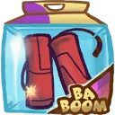 **Trinamite**: Increases the base damage of dynamite throw. *(Flavor: Now without superglue coating, making throwing multiple sticks a lot easier.)*
- 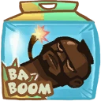 **Mister TNT**: Increases the explosion size of dynamite. *(Flavor: Free black van included.)*
- 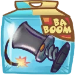 **Rubber Sleeve**: Makes your dynamite bounce. *(Flavor: Better shape, better explosive.)*
- 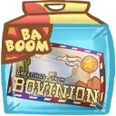 **Bovinian Postcard**: Hitting enemies with your blaster will reduce the cooldown of dynamite. *(Flavor: "Greetings from the green steppes of Bovinia!")*
- 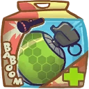 **Transfusion Grenades**: Adds a lifesteal effect to dynamite. *(Flavor: How you like them apples!)*
- 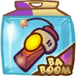 **Incendiary Bomb**: Increases damage over time of dynamite *(Flavor: The perfect gift for your Kremzon mother-in-law. Sharing is caring.)*

### Blaster
**Description:** Even though it's a bit modern for his tastes, Lonestar has shot his way out of many a tight situation using his deadly and accurate space blaster!

- **Damage**: 65 (102.05)
- **Attack Speed**: 166.7
- **Range**: 7.2

#### Upgrades
- 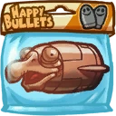 **Eagle Bullets**: Increases base damage of shots. *(Flavor: We love war! Buy more stuff from us - Vladimir Pewchenko, Happy Bullets)*
- 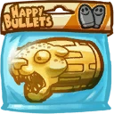 **Cheetah Bullets**: Increases attack speed of blaster. *(Flavor: No Zurians were harmed during testing, other than the ones that were.)*
- 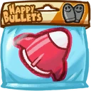 **Missile**: Adds a slow-loading homing missile to your blaster, which explodes. *(Flavor: SPECIAL OFFER: Buy one, get one free!)*
- 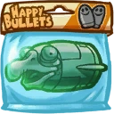 **Crystal Eagle Bullets**: Increases base damage of shots. *(Flavor: Crystals from Luxor moon of Calias. Handcarved by Zurians.)*
- 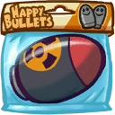 **Booming Bullets**: Makes bullets and missiles do damage in an area. *(Flavor: On planet Russia, bullet shoots you. - Vladimir Pewchenko, Happy Bullets)*
- 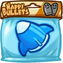 **Another Missile**: Adds a slow-loading homing missile to your blaster, which explodes. *(Flavor: SPECIAL OFFER: Buy one, get one free!)*

### Summon Hyper Bull
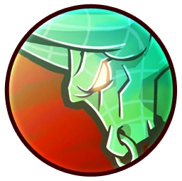

**Description:** To keep himself sharp, Lonestar trains with powerful holo-Bulls that knock anyone away. New fangled portable holo-tech allows him to turn his training program on his enemies!

- **Cooldown**: 8s
- **Speed**: 8
- **Health**: 400 (704)
- **Attack Speed**: 428.6
- **Knockback**: 1.2
- **Life Time**: 2.6s

#### Upgrades
- 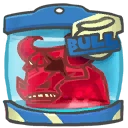 **Super Breed 2.0**: Makes hyper bull bigger, and push harder. *(Flavor: Patch notes 2.0+Improved frame rate+Polished horns+Added eye patch)*
- 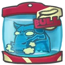 **Cattle Rebooter**: Reduces the cooldown on hyper bull. *(Flavor: Cattle rebooter, boots your cows and bulls.)*
- 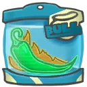 **Bull Charger**: Makes hyper bull explode on death. *(Flavor: Overclocks bull's processor to 1337 ultrahertz for faster processing of leg movement.)*
- 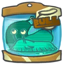 **Ribbit Snail Slime**: Makes hyper bull leave a healthpack behind upon despawning. *(Flavor: The slime of this snail is a strong adhesive and a popular ingredient in many cocktails.)*
- 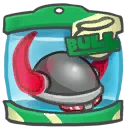 **Techno Viking Helmet**: Makes hyper bull deal damage. *(Flavor: This helmet is property of chief Red Beard.)*
- 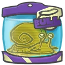 **Mature Ribbit Snail Slime**: Makes hyper bull slow enemies *(Flavor: A mature ribbit snail produces one of the strongest adhesives in the galaxy.)*

### Double Jump
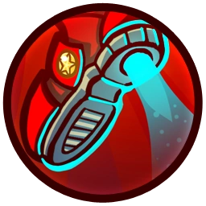

**Description:** Using the simple thrusters he integrated into his classic cowboy boots, Lonestar can do an extra jump in mid-air. Handy for traversing mountains of wrangled Bovinions!

- **Jump Height**: 4.752
- **Additional Jump Height**: 4.752
- **Jumps**: 2 (3 Rocket Boots)

#### Upgrades
-  **Power Pills Turbo**: Increases maximum health. *(Flavor: Insert pill into rear end of digestive tract.)*
-  **Med-i'-can**: Automatically regenerate health. *(Flavor: Hello... anyone there? Please get me out of here!!!)*
- 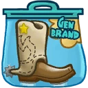 **Rocket Boots**: Increases movement speed. *(Flavor: Cowboy boots with rockets. What's not to like?)*
-  **Barrier Magazine**: Provides a damage absorbing shield. *(Flavor: Free personal shield with this month's edition of The Barrier! Read all about Zork's imperium.)*
-  **Piggy Bank**: Gives 100 Solar. *(Flavor: This product was brought to you by Zork industries, exploiting Zurians since 2780.)*
-  **Baby Kuri Mammoth**: Reduces the effect of all debuffs *(Flavor: "LOOK!!! A FLYING ELEPHANT!")*

