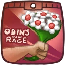
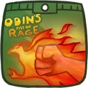
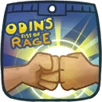
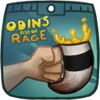
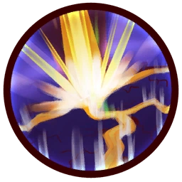
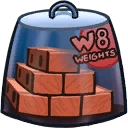

# Skølldir

## Backstory
Skølldir the Terrible Space Viking has raided over a hundred spaceports, cargo ships and grocery stores. His legendary thirst for battle is unquenchable. Great raids are usually followed by great feasts and soon his nickname was altered to Skølldir The Terribly Overweight Space Viking. Nothing could scorn Skølldir more than this honorless title!

Skølldir has set out on his space barge to impress the universe with his lightning fast fighting skills to prove this moniker wrong and show his nimbleness. Anyone who would dare to call him fat is met with a rapid series of crushing punches and is thrown aside. All the while, Skølldir's metallic suit is telling him how many calories he is burning.

If you find yourself on the battlefield, and hear the sound of crushing bones and thunderous farts in the distance, flee as Skølldir's fury is upon you!

## Base Stats
- **Health:**: 1600 (2816)
- **Movement Speed:**: 7.8
- **Attack Type:**: Melee
- **Role:**: Fighter
- **Mobility:**: Balanced

## Abilities & Upgrades
### Mighty Throw
**Description:** Always up for a Bear Hug, Skølldir never knew how to handle that awkward pause in the middle. His solution? Throw ‘m away! He ended up liking the throwing better than the hugging, so he stuck with that.

- **Damage**: 100 (157)
- **Knockback**: 1.7
- **Cooldown**: 8s
- **Stun duration**: 0.8s

#### Upgrades
-  **Power Briefs**: Adds damage to mighty throw. *(Flavor: You feel very powerful in these briefs.)*
-  **Cortexiphan Shake**: Adds a slowing effect to mighty throw. *(Flavor: Sideffect: You might experience switching between multiple dimensions.)*
-  **Axethrowing Trophy**: Throw further. *(Flavor: Won by Arnie in the 2006 championship.)*
-  **Crankin' Dumbbells**: Reduces the cooldown on mighty throw. *(Flavor: Speed up your weightlifting.)*
-  **Homeless Gnome**: Throw an exploding gnome. *(Flavor: If you are willing to throw a gnome you can throw anything!)*
-  **Oily Spray on Bronze**: Receive an attackspeed bonus after a successful throw *(Flavor: Real bronze, don't inhale! For robotics only.)*

### Bash
**Description:** No man should ever come within reach of Skølldir’s best friends, Lefty ‘n Righty. Better known as his Fists of Fury, he is able to pummel enemies with a devastating 3-hit combo that’ll leave their ears ringing!

- **Damage**: 110 (172.7) | 139 (218.23) | 247 (387.79)
- **Range**: 3.8 | 3.8 | 7.2
- **Combo Timeout**: 0s | 0.2s | 0.5s

#### Upgrades
-  **Perfumed White Flowers**: Regain health by landing the 3rd Bash combo bit. *(Flavor: You might get lucky with these.)*
-  **Rubber Ducky Choker**: Adds a stun effect to the 3rd Bash combo hit. *(Flavor: Choke hard to relieve stress.)*
-  **Chunk of Salted Meat**: Increases the damage of Bash. *(Flavor: Ingredients: 91% Drogo meat, 6% long hairs, 3% salt.)*
-  **Flaming Fists**: Increases the range of the 3rd Bash combo hit. *(Flavor: I'm on fiya!!)*
-  **Fistbump**: Deflect bullets with the first two punches of Bash. *(Flavor: Come at me bro!)*
-  **Pale Mead**: Increases the damage the third punch of Bash. *(Flavor: Goes great with some dried meat.)*

### Earthquake

**Description:** Putting on some weight made his buns of steel a force to be reckoned with. Planting them firmly on the ground after a daring leap shatters earth and enemies alike!

- **Damage over time**: 350 (549.5)
- **Damage Duration**: 5s
- **Cooldown**: 8s
- **Range**: 9
- **Time**: 1s

#### Upgrades
-  **Electric Hammer**: Adds a snaring effect to Earthquake. *(Flavor: Knock, knock! Who's there?)*
-  **Stolen Couch**: Increases the range of Earthquake. *(Flavor: Perfect for powerlifting.)*
-  **Stone Twins**: Makes Earthquake to go to the back as well. *(Flavor: Twice the action, twice the result.)*
-  **Iridium Bricks Game**: Increases base damage of Earthquake. *(Flavor: Stack 'em high! Ages 350 to 500)*
-  **Enhanced Muscle Fibers**: Recues cooldown time of Earthquake. *(Flavor: Exercise is so 3008.)*
-  **Small Volcano**: Increases height of Earthquake. *(Flavor: Fully functional volcano for at the office.)*

### Explosive Fart

**Description:** Able to channel his inner “strength”, Skølldir lets out a thunderous fart that lifts his bulk to new-found heights during a jump.

- **Jump Height**: 4.8
- **Additional Jump Height**: 4.8
- **Jumps**: 2

#### Upgrades
-  **Power Pills Turbo**: Increases maximum health. *(Flavor: Insert pill into rear end of digestive tract.)*
-  **Med-i'-can**: Automatically regenerate health. *(Flavor: Hello... anyone there? Please get me out of here!!!)*
-  **League Seven Boots**: Increases movement speed. Plus an extra boost when throwing enemies. *(Flavor: When you are in a hurry to get to league 1!)*
-  **Barrier Magazine**: Provides a damage absorbing shield. *(Flavor: Free personal shield with this month's edition of The Barrier! Read all about Zork's imperium.)*
-  **Piggy Bank**: Gives 100 Solar. *(Flavor: This product was brought to you by Zork industries, exploiting Zurians since 2780.)*
-  **Baby Kuri Mammoth**: Reduces the effect of all debuffs *(Flavor: "LOOK!!! A FLYING ELEPHANT!")*

