# Skree

## Backstory
Skree belongs to a race of hitchhiking witchdoctors. Mysticism and superstition are a big part of Skree’s heritage. After being dumped on the Starstorm by a space trucker. Skree found himself all alone on an abandoned space station filled with mighty looking robots. Mistaking the robots’ station for a burial ground of ancient space spirits, he decided to live the rest of his life in service to the silenced automatons. He spent his time on collecting different parts of the battle station to create shrines for his newly found robot gods and connected robot parts and machine scraps to form huge robotic statues and altars. Unbeknownst to Skree, his rigging rites accidentally shortly activated the mainframe of the Starstorm, powering the construction robots and the Starstorm’s weapons systems itself.

All of a sudden Skree found the Starstorm vibrating as it’s systems slowly started to come online, it’s robotic denizens starting to carry out their age-old grim directive. Skree decided he liked his spirit-gods better when they were statues and went into hiding.

Skree was found by the Awesomenauts on the Starstorm hiding in one of his shrines in the Starstorm’s ventilation systems, praying to make the evil robots go back to sleep. Thinking the Awesomenauts were magical spirit-guides, Skree adopted a new vision quest and joined the Awesomenauts to seek out better spirit-gods to worship.

## Base Stats
- **Health:**: 1350 (2376)
- **Movement Speed:**: 8.7
- **Attack Type:**: Ranged
- **Role:**: Harasser
- **Mobility:**: Swift

## Abilities & Upgrades
### Saw Blade
**Description:** Shoot a spinning blade that stays in one position for a limited time. You can place it and pull it towards you by pressing the button again.

- **Flying Damage**: 210 (329.7)
- **Damage Per Second**: 220 (345.4)
- **Attack Speed**: 600
- **Cooldown**: 10s
- **Range**: 12.6
- **Time**: 4.9s
- **Size**: 5.2

#### Upgrades
- 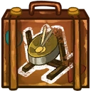 **Steeldrum**: Increases the base damage of saw blade against enemy Awesomenauts. *(Flavor: Old Namala steeldrum. One of the few things the Mon'Grah kept from their homeplanet.)*
- 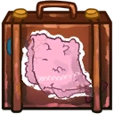 **Scruffy Towel**: Adds a lifestealing effect to saw blade. *(Flavor: It says "Wash at 42 degrees celcius")*
- 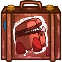 **Suitcase Monster**: Increases the size of saw blade. *(Flavor: These beasts can hold your luggage, but make sure to remove the luggage before they devour it!)*
- 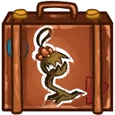 **Air Freshener**: Adds homing particles to saw blade when rotating in place. *(Flavor: The fresh smell of burnt weedling fills your cabine.)*
- 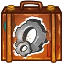 **Spare Blade**: Adds a second saw blade that moves backwards and deals less damage. *(Flavor: Industrial blades for cutting minerals on the moons of Okeanos.)*
- 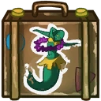 **Alien Hula Girl**: Adds a slowing effect to saw blade. *(Flavor: These vermin live in space trucks. Really hard to get rid of.)*

### Lightning Rod
**Description:** Shoot lightning from your mechanical rod. Deals half damage to secondary targets.

- **Damage**: 66 (103.62)
- **Fork Damage**: 30 (47.1)
- **Attack Speed**: 100
- **Range**: 7
- **Targets**: 3
- **Spread**: 35°

#### Upgrades
- 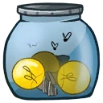 **Magic Sunballs**: Increases the amount of targets your lightning can hit. *(Flavor: Powered with an electrical current, these fascinating things emit a beatiful light.)*
- 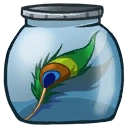 **Lashes Of The Goddess**: Increases the base damage of lightning rod. *(Flavor: Special painted birds bring these lashes down from the heavens.)*
- 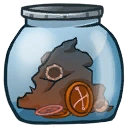 **Pills For The Mind**: Adds a slowing effect to lightning rod. *(Flavor: Warning! Some species experience vivd hallucinations by eating these.)*
-  **Ceremonial Mask**: Every 2 seconds, your next lightning shot will target all enemies within range. *(Flavor: Allows the wearer to directly look at welding rituals.)*
- 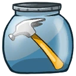 **Device Of The Heavens**: Increases the attack speed of lightning rod. *(Flavor: Very old and practical tool used in the creation of holy shrines.)*
-  **Soul Connectors**: Adds damage over time to lightning rod. *(Flavor: Weird folded strings of metal, possibly for tuning in with astral signals.)*

### Totem Of Power

**Description:** Place a totem that has collision for enemies and can be stand on by friendly units.

- **Cooldown**: 14s
- **Health**: 600 (1056)
- **Height**: 6
- **Width**: 1.6
- **Duration**: 7s

#### Upgrades
- 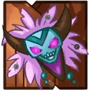 **Mask Of Fear**: Incrases the damage dealt by you and allied Awesomenauts while being near the totem of power. *(Flavor: When the tech-crazy Mon'Grah were exiled from Okeanos, they turned to dark magic wearing these sinister masks.)*
- 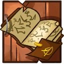 **Book Of Medicine**: Reduces the cooldown of the totem of power. *(Flavor: Contains hundreds of ancient recipes for mystic potions and elixirs.)*
- 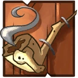 **Ornamented Pipe**: Increases height of totem of power. *(Flavor: Handcrafted from sandworm tailbone this piece is quite remarkable.)*
- 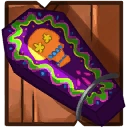 **Closed Coffin**: Increases the base health of the totem of power. *(Flavor: This coffin is nailed shut. You can hear a faint mumble from within.)*
- 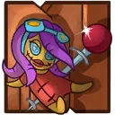 **Voodoo Doll**: Adds a slowing effect to the totem of power. *(Flavor: This new Awesomenauts line allows you to torture your favorite 'naut!)*
- 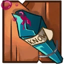 **Trial Elixir Of Knowledge**: Adds a knockback pulse when totem of power is created. *(Flavor: "Failed attempt #30024: Not enough water of Okeanos...? Needs more testing")*

### Whirling Blades
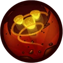

**Description:** Skree floats on a swirling set of blades, by holding the button he can stay on the same altitude in the air.

- **Jump Height**: 10
- **Descending Speed**: 0
- **Jumps**: 1 (Hover)

#### Upgrades
-  **Power Pills Turbo**: Increases maximum health. *(Flavor: Insert pill into rear end of digestive tract.)*
-  **Med-i'-can**: Automatically regenerate health. *(Flavor: Hello... anyone there? Please get me out of here!!!)*
-  **Space Air Max**: Increases movement speed. *(Flavor: Fashionable and Fast.)*
-  **Baby Kuri Mammoth**: Reduces the effect of all debuffs *(Flavor: "LOOK!!! A FLYING ELEPHANT!")*
-  **Piggy Bank**: Gives 100 Solar. *(Flavor: This product was brought to you by Zork industries, exploiting Zurians since 2780.)*
-  **Starstorm Statue**: Increases all damage you deal. *(Flavor: Made out of scraps and offerings it reads "SHIVA")*

