# Smiles

## Backstory
After escaping with the other renegades out the clutches of the “unstoppable” Piere Feu Darret the corrupt Scarg emperor, Smiles hid in the swamps on Ribbit II.

With a background of tracking and capturing yummy targets around the galaxy for the emperors endless appetite, he put his skills to good use: hunting some game in the deep swamps and starting a small business selling handcrafted luxurious handbags.

The unorthodox method of poaching swamp rodents with his flame thrower resulted in heavily burned pelts and hides, but it turned out a great business success as the dark charred bags were an instant hit on the amphibian black market.

One day an old friend knocked on his door and a plan of vengeance was drawn to find some new allies and clear their names.

## Base Stats
- **Health:**: 1600 (2816)
- **Movement Speed:**: 7.6
- **Attack Type:**: Short-ranged
- **Role:**: Fighter
- **Mobility:**: Balanced

## Abilities & Upgrades
### Trapper's Hook
**Description:** Throw out a hook that will connect with enemy Awesomenauts and lets you drag them around the map for a short duration.

- **Damage**: 100 (157)
- **Duration**: 1.1s
- **Reel in time**: 2s
- **Cooldown**: 8s

#### Upgrades
- 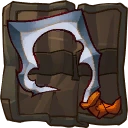 **Dinosaur Hook**: Increases the damage of Trapper's Hook. *(Flavor: For big poultry hunting.)*
- 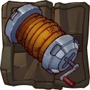 **Electric Magnetic Winch**: Increases the range of the hook *(Flavor: Normally this winch can be found on planetary vehicles.)*
-  **Candy Rope**: Reduces the 'naut damage output during the hook. *(Flavor: Sweetened rope to lure hungry green creatures.)*
- 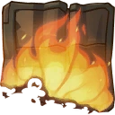 **Bush Telly**: Increases the duration of Trapper's Hook. *(Flavor: Nothing beats watching nature burn.)*
- 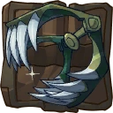 **Snapper Trap**: Adds a lifesteal effect to trapper's hook. *(Flavor: The same snapping power can be found on suicide warbots.)*
- 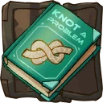 **The Knot Meister**: Reduces the cooldown on trapper's hook when successfully hitting an ememy with tail whip. *(Flavor: Herr Taschentuch will teach you every knot in the universe."Mister Taschentuch has some crafty tentacles" 8/10 - Croakin' book reviews "Some great knots in here: the tree choker, space tugger and headphone cord ball, great stuff!" 4/5 stars - Titan books)*

### Bush Fire
**Description:** Fire your flamethrower and set everything ablaze.

- **Damage**: 23 (36.11)
- **Awesomenaut Damage**: 28 (43.96)
- **Attacks per second**: 7.7

#### Upgrades
- 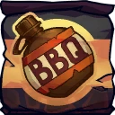 **Barbie Sauce**: Increases the damage of bush fire. *(Flavor: You can't go anywhere without this famous sauce made out of ketchup, charcoal and human dolls.)*
- 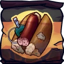 **Pocket Dog**: Adds a big flame to your bush fire. *(Flavor: If you forgot the burgers or road kill steak, you always have your backup pocket dog.)*
- 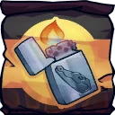 **Inscribed Lighter**: The first flames will burn terrain. *(Flavor: Countains explosive rocket fuel, shake gently before use.)*
- 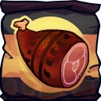 **Roadkill Shashlik**: Increases the range of Bush fire. *(Flavor: Today's freshly hit special: fat grime fly and purple beaver.)*
- 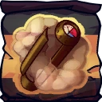 **Rodent Smoker**: Receive a heal over time effect when killing a droid. *(Flavor: Easy set up smoker for any kind of small piece of bushmeat such as space rats.)*
-  **Dirty Apron**: Increases the damage of bush fire against enemies who are slowed, snared or stunned. *(Flavor: "Kiss the Croc!")*

### Tail Whip
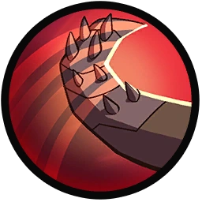

**Description:** Smack your foes with your reinforced tail, knocking them back.

- **Damage**: 280 (439.6)
- **Knockback**: Yes
- **Stun**: 0.2s
- **Cooldown**: 7.5s

#### Upgrades
-  **Wooly Geurt**: Reduces the cooldown of tail whip. *(Flavor: A beautiful specimen of the smelly tusked beasts that roam the wastelands of Eiron.)*
-  **Gnome King**: Increases the damage of tail whip *(Flavor: The mighty Orron Valpip II was one of the greatest kings of his era. Some gnomes still honor him by wearing a snapped hood.)*
- 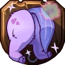 **Unicornian Butt**: Increases the stun effect to tail whip. *(Flavor: Disclaimer: The rainbow fart unfortunately is fake, but it's still a timeless piece.)*
- 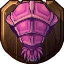 **Sandworm Tail**: Increases damage of tail whip against enemy Awesomenauts when they have more than 50% health. *(Flavor: Difficult choice to put this on your wall or on the grill.)*
- 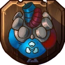 **Warbot "Heart"**: Hitting friendly droids with your tail whip will increase their movement and attack speed. *(Flavor: A unique and rare piece: an actual warbot heart. Only a few warbots were fitted with these, no one knows why.)*
- 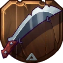 **My First Machete**: Adds a slowing effect to tail whip. *(Flavor: A very dull weapon to allow practice of a 'clean' kill.)*

### High Reptilian Jump
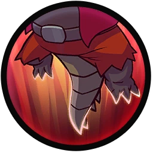

**Description:** High reptilian jump.

- **Jumps**: 1

#### Upgrades
-  **Power Pills Turbo**: Increases maximum health. *(Flavor: Insert pill into rear end of digestive tract.)*
-  **Med-i'-can**: Automatically regenerate health. *(Flavor: Hello... anyone there? Please get me out of here!!!)*
- 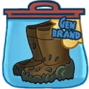 **Swamp Gummies**: Increases movement speed and increases health regeneration while inside hide areas. *(Flavor: Now with real swamp stank!)*
-  **Barrier Magazine**: Provides a damage absorbing shield. *(Flavor: Free personal shield with this month's edition of The Barrier! Read all about Zork's imperium.)*
-  **Piggy Bank**: Gives 100 Solar. *(Flavor: This product was brought to you by Zork industries, exploiting Zurians since 2780.)*
-  **Baby Kuri Mammoth**: Reduces the effect of all debuffs *(Flavor: "LOOK!!! A FLYING ELEPHANT!")*

