# Snork Gunk

## Backstory
Although Snork Gunk is considered one of the better conchballers in Scargi Space he never reached first league with his team, the Pearl Sluggers. He always criticized the sport had become too slow. Blaming the slugs at management for trying to slow the pace of the game, games that were already drawn out over the span of 14 Earth months. "With an average of only one or two goals a game, you have more fun watching paint dry" he complained. After many times of being disqualified for scoring too quickly, the team benched him for good.

Fed up with his failed carrer in sports he decided to join the Scargi military police hoping for some more action by tracking and hunting down enemies of the empire. After a good run of swift catches, he was assigned on a mission to hunt down the fugitive Rocket's Renegades. Realizing the Renegades had joined the ranks of the Awesomenauts, a team of 'big league' mercenaries, he applied for the transfer of a lifetime...

## Base Stats
- **Health:**: 1300 (2288)
- **Movement Speed:**: 8.1
- **Attack Type:**: Melee
- **Role:**: Harasser
- **Mobility:**: Tactical

## Abilities & Upgrades
### Sticky Snail
**Description:** Shoot out a sticky snail which pulls you towards walls or enemy Nauts with such force that enemies in the area take damage and are slowed.

- **Slow**: 20%
- **Slow duration**: 2.5s
- **Cooldown**: 6s

#### Upgrades
- 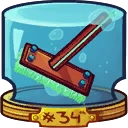 **Conchball Broom**: Increases the range of sticky snail *(Flavor: Conchball game rule 06: The conchball may only be thrown once and movement may only be adjusted by brushing spacetime in front of the moving ball.)*
- 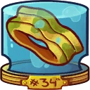 **Nasty Sweat Band**: Adds damage to the impact of sticky snail. *(Flavor: 50% off. Comes with some stains.)*
- 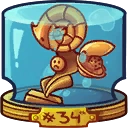 **Participation Trophy**: Adds a lifestealing effect to sticky snail. *(Flavor: Engraved at the bottom it says: "Congratulations! You successfully participated in the Conchball Cup of the 34th decade.)*
- 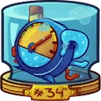 **Broken Speed Limiter**: Reduces the cooldown of sticky snail. *(Flavor: Conchball game rule 33: Players must keep and maintain a topspeed of 0.005 miles per hour at all times.)*
- 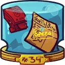 **Red Card Collection**: Increases the slowing effect of sticky snail. *(Flavor: A box full of red cards, there are also some unpaid speeding tickets in there.)*
- 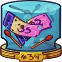 **Season Tickets '35**: When the snail hits, it releases a stun pulse around it. *(Flavor: Comes with a free box of matchsticks to keep your eyes open.)*

### Conch Dunk
**Description:** Hit your enemies for damage.

- **Damage**: 95 (149.15)
- **Attack Speed**: 138

#### Upgrades
- 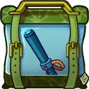 **Electric Stun Baton**: Increases the base damage of conch ball against enemy Awesomenauts. *(Flavor: There is a button on the side. If you press it, the baton shouts "STOP RESISTING!".)*
- 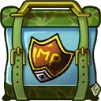 **Scargi MP Seal**: Each conchdunk hit against enemy Awesomenauts reduces the cooldown of shell bombs. *(Flavor: Water and slime resistant royal seal of the Scargi Military Police.)*
- 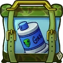 **Tear Gas**: Leaves a gas cloud when using Conch Dunk. *(Flavor: This grenade has some heartbreaking stories to tell.)*
- 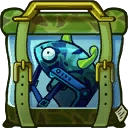 **Brainslug Helm**: Adds a weakening effect to conch dunk. *(Flavor: This helm is super safe, trust me! Try it for a day, you will be a satisfied customer!)*
- 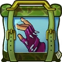 **Action Gloves**: Increases base damage of the next conch dunk after hitting an enemy with shell bomb. *(Flavor: Look inappropriate at any occasion!)*
- 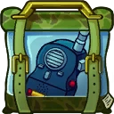 **Walkie Talkie**: Increases conch dunk damage against stunned, slowed, silenced, blinded and/or snared enemies. *(Flavor: This device walks out of a conversation any chance it gets.)*

### Shell Bombs
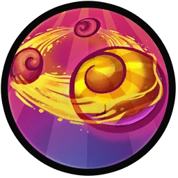

**Description:** Summon holographic shells that will spin around you and deal damage per second. When a shell hits an enemy naut, it will explode for damage.

- **Damage per second**: 500 (785)
- **Explosion Damage**: 160 (251.2)
- **Duration**: 4s
- **Shells**: 3
- **Cooldown**: 12s

#### Upgrades
- 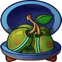 **Cockle Multiball**: Adds a knockback to conch dunk while shell bombs are active. *(Flavor: Conchball rule 14: Every 100 meters the teams in conchball are allowed to try to knock the opponent's team conchball out by throwing mini cockleballs at it.)*
- 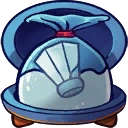 **Salt Line Bag**: Increases the duration of shell bombs. *(Flavor: Althought salt is forbidden, it has been a tradition to use it to draw the lines of the conchballfield and till this day the substance has been allowed to be used for this purpose. Many frown upon the use of it and consider it a barbaric practice.)*
- 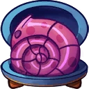 **Official Conchball**: Increases the size of shell bombs. *(Flavor: Comes with a certificate of authenticity from the intergalactic federation of conchballers.)*
- 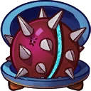 **Spiky Shellball**: Increases the explosion damage of the shell bombs. *(Flavor: The training ball for young Scargi conchballers has sharp spikes to teach them not to touch the ball, but to use a certified broom.)*
- 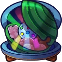 **Disco Clamball**: Adds a healing effect to shell bombs for allied Awesomenauts. *(Flavor: The ball can be adjusted with tiny weights on the inside and an adjustable discoball with led lights for extra coolness.)*
- 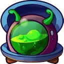 **Snail Slime Container**: Grants a shield while shellbombs are active. *(Flavor: "A perfect game is a very slow game!" Rob Bourgogne - Sports Caster)*

### Antigravity Jump
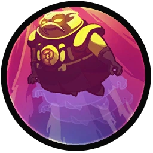

**Description:** Float above the ground with this belt and hold the button to ascend.

- **Jumps**: 1

#### Upgrades
-  **Power Pills Turbo**: Increases maximum health. *(Flavor: Insert pill into rear end of digestive tract.)*
-  **Med-i'-can**: Automatically regenerate health. *(Flavor: Hello... anyone there? Please get me out of here!!!)*
-  **Space Air Max**: Increases movement speed. *(Flavor: Fashionable and Fast.)*
-  **Wraith Stone**: Heal additional health by killing critters. *(Flavor: Life sucks, death even more.)*
-  **Piggy Bank**: Gives 100 Solar. *(Flavor: This product was brought to you by Zork industries, exploiting Zurians since 2780.)*
- 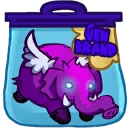 **Baby Kuri Mammoth**: Reduces the effect of all debuffs *(Flavor: "LOOK!!! A FLYING ELEPHANT!")*

