# Ted McPain

## Backstory
Ted McPain was one of the great heroes of the first AI Wars, a long time ago. He has led his squad of elite super soldiers, the Killer Koala’s, against many opponents and has been decorated as an outstanding soldier a hundred times over. His ultimate achievement, during the climax of the First AI Wars, was a solo operation onto the AI’s battle station Starstorm. This mission ended in Ted McPain single handedly unhinging all of the station’s crucial power couplings, effectively making sure the station wouldn’t be completed before the end of the war.
Ted McPain eventually died when he sacrificed himself to save the Sunny-Daisy Alien Orphanage from a band of bloodthirsty dinosaur zombies in 3021. Ted’s heroic deeds would never be forgotten.

He lived on as he became the star of various video games: Ted McPain I through XVII, Ted McPain: Zombie Blast, Ted McPain vs. evil Ted McPain and Ted McPain Unicorn Dance Karting.

When Voltar The Omniscient learned of the violent dimwitted video game star, he brewed up a plan that would backfire horribly. He created the Materializotron XT8000 with which he wanted to bring back the war hero of old to be his personal assistant. Extracting Ted McPain’s digital essence from his video games, Voltar managed to materialize a life-size flesh and blood version. The Ted McPain that appeared though was missing his pants for unknown reasons. Voltar waved the issue aside saying “Stop asking stupid questions! He looks fine to me.”

## Base Stats
- **Health:**: 1400 (2464)
- **Movement Speed:**: 7.4
- **Attack Type:**: Range
- **Role:**: Fighter
- **Mobility:**: Tactical

## Abilities & Upgrades
### Airstrike
**Description:** Shoot a flare that marks the location for a powerful airstrike. Only available when holding the machinegun.

- **Damage**: 450 (706.5)
- **Cooldown**: 11s
- **Range**: 10

#### Upgrades
- 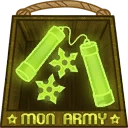 **Stealthy Ninja Weapons**: Adds damage over time to airstrike *(Flavor: User Rating: 0 out of 5 stars "These are glow in the dark?!!... how on Jupiter is this stealthy... I don't even...")*
- 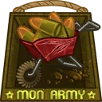 **Wheelbarrow with Ammo**: Increases base damage of the airstrike against enemy Awesomenauts. *(Flavor: New technology to reload walking mechs. It's not very effective, but looks really cool!)*
- 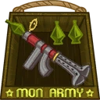 **Double RPG**: Allows a second airstrike to be fired shortly after the first one. *(Flavor: This little piggy blew up the market This little piggy wrecked home This little piggy made some roast beef.)*
- 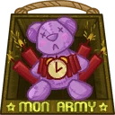 **I-Don't-Carebear**: Adds a stunning effect to airstrike *(Flavor: Look kids! It's gloomy! The super depressed bear from the I-don't-carebears television series!)*
- 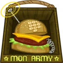 **Hamburger Phone**: After airstrike, a healthpack supply will drop *(Flavor: "Hello. Yes this is hotdog.")*
- 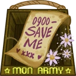 **Adlez Princess Phonenumber**: Airstrike will go through terrain, all across the level *(Flavor: After getting in trouble, Adlez princesses send out intergalactic distress calls to find their prince.)*

### Shotgun and Machine Gun
**Description:** Ted can alternate between his shotgun and machine gun

- **Shotgun Damage**: 210 (329.7) (piercing)
- **Shotgun Attack Speed**: 50
- **Shotgun Range**: 5
- **Shotgun Reload Time**: 2s
- **Shotgun Knockback**: 0.2
- **Shotgun Spread**: 20°
- **Machine Gun Damage**: 42 (65.94)
- **Machine Gun Attack Speed**: 352.9
- **Machine Gun Range**: 7.5
- **Movement with machine gun**: +0.8
- **Weapon Switch Cooldown**: 0.6s

#### Upgrades
- 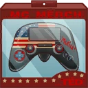 **Ted McPain Unicorn Dance Karting**: Adds a grenade to shotgun shots *(Flavor: Now with a rearview mirror on the controller!)*
- 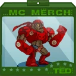 **Commando Ted Figurine**: Increases the base damage of shotgun and machine gun *(Flavor: Wind him up and he will teach your kids the latest barfighting moves.)*
- 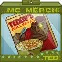 **Teddy's Bullseyes**: Increases the Shotgun Ammo *(Flavor: Add some chunky Bovinian milk to start the day like a champ!)*
- 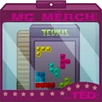 **Tedris Ville**: Adds a long ranged snipe shot to machine gun *(Flavor: Tap two blocks and wait a month or pay 99 Solar cents. Your friends play it!)*
- 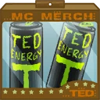 **Can O'Juice!**: Increases the range of machine gun *(Flavor: Ted juice walk it out! DRAAANK!)*
- 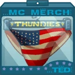 **Ted's Power Briefs**: Increases knockback on shotgun shots *(Flavor: Limited Edition! You might want to wash these first.)*

### Stimpack
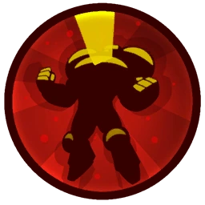

**Description:** Receive a temporary burst of attack speed. Only available when holding the shotgun.

- **Attack Speed**: +40%
- **Swap Speed**: +40%
- **Duration**: 4s
- **Cooldown**: 10s

#### Upgrades
-  **Armpit Shaving Cream**: You gain a damage-reducing shield when stimpack is enabled. *(Flavor: Also goes great with some toast and sparkling wine.)*
- 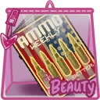 **Ammo Weekly**: Increases the attackspeed while stimpack is active *(Flavor: This week's special Recycling bullets: bad for you, good for the environment!)*
- 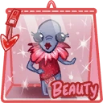 **Personal Assistant**: Increases the duration of stimpack *(Flavor: Pocketsize, they don't need a charger and come with a great résumé!)*
- 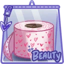 **Angel Wing Toilet Paper**: Stimpack automatically reloads your shotgun. *(Flavor: My $#! feels like heaven!  Disclaimer: Nalani angel wings have been harvested unhumanly as possible.)*
- 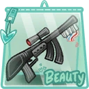 **Sniper Toothbrush**: Increases movement speed while stimpack is active *(Flavor: If you are going to pull the trigger while brushing your teeth, you're gonna have a bad time.)*
-  **Grénaide pour Homme**: Adds a stun pulse to activating stimpack. *(Flavor: A fragrance made of Zurian tears.)*

### Jumppack
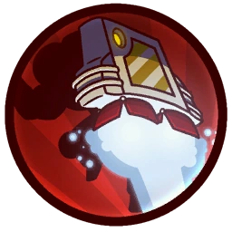

**Description:** This marine can handle any assault course with his jumppack

- **Jump Height**: 8
- **Jumps**: 1

#### Upgrades
-  **Power Pills Turbo**: Increases maximum health. *(Flavor: Insert pill into rear end of digestive tract.)*
-  **Med-i'-can**: Automatically regenerate health. *(Flavor: Hello... anyone there? Please get me out of here!!!)*
-  **Space Air Max**: Increases movement speed. *(Flavor: Fashionable and Fast.)*
-  **Baby Kuri Mammoth**: Reduces the effect of all debuffs *(Flavor: "LOOK!!! A FLYING ELEPHANT!")*
-  **Piggy Bank**: Gives 100 Solar. *(Flavor: This product was brought to you by Zork industries, exploiting Zurians since 2780.)*
-  **Starstorm Statue**: Increases all damage you deal. *(Flavor: Made out of scraps and offerings it reads "SHIVA")*

