# Vinnie & Spike

## Backstory
Vinnie and Spike are notorious partners in crime and BFF's. Spike is the muscle of the team and a bit of a silent guy, he loves late night krab burgers.Vinnie is quite the hothead, leaving Spike to do the heavy lifting while he plots out the next heist. With a pack full of restraining orders this little plankton devil is not to be messed with. They are wanted on numerous planets including their homeplanet Okeanos where the largest crime syndicate Shisu has put a reward on their head for stealing the Kullinan Koi, the biggest golden Koi ever known to fish and worth 4.8 Billion Solar.Unfortunately the duo lost the Koi somewhere in the Atlantic ocean while fleeing from Interpool.Being a pufferfish, Spike can gasp for air and float up, flapping his fins to move around. He is always ready for a fast getaway and can dash out of combat, leaving a smokebomb behind to fool his enemies, while both Vinnie and Spike run with the loot.

## Base Stats
- **Health:**: 1250 (2200)
- **Movement Speed:**: 5.71206 x1.5(Airborne)
- **Attack Type:**: Medium Range
- **Role:**: Assassin
- **Mobility:**: Aerial

## Abilities & Upgrades
### Spike Dive
**Description:** In many a mad dash to escape them flat-flooted coppers, Spike has specialised in a Dive that lets him torpedo through just about any roadblock. It delivers a lethal dose of spikes shot from his spine to add to the mayhem!

- **Damage**: 400 (628)
- **Cooldown**: 8s
- **Radius**: 6

#### Upgrades
- 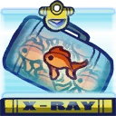 **Bag Full of Gold Fish**: Deal extra damage with the dive when you have 150 solar in your pockets *(Flavor: Common currency on Okeanos.)*
- 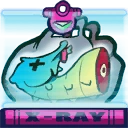 **Dead Seahorse Head**: Shoot extra spikes before you dive. *(Flavor: The Omean give these to their children to warn them of the dangers of the seas.)*
- 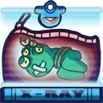 **Alien Abduction Kit**: Adds a lifesteal effect to spike dive *(Flavor: It's probing time!)*
- 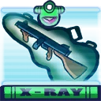 **Antique Machinegun**: Adds a silence effect to spike dive *(Flavor: This rusty weapon has quite the recoil.)*
- 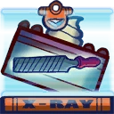 **Chrome File**: Increases damage of spike dive against enemy Awesomenauts. *(Flavor: For male pufferfish hygenic use and escaping prison.)*
- 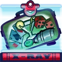 **Rigged Casino Games**: Allows a second spike dive to be used after the first one, but reduces the damage. *(Flavor: Nobody likes chance!)*

### Bubble Gun
**Description:** The small difference between the bubbles shot from Spike’s mouth, and the gently tumbling soapy dreams we all adore from our childhood, is that Spike’s bubbles will take your arm off if you try to pop ‘m!

- **Bullets**: 3
- **Damage**: 35 (54.95)
- **Attack Speed**: 85.7
- **Range**: 7

#### Upgrades
- 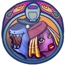 **Sharky & Remora**: Increases range of bubble gun *(Flavor: Two friends in a can.)*
- 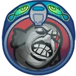 **Scarfish**: Increases attack speed of bubble gun *(Flavor: Say hello to my little friend!)*
- 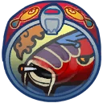 **Yakoiza**: Increases base damage of bubble gun after using smoke screen or spike dive *(Flavor: This decoy was used in the famous Kullinan Koi heist.)*
-  **Al Carper**: Increases base damage of bubble gun *(Flavor: Great with a good cocktail!)*
- 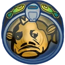 **The Codfather**: Increases damage of bubble gun to wealthy enemies. (150 solar) *(Flavor: SALE! Now for an offer you can't refuse!)*
- 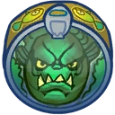 **Loanshark**: Adds 4th bubble to bubble gun. *(Flavor: Better pay your debts!)*

### Smoke Screen
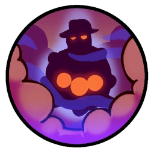

**Description:** Whenever Spike gets cornered, he squirts out a misty cloud that leaves everyone blinded in its wake. Vinnie has long since learned to use this nervous tick in his trusty pal to beat a hasty retreat when things get nasty!

- **Cooldown**: 11s
- **Duration**: 4s
- **Size**: 8
- **Attack Speed**: 160
- **Blind Duration**: 0.38s

#### Upgrades
-  **Red Bandana**: Adds a weakening effect to smoke screen *(Flavor: Say what again! I dare ya! I double dare ya!)*
- 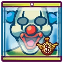 **Clown's Mask**: When using smoke screen you will become temporarily immune to all debuffs *(Flavor: Worn by Grint tribe members during sacrificial rituals.)*
- 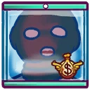 **Mammoth Sock with Holes**: Makes teammates invisible *(Flavor: Common giant second-hand sock worn by the mammoths on the glass planet Kuri.)*
- 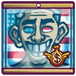 **Withered President Mask**: Increases movement speed after using smoke cloud. *(Flavor: Although the mask is bleached by the sun, it's still in good shape. It says "4 more years!")*
- 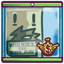 **Rocketeer**: Increases size of smoke screen *(Flavor: This poor guy seems to be tied to a rocket!)*
- 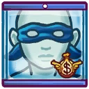 **Rubber Mask**: Gain health for every enemy in the cloud. *(Flavor: Latest in Cerean eyewear. By Lucci)*

### Inflate
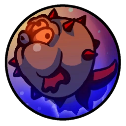

**Description:** Being the smart guy that he is, Vinnie uses Spike’s ability to bloat his body and float around. Apart from a hilarious party trick, this will get the duo up to those hard to reach places for the choicest pieces of loot!

- **Jump Height**: 4
- **Jumps**: 500

#### Upgrades
-  **Power Pills Turbo**: Increases maximum health. *(Flavor: Insert pill into rear end of digestive tract.)*
-  **Solar Krab Burgers**: Solar coins will heal you *(Flavor: This popular underwater fast food, makes your stomach resistant to solar.)*
-  **Space Air Max**: Increases movement speed. *(Flavor: Fashionable and Fast.)*
-  **Wraith Stone**: Heal additional health by killing critters. *(Flavor: Life sucks, death even more.)*
-  **Piggy Bank**: Gives 100 Solar. *(Flavor: This product was brought to you by Zork industries, exploiting Zurians since 2780.)*
-  **Baby Kuri Mammoth**: Reduces the effect of all debuffs *(Flavor: "LOOK!!! A FLYING ELEPHANT!")*

