# Yuri

## Backstory
Once part of the soviet space program, Yuri was a monkey, experimentally shot into space during the 1960's cold war spacerace. Mysteriously, monitoring soviet scientists suddenly lost track of monkey Yuri's spacecraft.

Puzzled by its sudden disappearence, Soviet space-command wondered what had become of their beloved test-pet Yuri. Little did they know that Yuri's spacecraft had entered a warpfield anomaly and was transported hundreds of years into the future!

Also, the warpfield's radiation boosted Yuri's mind to superintelligent levels. The new, more intelligent, mad and slightly sadistic Yuri quickly grasped the situation and modified his broken rocket into an equally mad timetravelling supercomputer jetpack.

With the jetpack translating everything Yuri says and does, enemies are never quite sure who is in control, the mad scientist monkey, or the computer it created?

## Base Stats
- **Health:**: 1350 (2376)
- **Movement Speed:**: 8.7
- **Attack Type:**: Long Range
- **Role:**: Support
- **Mobility:**: Aerial

## Abilities & Upgrades
### Mine Deploying
**Description:** What’s the use of a jetpack if all it can do is fly and warp space and time? Exactly, it needs explosions!

- **Damage**: 410 (643.7)
- **Cooldown**: 4s
- **Time**: 10s
- **Size**: 2.4

#### Upgrades
- 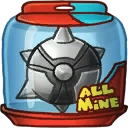 **Titanium Spikes**: Increases the base damage of mines. *(Flavor: Arm your mines to the teeth.)*
- 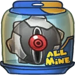 **Toaster Timer**: Increases the longevity of mines. *(Flavor: We like our enemies extra crispy.)*
- 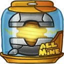 **Aerial Spring**: Makes mines bounce up and down. *(Flavor: a.k.a. The Dove Exterminator)*
-  **Mine Constructor**: Reduces cooldown time on mines. *(Flavor: By warping the mines directly from our factory to you, we can provide the quickest recharge time.)*
- 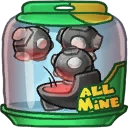 **Carpet Bombs**: Increases the amount of mines placed, dividing total damage evenly across them. *(Flavor: Instructions: Cut mine along dotted line (use the included steelcutter). Remove the three cores.)*
-  **Uranium Spikes**: Exploded mines become healthpacks. *(Flavor: My spikes are bigger than yours.)*

### Laser
**Description:** Affixed on top of the jetpack is a deadly laser that is able to fire in a full circle with pinpoint precision. It is able to slice through multiple enemies and even bounce off walls to hit people around a corner!

- **Damage**: 30 (47.1)
- **Maximum Damage**: 40 (62.8)
- **Attack Speed**: 300
- **Range**: 9
- **Charge time**: 0.5

#### Upgrades
-  **Giant Monocle**: Increases the range of laser. *(Flavor: Standard giant bifocal monocle for a giant toad.)*
- 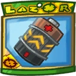 **Instant Charge Battery**: Increases attack speed of laser. *(Flavor: Charged at lightning farm Xeo-3011 on Sorona.)*
- 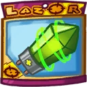 **Resonance Amplifier**: Increases the maximum base damage per hit of laser. *(Flavor: Luxor crystals are huge, light, and trendy! A real show stealer!)*
-  **Flyswatter**: Adds a damage over time effect to laser. *(Flavor: Splat!)*
- 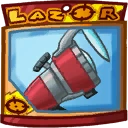 **Hubble's Lens**: Increases the minimum and maximum base damage of laser. *(Flavor: Although the lens is quite old, it remains perfectly poilished.)*
-  **Baby Yeti**: Adds a slowing effect to your Laser. *(Flavor: Aw... he is so cute!! OUCH! He bit me! Why you little...)*

### Time Warp

**Description:** After his brain got zapped in the anomaly, Yuri managed to recreate parts of it inside his new fancy jetpack, allowing him to alter the flow of time in an area around himself.

- **Cooldown**: 15s
- **Duration**: 3.5s
- **Size**: 12.8
- **Slow down**: 30%
- **Speed up**: 10%

#### Upgrades
- 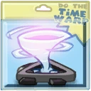 **Chrono Rift**: Reduces the cooldown of Time Warp. *(Flavor: Contains huge wormhole. Keep away from children.)*
-  **Regeneration Pod**: Allied droids and Awesomenauts inside your time warp are healed over time. *(Flavor: Want to feel 20 years younger? Now you can! With our patented Turn-back-time technology.)*
- 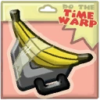 **Pod Pack Deluxe With Banana**: Adds a lifesteal effect to your laser while time warp is active. *(Flavor: Because you are not worth it.)*
- 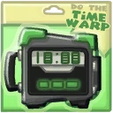 **Flash Forward**: Allied robots and Awesomenauts inside your time warp will move and fight faster. *(Flavor: Ends combat and shoetalk with your centipede girlfriend quicker.)*
-  **Spacetime Continuity Device**: Provides debuff immunity during the time warp. *(Flavor: Special moments will last forever. Literally.)*
- 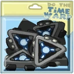 **Time Primer**: Increases slowing effect of Time Warp. *(Flavor: By folding time, we have managed to copy our products many, many times.)*

### Jet Pack

**Description:** The pride and joy of Yuri: it alters the flow of time, shoots laserbeams, drops mines, can insult enemies in over six million forms of communication and oh yeah, it can fly.

- **Jump Height**: 0 (Jet Pack)
- **Jumps**: 1 (Toggle)

#### Upgrades
-  **Power Pills Turbo**: Increases maximum health. *(Flavor: Insert pill into rear end of digestive tract.)*
-  **Med-i'-can**: Automatically regenerate health. *(Flavor: Hello... anyone there? Please get me out of here!!!)*
-  **Space Air Max**: Increases movement speed. *(Flavor: Fashionable and Fast.)*
-  **Barrier Magazine**: Provides a damage absorbing shield. *(Flavor: Free personal shield with this month's edition of The Barrier! Read all about Zork's imperium.)*
-  **Piggy Bank**: Gives 100 Solar. *(Flavor: This product was brought to you by Zork industries, exploiting Zurians since 2780.)*
-  **Baby Kuri Mammoth**: Reduces the effect of all debuffs *(Flavor: "LOOK!!! A FLYING ELEPHANT!")*

